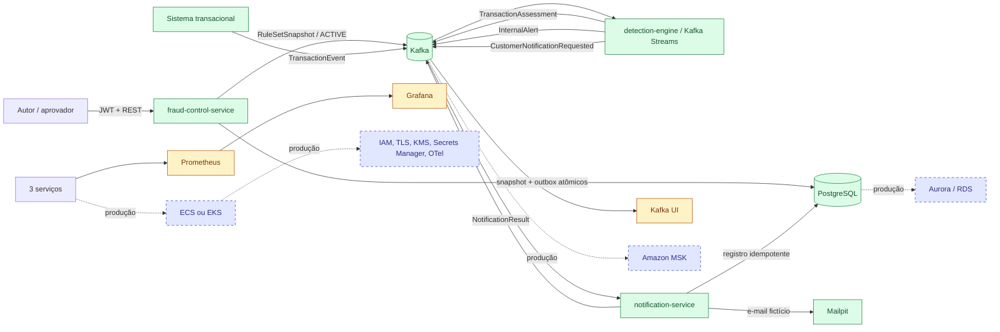

# Arquitetura do Fraud Detection Engine

## Objetivo e fronteira

O sistema detecta padrões suspeitos depois que a transação foi emitida. Ele não autoriza, recusa nem interrompe uma transação: a disponibilidade do motor fica fora do caminho transacional. Cada evento aceito produz uma avaliação; somente avaliações suspeitas geram alerta interno e solicitação sanitizada de contato.

O MVP é um monorepo Java 21 com três aplicações Spring Boot, Kafka 4.2 em KRaft, PostgreSQL 17 e Mailpit. Prometheus, Grafana e Kafka UI compõem a observabilidade local. O ambiente usa dados e identidades fictícios.

## Visão principal

Verde representa o caminho obrigatório executável. Amarelo representa U6, opcional no plano e implementada neste repositório. Azul tracejado é arquitetura produtiva documentada, não evidência local.

## Fluxo de controle: regras governadas

1. Um JWT RS256 válido, com `iss`, `aud`, `exp` e `sub`, cria uma regra ou nova versão. A autoria vem exclusivamente de `sub`.
2. A proposta imutável fica em `PENDING_APPROVAL`; uma regra só pode ter uma pendência.
3. Outra identidade, com `RULE_APPROVE`, aprova. Autoaprovação é recusada e auditada.
4. Sob lock do `ruleset_head`, o serviço monta o conjunto completo, valida DSL, limites, schema, serialização canônica, hash, tamanho e a regra de conjunto não vazio.
5. A mesma transação PostgreSQL decide a versão, grava auditoria, snapshot, head desejado e outbox.
6. O relay publica sempre a menor versão pendente com chave `ACTIVE`. Falha aplica backoff e impede N+1 de ultrapassar N.
7. Cada motor valida schema, hash, versão e DSL antes de trocar sua referência imutável. Snapshot inválido ou antigo conserva o último conjunto válido.

`desiredVersion`, `publishedVersion` e `loadedVersion` tornam a convergência observável, mas o MVP não coordena um corte simultâneo entre várias instâncias.

## Fluxo de dados

1. `TransactionEvent` chega com chave `transactionId` e atributos mínimos.
2. Schema e correspondência entre chave e `transactionId` são validados. Falha gera apenas `InvalidEventReference` sanitizada.
3. Antes do reparticionamento, um store persistente identifica outro `eventId` para a mesma transação.
4. O stream é reparticionado uma vez por `customerId`. Stores RocksDB/changelog mantêm impressão digital do evento e histórico temporal.
5. O motor executa `AMOUNT_THRESHOLD`, `COUNT_WINDOW`, `ALL` e `ANY` no snapshot carregado.
6. Qualquer `MATCHED` produz `SUSPICIOUS`; sem match e com `NOT_EVALUATED`, `INCONCLUSIVE`; todos em `NO_MATCH`, `NOT_SUSPICIOUS`.
7. Kafka Streams `exactly_once_v2` abrange offset, estado e saídas. IDs determinísticos protegem as fronteiras externas.
8. Uma avaliação suspeita gera um único alerta consolidado e uma solicitação sem e-mail ou canal.
9. O notificador resolve o contato fictício internamente, disputa uma transição persistente para `SENDING`, envia e grava `SENT` ou `FAILED`. Replay de uma entrega `SENT` republica o resultado sem novo SMTP.

Eventos tardios ainda cobertos pelos 15 minutos de histórico são avaliados e marcados. Quando a evidência necessária já expirou, regras com estado retornam `NOT_EVALUATED`; o sistema não fabrica uma conclusão segura.

## Contratos e tópicos

| Tópico | Chave | Payload | Partições | Retenção local |
|---|---|---|---:|---|
| `fraud.transaction.received.v1` | `transactionId` | `TransactionEvent` | 12 | 7 dias |
| `fraud.ruleset.active.v1` | `ACTIVE` | `RuleSetSnapshot` | 1 | compactado |
| `fraud.assessment.created.v1` | `transactionId` | `TransactionAssessment` | 12 | 30 dias |
| `fraud.alert.internal.v1` | `alertId` | `InternalAlert` | 12 | 30 dias |
| `fraud.notification.requested.v1` | `notificationRequestId` | `CustomerNotificationRequested` | 12 | 7 dias |
| `fraud.notification.result.v1` | `notificationRequestId` | `NotificationResult` | 12 | compactado + 30 dias |
| `fraud.transaction.invalid.v1` | chave recebida | `InvalidEventReference` | 6 | 7 dias |
| `fraud.transaction.quarantine.v1` | `transactionId` | `QuarantinedEventReference` | 6 | 7 dias |
| `fraud.notification.dlq.v1` | reservada | sem produtor automático no MVP | 6 | 7 dias |

Schemas JSON Draft-07 e exemplos ficam em `contracts/`. Records Java são manuais para manter contrato e código legíveis. Consumidores de saídas transacionais devem configurar `isolation.level=read_committed`.

## Idempotência e consistência

- `assessmentId = UUIDv3("ASSESSMENT:" + eventId)`;
- `alertId = UUIDv3("ALERT:" + assessmentId)`;
- `notificationRequestId = UUIDv3("NOTIFICATION-REQUEST:" + alertId)`;
- a identidade transacional é mantida por 24 horas de stream-time;
- um replay com mesma identidade e fingerprint não altera histórico nem republica efeitos;
- conflitos de `transactionId` ou fingerprint são isolados por referência sanitizada;
- outbox transacional liga aprovação no PostgreSQL à publicação repetível do snapshot;
- a PK `notification_request_id` e a transição condicional de estado impedem dois envios concluídos pelo caminho coberto.

Isso oferece efeitos efetivamente uma vez nas bordas demonstradas. Não é uma afirmação de exatamente uma vez global entre Kafka, SMTP e qualquer infraestrutura futura.

## Falhas e operação

| Falha | Comportamento executável | Endurecimento produtivo |
|---|---|---|
| serviço de controle indisponível | motor conserva o último snapshot carregado | SLO e alerta por idade/convergência |
| snapshot inválido/antigo | rejeitado sem substituir o ativo | quarentena operacional e investigação |
| Kafka indisponível | processamento pausa; não produz `INCONCLUSIVE` artificial | MSK multi-AZ, quotas e runbooks |
| payload inválido/conflitante | referência sanitizada em tópico separado; histórico intacto | retenção protegida e replay auditado |
| publicação da outbox falha | backoff limitado e ordenação preservada | alertas, lease e operação assistida |
| contato ou SMTP falha | entrega `FAILED` com código sanitizado e retry pela mesma identidade | circuit breaker, DLQ e reconciliação SMTP |
| processo reinicia | changelogs restauram stores do Kafka Streams | capacidade e tempo de restauração testados |

Prontidão do motor exige um ruleset válido. Os endpoints Actuator e as métricas não carregam `customerId`, contato ou payload como label. Logs devem usar somente IDs opacos de correlação.

## Segurança e LGPD

No ambiente local, a API de controle é stateless, valida JWT assimétrico, separa permissões de escrita, aprovação, leitura e auditoria, e extrai identidades administrativas do token. O banco possui usuários e schemas separados para controle e notificação. O motor nunca recebe contato; a solicitação externa contém apenas `customerId`, categoria segura e template. A chave privada e tokens ficam em `.local/security/`, fora do Git.

Em produção, o desenho requer emissor corporativo/JWKS, TLS e IAM/ACL no MSK, identidade de workload, Secrets Manager, criptografia KMS em trânsito e repouso, trilha de auditoria protegida, retenção definida por finalidade, acesso mínimo e descarte verificável. Dados brutos de quarentena ou arquivo só podem ser acessados por processo autorizado. Esses controles AWS não foram executados localmente.

## Escala e capacidade

O particionamento por cliente permite paralelismo por partição e mantém consulta de estado local. O tópico de entrada possui 12 partições no ambiente local; o teto real depende de distribuição de chaves, CPU, disco, tamanho dos stores, replicação e restauração. Chaves quentes podem exigir salting e agregação em dois estágios; esse desenho não está implementado.

As metas arquiteturais de 8.000 TPS médios, 25.000 TPS de pico e 99,9% em até 500 ms não foram medidas: U8 não foi executada. Nenhum número de capacidade deve ser inferido do smoke ou dos testes.

## MVP executável x arquitetura de produção

| Capacidade | MVP executável | Arquitetura de produção |
|---|---|---|
| broker | Kafka único, KRaft, replicação 1 | MSK multi-AZ, TLS, IAM e quotas |
| compute | três containers Spring Boot | ECS/EKS com autoscaling e identidades de workload |
| regras | JWT local, quatro olhos, snapshot/outbox | IdP corporativo, break-glass e políticas operacionais |
| estado | RocksDB + changelog | disco dimensionado, restauração ensaiada, capacidade por partição |
| banco | PostgreSQL único, schemas/usuários separados | Aurora/RDS HA, backup, KMS e rotação |
| contratos | JSON Schema versionado no repositório | Glue Schema Registry e governança de compatibilidade |
| notificação | fixture + Mailpit, retry explícito | provedor real, lease, idempotency key, circuit breaker e reconciliação |
| observabilidade | Actuator, Prometheus, Grafana e Kafka UI | OTel/CloudWatch, alertas, SLOs e retenção |
| quarentena | referência sanitizada | arquivo criptografado, acesso restrito e replay auditado |
| replay/backtest | ausente | `runId`, intervalo delimitado e notificações bloqueadas |
| capacidade | não medida | ensaios representativos antes de comprometer SLO |
| entrega automatizada | fora do escopo atual | pipeline controlado com gates definidos pela organização |

## Trade-offs

- **PostgreSQL sobre MongoDB/DynamoDB:** JSONB preserva flexibilidade da DSL, enquanto transações, constraints, locks e outbox sustentam invariantes entre regras, auditoria e snapshots.
- **Kafka sobre persistência síncrona das avaliações:** mantém o motor desacoplado e torna as saídas parte da transação do stream; consultas ad hoc exigiriam um projetor futuro.
- **Detecção assíncrona sobre motor bloqueador:** isola disponibilidade e latência da autorização, ao custo de não decidir a transação em linha.
- **Kafka Streams sobre Flink ou consumidor convencional:** entrega estado particionado, changelog e transação Kafka com menor superfície operacional para o MVP; Flink ganha quando event-time e pipelines mais complexos justificarem a plataforma.
- **DSL segura sobre Drools:** a AST tipada limita expressividade, mas evita scripts/ações arbitrárias, simplifica validação e melhora explicabilidade.
- **Snapshot completo sobre deltas:** troca atômica e avaliação reproduzível são simples; snapshots maiores exigem limite de tamanho e publicação ordenada.

## Testes e rastreabilidade

Testes unitários cobrem contratos e domínio; `TopologyTestDriver` cobre a topologia e stores; Testcontainers cobre Kafka, PostgreSQL e Mailpit; `scripts/smoke.sh` comprova a fatia vertical. A estratégia e seus limites estão em [../testing/strategy.md](../testing/strategy.md), e os ciclos registrados em [../testing/tdd-evidence.md](../testing/tdd-evidence.md).

Limitações e evoluções consolidadas: [../limitations-and-evolution.md](../limitations-and-evolution.md). Uso de IA e classes autorais: [../ai-usage.md](../ai-usage.md).
