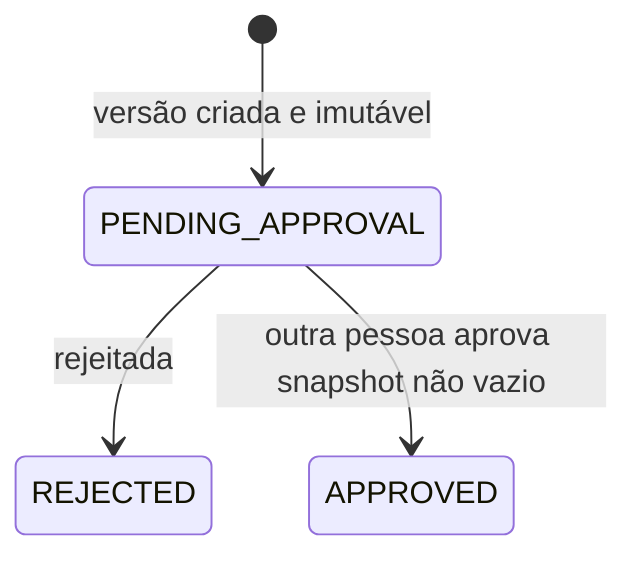
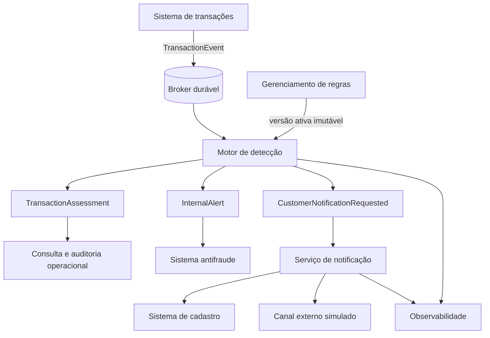
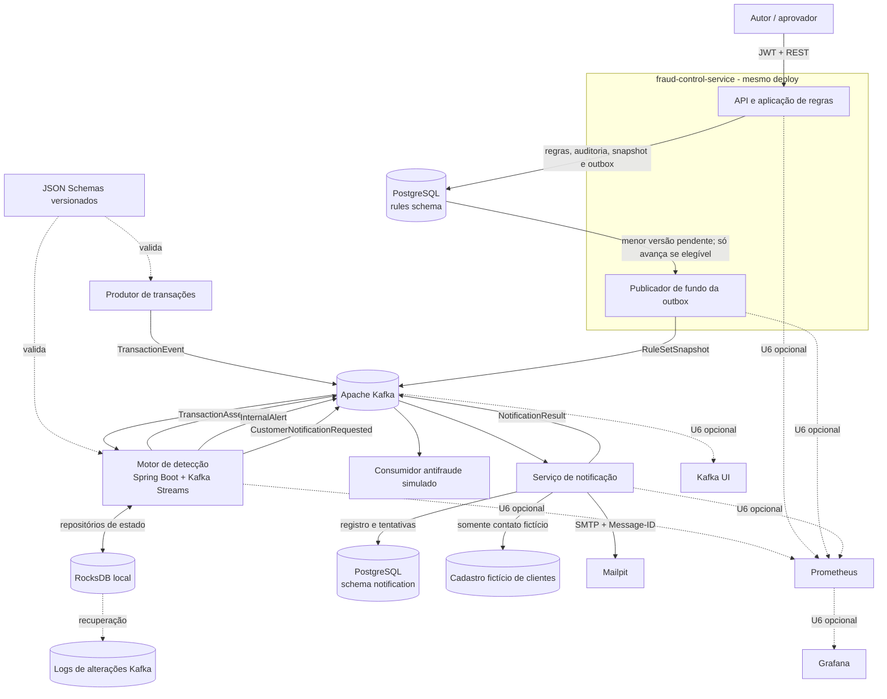
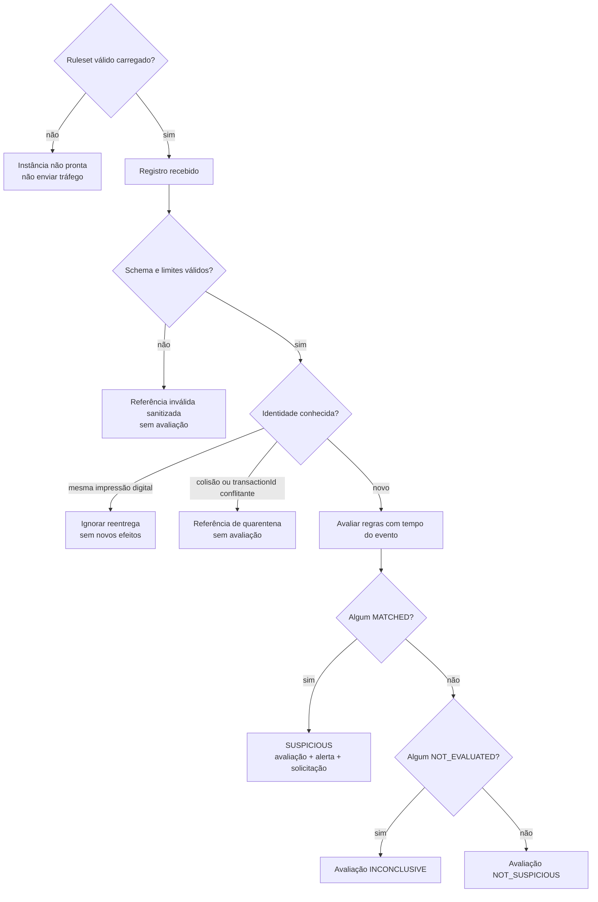
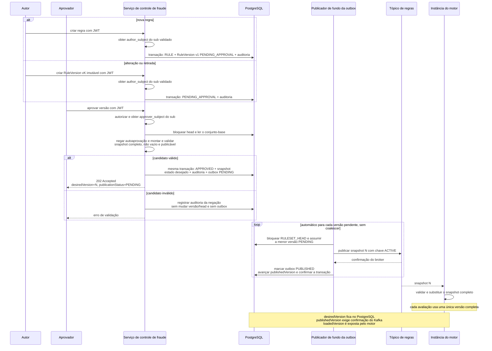
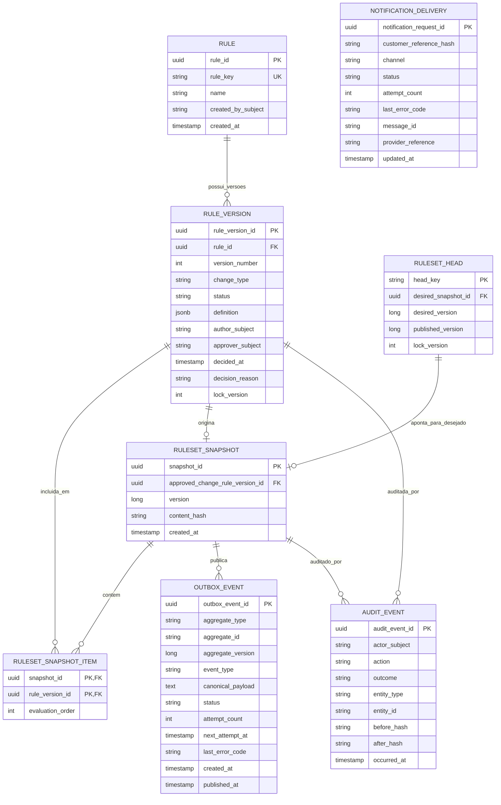
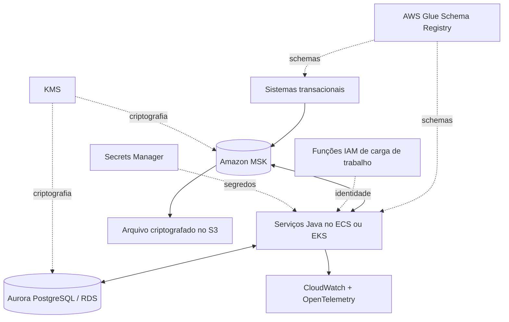

# Motor de Detecção de Transações Suspeitas - Plano

## Resumo do objetivo

- **Objetivo:** Permitir que sistemas antifraude identifiquem transações suspeitas em tempo real, recebam evidências explicáveis e notifiquem o cliente sem colocar o motor no caminho de autorização da transação.
- **Meios:** Construir uma fatia vertical em Java 21 com Spring Boot e Kafka Streams, apoiada por PostgreSQL e contratos JSON versionados; Python aparece somente no ensaio opcional de carga (KTD1, KTD2, KTD3, KTD4).
- **Autoridade do produto:** Requisitos do case técnico e decisões de escopo confirmadas durante o refinamento.
- **Perfil de execução:** Plano reduzido para uma fatia vertical executável. U1-U5 e U9 são obrigatórias; U6 e U8 são opcionais e só começam depois que o caminho principal estiver verificado. U7 foi absorvida por U5.
- **Condições de conclusão:** Todos os requisitos atribuídos às unidades obrigatórias, seus cenários de aceite, verificações e documentação devem estar atendidos. U6 e U8 não bloqueiam a entrega. Nenhum resultado de benchmark pode ser apresentado como certificação produtiva.
- **Responsabilidade pelo acabamento:** A execução inclui remoção de tentativas abandonadas, atualização dos diagramas e registro dos resultados reais de testes e benchmarks.

### Compromisso de autoria e aprendizagem

- Pelo menos duas classes relevantes da solução serão implementadas integralmente pelo autor do case. Nessas classes, a IA poderá explicar requisitos, esclarecer conceitos e revisar o resultado posteriormente, mas não gerará a implementação.
- As duas classes serão escolhidas antes da unidade correspondente, terão responsabilidade de domínio ou infraestrutura não trivial e serão identificadas na declaração final de uso de IA.

### Política global de TDD

- A implementação seguirá o ciclo vermelho-verde-refatoração em fatias verticais: um comportamento observável e um teste por vez, seguidos pelo código mínimo para fazê-lo passar.
- Os testes priorizarão interfaces públicas e comportamento, evitando acoplamento a métodos privados, estrutura interna ou mocks de colaboradores internos.
- Refatorações ocorrerão somente com a suíte verde, e cada unidade registrará os comandos e resultados que comprovam o ciclo.

---

## Contrato do produto

> **Nota de preservação:** O contrato do produto foi alterado em A2, R8, R9, R12, F4 e AE13-AE15 por decisões explícitas do autor do case: a criação já produz uma versão imutável pendente; sua aprovação valida integralmente a mudança, cria atomicamente um snapshot desejado não vazio e sua outbox; e as identidades administrativas vêm exclusivamente do `sub` do JWT validado. Foram removidas a submissão e a ativação manual separadas, sem enfraquecer a proibição de autoaprovação.
>
> **Nota de redução de escopo:** Em 2026-09-06, o autor aprovou concentrar a evidência executável no núcleo da detecção. R18, R20-R25, R27, R33, R35 e R36 foram delimitados entre garantia mínima local, arquitetura produtiva documentada e trabalho opcional. U7 foi absorvida por U5; U6 e U8 passaram a ser opcionais. As propriedades retiradas do código obrigatório permanecem registradas como limitações e evoluções, não como capacidades implementadas.

### Resumo

O plano implementa o núcleo do brainstorm em um monorepo com três aplicações Java e Kafka Streams no plano de dados. O caminho obrigatório demonstra regras governadas e dinâmicas, avaliação sem estado e com estado, saídas explicáveis, idempotência nas bordas e uma notificação local. Segurança corporativa completa, tratamento operacional avançado, painéis e ensaios de capacidade permanecem documentados ou opcionais conforme a seção de escopo.

### Contexto do problema

Sistemas transacionais do banco precisam emitir eventos para detecção sem assumir dependência síncrona de um motor antifraude. O motor deve sustentar alta vazão e baixa latência, manter consistência após falhas, evitar efeitos duplicados, preservar dados pessoais e integrar sistemas internos heterogêneos.

O desafio exige profundidade no núcleo de processamento e clareza sobre operação em produção, mas não uma reprodução completa da infraestrutura corporativa. O escopo deve produzir evidência executável para as propriedades mais importantes e documentar os controles produtivos que não cabem no ambiente local.

### Atores

- A1. **Sistema produtor de transações:** publica eventos imutáveis no contrato canônico de entrada.
- A2. **Pessoa autora ou aprovadora de regras:** cria uma versão imutável de inclusão, alteração ou retirada, ou aprova uma versão criada por outra pessoa. A aprovação solicita automaticamente sua propagação; uma mesma identidade pode acumular permissões, mas nunca aprovar a própria alteração.
- A3. **Motor de detecção:** avalia cada evento aceito e publica resultados explicáveis.
- A4. **Sistema ou equipe antifraude:** consome alertas internos detalhados e fornece resultados posteriores de investigação.
- A5. **Serviço de notificação:** consome solicitações sanitizadas, resolve o canal do cliente e controla a entrega externa.
- A6. **Sistema de cadastro de clientes:** mantém dados de contato fora do domínio do motor e os fornece somente ao notificador autorizado.
- A7. **Cliente final:** recebe comunicação segura sobre uma transação suspeita.
- A8. **Equipe de SRE:** monitora disponibilidade, desempenho, qualidade das regras e recuperação após incidentes.
- A9. **Auditoria, Segurança e Compliance:** definem políticas de acesso, retenção e tratamento de dados e consultam evidências autorizadas.

### Decisões principais

- **Detecção assíncrona.** (decisão consolidada na sessão: direcionada pelo usuário — escolhida em vez do bloqueio síncrono da autorização porque o case pede detecção e alerta, e manter o motor fora do caminho de autorização isola a disponibilidade das transações.) Rege R1, R3, R27.
- **Resultado para toda transação e alerta somente para suspeitas.** (decisão consolidada na sessão: aprovada pelo usuário — escolhida em vez de publicar apenas resultados suspeitos porque um fluxo completo de avaliações melhora a auditabilidade e a integração com consumidores.) Rege R3, R4.
- **Um evento imutável por transação.** (decisão consolidada na sessão: direcionada pelo usuário — escolhida em vez de eventos de ciclo de vida da transação porque o MVP favorece um contrato delimitado e o tratamento explícito de conflitos.) Rege R1, R14, R15.
- **Regras determinísticas no MVP.** (decisão consolidada na sessão: direcionada pelo usuário — escolhida em vez de um modelo de aprendizado de máquina online porque regras determinísticas sem estado e com estado oferecem explicabilidade e validam o núcleo de streaming dentro do prazo.) Rege R7, R13.
- **Aprovação promove a mudança automaticamente.** (session-settled: user-directed — chosen over explicit submission and manual activation steps: the MVP preserves four-eyes approval without adding workflow ceremony.) A aprovação persiste o novo estado desejado e a outbox na mesma transação; a distribuição posterior é automática e observável. No máximo uma versão pode permanecer `PENDING_APPROVAL` por regra, impedindo que uma aprovação tardia restaure uma proposta obsoleta. Rege R8-R12.
- **O conjunto ativo nunca fica vazio.** (session-settled: user-approved — chosen over accepting an empty ruleset: an empty set could silently classify every transaction as `NOT_SUSPICIOUS`.) A aprovação de uma retirada que removeria a última regra ativa é negada antes de qualquer alteração de estado ou outbox. Rege R8, R12, R13.
- **Identidades administrativas vêm do JWT.** (session-settled: user-approved — chosen over accepting subjects supplied by the client: the validated `sub` is the authoritative identity for authorship, approval and audit.) Os DTOs de escrita não aceitam `author_subject`, `approver_subject` nem ator de auditoria informados no corpo. Rege R9, R29.
- **Estado gerenciado pelo processador e particionado por cliente.** (decisão consolidada na sessão: aprovada pelo usuário — escolhida em vez de Redis no caminho crítico porque o estado local particionado por chave evita uma dependência remota para cada transação.) Rege R19, R26.
- **Tempo do evento com resposta imediata.** (decisão consolidada na sessão: aprovada pelo usuário — escolhida em vez de usar somente tempo de processamento e esperar o fechamento completo da janela porque as janelas de negócio continuam significativas sem sacrificar a meta de latência.) Rege R20, R21, R22, R27.
- **Efeitos efetivamente uma vez.** (decisão consolidada na sessão: aprovada pelo usuário — escolhida em vez de afirmar processamento global exatamente uma vez porque a atomicidade da plataforma depende da meta de latência, enquanto identidade determinística e idempotência protegem as fronteiras externas.) Rege R14, R16, R17, R18.
- **Dois níveis de alerta.** (decisão consolidada na sessão: aprovada pelo usuário — escolhida em vez de expor um alerta rico a todos os consumidores porque a investigação interna recebe evidências enquanto a comunicação com o cliente permanece sanitizada.) Rege R4, R5.
- **Dados de contato fora do motor.** (decisão consolidada na sessão: aprovada pelo usuário — escolhida em vez de incluir dados de contato nos alertas porque a fronteira de notificação impõe limitação de finalidade e reduz a exposição.) Rege R5, R28.
- **Segurança produtiva especificada por fronteira.** (decisão consolidada na sessão: aprovada pelo usuário — escolhida em vez de reproduzir localmente todos os controles corporativos porque controles representativos continuam executáveis sem prejudicar a clareza do desenho produtivo.) Rege R29, R35.
- **Integração por contratos canônicos e adaptadores.** (decisão consolidada na sessão: aprovada pelo usuário — escolhida em vez de acoplamento direto aos sistemas internos porque produtores e consumidores podem evoluir sem alterar a semântica das regras.) Rege R1, R31, R32.
- **Fatia vertical em um monorepo.** (decisão consolidada na sessão: direcionada pelo usuário — escolhida em vez de um ecossistema poliglota de microsserviços e uma entrega somente arquitetural porque um fluxo executável maximiza profundidade, reprodutibilidade e domínio do código.) Rege R6, R35, R36, R37.

### Requisitos

**Detecção e saídas**

- R1. O motor deve consumir em tempo real um evento canônico, versionado e imutável por transação a partir de um broker de eventos durável.
- R2. O evento deve conter somente identificadores opacos e atributos necessários às regras, incluindo identidade do evento e da transação, cliente, valor, moeda, horário e contexto transacional aplicável.
- R3. Cada evento aceito deve produzir um `TransactionAssessment` com estado `NOT_SUSPICIOUS`, `SUSPICIOUS` ou `INCONCLUSIVE`; o resultado não representa autorização nem legitimidade definitiva da transação.
- R4. Uma avaliação suspeita deve produzir um único `InternalAlert` consolidado e uma única `CustomerNotificationRequested`, ambos relacionados pelo mesmo `alertId`.
- R5. O alerta interno deve conter as regras e evidências acionadas, enquanto a solicitação externa deve conter apenas referência opaca do cliente, categoria segura e referência de template.
- R6. O MVP deve demonstrar a entrega externa com dados fictícios e uma caixa de e-mail local, incluindo resultado de envio observável.

**Regras e governança**

- R7. O motor deve executar regras declarativas sem estado e com estado, usando limites, comparações e composições `AND`/`OR`, permitindo criar novos padrões dentro das primitivas suportadas sem nova implantação.
- R8. Inclusão, alteração ou retirada deve nascer como versão imutável pendente. Cada regra admite no máximo uma versão em `PENDING_APPROVAL`; uma nova proposta para a mesma regra só pode ser criada depois da decisão sobre a anterior. A aprovação por outra pessoa deve validar integralmente a mudança, registrar a decisão, criar um novo snapshot desejado com pelo menos uma regra ativa e inserir sua outbox na mesma transação; não haverá submissão nem ativação manual separadas no MVP.
- R9. A mesma pessoa não deve aprovar a própria alteração de regra. `author_subject`, `approver_subject` e o ator de cada auditoria administrativa devem ser derivados exclusivamente do `sub` do JWT validado, nunca de campos enviados pelo cliente.
- R10. O motor deve trocar o conjunto ativo de regras atomicamente para novas avaliações.
- R11. Uma indisponibilidade do gerenciamento deve manter o último conjunto válido em execução; idade acima do limite operacional configurado gera alerta sem tornar automaticamente a instância indisponível.
- R12. Um conjunto válido deve conter pelo menos uma regra ativa; uma instância sem esse conjunto não deve ficar pronta.
- R13. Cada regra deve produzir resultado individual explicável; qualquer `MATCHED` torna a avaliação suspeita, a severidade final é a maior encontrada e o alerta consolida todas as correspondências.



`APPROVED` registra uma decisão de governança concluída; não afirma que todas as instâncias do motor já carregaram o novo conjunto. A participação ativa de uma versão é derivada dos itens do snapshot desejado mais recente, enquanto publicação e carregamento são acompanhados separadamente. Uma versão rejeitada não é editada ou reenviada: a correção cria uma nova versão imutável.

**Consistência, tempo e estado**

- R14. Dentro do horizonte online configurado, o motor deve deduplicar o mesmo `eventId` na rota esperada de `transactionId` e `customerId` sem repetir saídas; além dele, IDs determinísticos e consumidores idempotentes protegem o efeito de negócio. Reutilização de `eventId` entre clientes e replay deliberado pertencem às limitações e ao desenho futuro.
- R15. O mesmo `transactionId` com outro `eventId` deve ser tratado como conflito de dados.
- R16. Avaliações, alertas e notificações devem usar identificadores determinísticos e consumidores idempotentes.
- R17. O MVP deve manter habilitada a atomicidade do processador para coordenar offsets, estado e saídas Kafka; se o benchmark local não atingir R27, o desvio será registrado como limitação medida e não justificará remover silenciosamente a garantia.
- R18. O MVP deve impedir uma segunda entrega para a mesma `notificationRequestId` já concluída. Em produção, integrações externas devem usar chave de idempotência ou consulta de status para reconciliar resultados ambíguos antes de repetir um efeito.
- R19. O fluxo principal deve ser particionado por `customerId` e manter estado de janela com TTL no processador, sem consulta remota obrigatória por transação.
- R20. Regras temporais devem usar `occurredAt`; o MVP avalia eventos dentro do histórico retido sem aguardar reordenação, enquanto uma política completa de marca d'água e tolerância configurável fica como evolução.
- R21. Um evento sem histórico suficiente deve tornar `NOT_EVALUATED` as regras com estado afetadas, sem exigir no MVP uma classificação operacional completa de todos os atrasos.
- R22. Eventos atrasados não devem reabrir avaliações anteriores automaticamente no MVP.

**Resiliência e capacidade**

- R23. A indisponibilidade do plano de controle não deve interromper o motor que já possui um ruleset válido; falhas de notificação não podem remover ou atrasar o alerta interno já publicado.
- R24. O MVP deve registrar falhas de notificação e permitir nova tentativa segura pelo mesmo identificador. Backoff exponencial, circuit breaker e DLQ automatizada pertencem à arquitetura produtiva documentada.
- R25. Payloads inválidos e conflitos de identidade devem produzir referências sanitizadas em tópicos próprios e não alterar o estado de detecção. Investigação, retenção protegida e reexecução autorizada da quarentena pertencem ao procedimento produtivo documentado.
- R26. A arquitetura deve escalar horizontalmente para média de 8.000 TPS e picos de 25.000 TPS, expondo distribuição por partição, atraso dos consumidores, crescimento de estado e chaves sobrecarregadas.
- R27. O SLO produtivo deve ser de 99,9% das avaliações e alertas internos publicados de forma durável em até 500 ms após o recebimento; a entrega externa fica fora dessa janela.

**Segurança, privacidade e retenção**

- R28. O motor deve aplicar minimização e pseudonimização, excluir dados de contato do seu domínio e impedir que payloads ou logs exponham CPF, conta, cartão, e-mail ou telefone.
- R29. A arquitetura produtiva deve definir TLS em cada trânsito, criptografia em repouso, identidade de carga de trabalho, autorização de menor privilégio por serviço e tópico, gestão e rotação de segredos, auditoria e proteção equivalente para DLQ, quarentena, logs e rastros.
- R30. Avaliações e alertas devem ter retenção operacional e arquivamento protegido por períodos configuráveis, seguidos de eliminação ou anonimização conforme política institucional; o pipeline completo de arquivamento não pertence ao MVP.

**Integrações e operação**

- R31. Entrada e saídas devem usar contratos canônicos versionados e adaptadores substituíveis para evitar acoplamento da lógica de regras aos sistemas integrados.
- R32. Evolução de schema, testes de contrato e identidade de correlação devem proteger a compatibilidade e a rastreabilidade das integrações.
- R33. O MVP obrigatório deve expor prontidão do motor, status do rollout, saídas consultáveis e logs correlacionados sem dados pessoais. Métricas agregadas, painéis, alertas e visualização concreta de vazão, latência e atraso de consumo compõem U6 opcional.
- R34. O sistema deve distinguir anomalias imediatas de volume de falsos positivos confirmados e prever feedback `FRAUD`, `LEGITIMATE` ou `UNKNOWN` vindo de investigação, cliente ou sistemas posteriores.
- R35. A evidência obrigatória deve cobrir testes unitários, contratos, integração e fumaça ponta a ponta. Segurança, resiliência, desempenho e backtest devem ter estratégia documentada; automação adicional segue a prioridade explícita das unidades.
- R36. Se executados, testes de carga e falha devem rodar fora da etapa comum de CI e registrar ambiente, configuração e resultados sem extrapolar a capacidade observada para produção.
- R37. O repositório deve fornecer execução reproduzível, decisões e trade-offs, diagramas, limitações e uso transparente de IA, mantendo explicações necessárias para que o responsável pelo case domine o comportamento entregue.
- R38. O documento de arquitetura deve prever backtest e reprocessamento futuros sobre intervalos delimitados, com `runId` próprio e notificações externas bloqueadas; nenhuma capacidade executável de replay pertence ao MVP.

### Fluxo do sistema



### Fluxos principais

- F1. **Avaliação normal**
  - **Gatilho:** A1 publica uma transação válida.
  - **Atores:** A1, A3.
  - **Etapas:** O motor valida e deduplica o evento, consulta o estado do cliente, aplica o conjunto ativo e publica a avaliação.
  - **Resultado:** Existe um resultado explicável dentro da fronteira de latência.
  - **Abrange:** R1, R3, R10, R11, R12, R13, R27.
- F2. **Transação suspeita e notificação**
  - **Gatilho:** Pelo menos uma regra retorna `MATCHED`.
  - **Atores:** A3, A4, A5, A6, A7.
  - **Etapas:** O motor publica a avaliação, o alerta interno consolidado e a solicitação sanitizada; o notificador resolve o contato fora do motor e controla a entrega.
  - **Resultado:** A equipe recebe evidências detalhadas e o cliente recebe comunicação sem exposição da lógica antifraude.
  - **Abrange:** R4, R5, R6, R16, R18, R28.
- F3. **Reentrega e conflito**
  - **Gatilho:** Um evento já visto ou uma nova identidade de evento para a mesma transação chega ao motor.
  - **Atores:** A1, A3, A8.
  - **Etapas:** A reentrega é identificada antes de alterar o histórico; a identidade conflitante gera uma referência sanitizada e é isolada do fluxo de avaliação.
  - **Resultado:** Nenhum alerta ou envio externo é duplicado.
  - **Abrange:** R14, R15, R16, R24, R25, R33.
- F4. **Mudança de regra**
  - **Gatilho:** A2 propõe uma nova regra ou versão.
  - **Atores:** A2, A3, A9.
  - **Etapas:** A criação persiste uma versão imutável pendente e associa ao `sub` autenticado sua autoria e auditoria. Uma segunda pessoa solicita a aprovação; antes de alterar qualquer estado, o serviço valida a AST, os limites, o contrato, a serialização canônica e que o snapshot candidato contém ao menos uma regra. A mesma transação registra o aprovador autenticado e a auditoria, monta o novo snapshot completo desejado e cria a outbox. O publicador propaga automaticamente todos os snapshots em ordem, e cada instância do motor valida e troca atomicamente o conjunto usado pelas novas avaliações.
  - **Resultado:** A mudança ocorre sem nova implantação e preserva o histórico; retirada emergencial com prioridade própria fica como evolução produtiva.
  - **Abrange:** R7, R8, R9, R10, R11.
- F5. **Falha de dependência**
  - **Gatilho:** Gerenciamento de regras, notificador ou outra dependência fica indisponível.
  - **Atores:** A3, A5, A8.
  - **Etapas:** O motor usa o último ruleset válido local; o notificador registra o resultado e reconhece uma repetição pela mesma identidade.
  - **Resultado:** O alerta interno permanece independente da entrega externa e o mesmo pedido concluído não gera outro e-mail.
  - **Abrange:** R11, R12, R16, R18, R23, R24.
- F6. **Evento atrasado**
  - **Gatilho:** Um evento chega fora de ordem.
  - **Atores:** A1, A3, A8.
  - **Etapas:** O motor consulta o histórico retido pelo horário de ocorrência; histórico insuficiente impede somente as regras com estado afetadas.
  - **Resultado:** O evento não é descartado silenciosamente e avaliações passadas não são reabertas no MVP.
  - **Abrange:** R20, R21, R22, R23, R33.
- F7. **Incidente de qualidade**
  - **Gatilho:** Métricas mostram crescimento atípico de alertas ou feedback posterior confirma baixa qualidade.
  - **Atores:** A2, A4, A8.
  - **Etapas:** A equipe identifica as regras responsáveis, investiga o contexto e retira ou substitui a versão ativa.
  - **Resultado:** O impacto é contido e permanece auditável sem classificar toda anomalia como falso positivo.
  - **Abrange:** R8, R10, R33, R34.

### Exemplos de aceite

- AE1. **Transação normal.** **Abrange R3.** Dado um evento válido que não aciona regras, quando ele é avaliado, então uma avaliação `NOT_SUSPICIOUS` é publicada e nenhum alerta é criado.
- AE2. **Múltiplas correspondências.** **Abrange R4, R13.** Dado que regras `HIGH` e `CRITICAL` acionam na mesma transação, quando a avaliação termina, então existe um alerta consolidado com ambas e severidade final `CRITICAL`.
- AE3. **Reentrega idêntica.** **Abrange R14, R16.** Dado o mesmo `eventId` recebido mais de uma vez dentro do horizonte online de identidade, quando as entregas são processadas, então ocorre somente o conjunto de saídas da primeira avaliação; alerta e notificação existem apenas quando essa avaliação é suspeita.
- AE4. **Identidade conflitante.** **Abrange R15, R25.** Dado o mesmo `transactionId` com outro `eventId`, quando o segundo evento chega, então uma referência sanitizada de conflito é publicada, nenhuma avaliação é criada e o histórico não muda.
- AE5. **Autoaprovação.** **Abrange R9.** Dado que uma pessoa criou uma versão, quando tenta aprová-la, então a operação é negada e auditada.
- AE6. **Gerenciamento indisponível.** **Abrange R11, R12, R23.** Dado um conjunto válido já carregado, quando o serviço de regras fica indisponível, então o motor continua com a última versão; uma instância vazia permanece não pronta.
- AE7. **Entrega idempotente.** **Abrange R6, R16, R18, R23, R24.** Dada uma solicitação já enviada, quando ela é consumida novamente, então o registro existente é reutilizado e nenhum segundo e-mail é enviado. Uma falha de canal termina em estado observável sem afetar o alerta interno.
- AE8. **Evento atrasado recuperável.** **Abrange R20.** Dado um evento fora de ordem ainda coberto pelo estado, quando chega, então é avaliado automaticamente, marcado como atrasado e passa a contribuir para avaliações futuras.
- AE9. **Histórico insuficiente.** **Abrange R3, R21, R23.** Dado um evento antigo demais para uma regra com estado e nenhuma correspondência conclusiva, quando é avaliado, então o resultado é `INCONCLUSIVE`, não `NOT_SUSPICIOUS`.
- AE10. **Minimização de dados.** **Abrange R2, R5, R28.** Dado o fluxo completo, quando payloads e logs são inspecionados, então somente o notificador autorizado acessa o contato fictício e o motor não contém esse dado.
- AE11. **Carga reproduzível opcional.** **Abrange R26, R27, R33, R35, R36.** Se U8 for executada, dado um perfil documentado de carga, quando o teste executa, então registra vazão, percentis de latência, atraso de consumo, recursos e integridade das saídas com identificação do ambiente.
- AE12. **Integração substituível.** **Abrange R31, R32.** Dado um consumidor interno compatível com o contrato versionado, quando ele é conectado por outro adaptador, então a lógica das regras não precisa mudar.
- AE13. **Aprovação e rollout assíncrono.** **Abrange R8-R12.** Dada uma versão pendente criada por outra pessoa, quando o aprovador a aprova, então a API retorna `202 Accepted` com o snapshot desejado e a publicação pendente. Cada instância continua usando seu último snapshot válido até receber, validar e trocar para a nova versão; uma republicação idêntica não causa segunda troca lógica.
- AE14. **Conjunto de regras não vazio.** **Abrange R8, R12, R13.** Dado que uma retirada eliminaria a última regra ativa, quando sua aprovação é solicitada, então a operação registra a auditoria da negação, mas não altera versão, head ou snapshot nem cria outbox; o último conjunto válido permanece em uso.
- AE15. **Proveniência da identidade administrativa.** **Abrange R9, R29.** Dado um token JWT válido, quando uma regra é criada, aprovada ou rejeitada, então autoria, aprovação e ator da auditoria correspondem ao `sub` autenticado; campos de identidade enviados no corpo são rejeitados e não podem falsificar a trilha.

### Critérios de sucesso

- O ambiente local executa o fluxo da transação até a avaliação, o alerta interno e o e-mail fictício com instruções reproduzíveis.
- O teste funcional não perde eventos únicos aceitos nem produz efeitos de negócio duplicados nos cenários de reentrega cobertos.
- A arquitetura demonstra como escalar para 8.000 TPS médios e 25.000 TPS de pico e identifica limites do hardware local.
- A documentação distingue capacidades executadas, capacidades apenas projetadas para produção e trabalhos opcionais não concluídos.
- Se U6 for executada, um painel mostra saúde, vazão, latência, atraso de consumo e versão do ruleset.
- Se U8 for executada, o relatório publica p50, p95, p99, p99.9, máximo, vazão, atraso de consumo e uso de recursos para carga sustentada e de pico.
- Segurança, privacidade, integração, operação e retenção têm controles produtivos rastreáveis e simplificações locais declaradas.
- A documentação permite relacionar requisitos, decisões, fluxos, testes, limitações e evoluções sem depender de conhecimento implícito.

### Limites de escopo

**Incluído no MVP**

- Motor determinístico com uma regra sem estado e uma regra de janela por cliente, broker, gerenciamento governado de regras, contratos de saída e observabilidade essencial por saúde, métricas e logs.
- Entrega externa local simulada com idempotência por `notificationRequestId`, testes automatizados de domínio, contrato e integração, além de uma verificação de fumaça do caminho principal.
- Documentação da arquitetura produtiva, ameaças e controles, trade-offs, capacidade, operação e uso de IA.

**Se der tempo**

- U6 provisiona Prometheus e Grafana e cria um painel concreto para saúde, vazão, latência, atraso de consumo, versões do ruleset e resultado de notificações.
- U8 executa uma carga reproduzível para testar as metas de 8.000 TPS médios, pico de 25.000 TPS e 99,9% das avaliações/alertas internos em até 500 ms. O relatório deve declarar o resultado medido, inclusive quando a máquina local não atingir a meta.

**Adiado para depois**

- Aprendizado de máquina online, repositório compartilhado de características, serviço Python de decisão, modo sombra completo e pontuação ponderada ou híbrida.
- Motor síncrono no fluxo de autorização, respostas `approve/challenge/block` e políticas fail-open ou fail-closed.
- Reprocessamento e backtest automatizados, correção retroativa de avaliações e feedback real de sistemas de investigação ou contestação.
- Retirada emergencial que ultrapassa snapshots pendentes, coalescimento autorizado ou corte global coordenado do ruleset.
- Distribuição adaptativa de chaves sobrecarregadas (`salting`), agregação em dois estágios e múltiplos fluxos reparticionados por entidade.
- Deduplicação global de `eventId` entre clientes, bootstrap com consumidor independente até o end offset, convergência automatizada entre duas instâncias, política completa de eventos atrasados e automação operacional de quarentena.
- Concessão de trabalho no notificador, supressão por janela, circuit breaker, reconciliação de resultado SMTP ambíguo e DLQ automática.
- Testes destrutivos de caos, matriz completa de recuperação e pipeline executável de backtest.
- Infraestrutura multi-região, arquivamento automatizado, integração com provedor externo real e segurança corporativa completa no ambiente local.
- UI para regras, investigação, operação ou visualização de alertas.

### Dependências e premissas

- O produtor gera `eventId` e `transactionId` estáveis e publica o evento semanticamente correto por outbox transacional ou mecanismo equivalente.
- O broker é a entrada canônica e oferece retenção suficiente para reexecução e recuperação.
- O `customerId` é opaco e adequado ao particionamento; o contrato não transporta dados cadastrais desnecessários.
- O sistema de cadastro e os canais internos reais do banco serão representados por contratos e adaptadores simulados no MVP.
- O limite de 500 ms começa no recebimento pelo motor e termina na publicação durável da avaliação e do alerta interno.
- Prazos de retenção e tolerância a atraso são configuráveis e, em produção, dependem de políticas institucionais e requisitos regulatórios.
- Resultados obtidos em uma única máquina são evidência do comportamento do MVP, não certificação de capacidade produtiva.

### Fontes e pesquisa

- [Lei Geral de Proteção de Dados Pessoais](https://www.planalto.gov.br/ccivil_03/_ato2015-2018/2018/lei/l13709compilado.htm)
- [Glossário da ANPD](https://www.gov.br/anpd/pt-br/documentos-e-publicacoes/glossario-anpd)
- [Garantias de processamento do Apache Kafka Streams](https://kafka.apache.org/42/streams/core-concepts/)
- [Configuração do Apache Kafka Streams](https://kafka.apache.org/42/streams/developer-guide/config-streams/)
- [Testes do Apache Kafka Streams](https://kafka.apache.org/42/streams/developer-guide/testing/)
- [Estado global do Apache Kafka Streams](https://kafka.apache.org/42/javadoc/org/apache/kafka/streams/Topology.html)
- [GlobalKTable do Apache Kafka Streams](https://kafka.apache.org/42/javadoc/org/apache/kafka/streams/kstream/GlobalKTable.html)
- [Ciclo de vida do Kafka Streams](https://kafka.apache.org/42/javadoc/org/apache/kafka/streams/KafkaStreams.html)
- [Visão geral de segurança do Apache Kafka](https://kafka.apache.org/42/security/security-overview/)
- [Controle de acesso IAM do Amazon MSK](https://docs.aws.amazon.com/msk/latest/developerguide/iam-access-control.html)
- [AWS Glue Schema Registry](https://docs.aws.amazon.com/glue/latest/dg/schema-registry.html)
- [JSON Schema](https://json-schema.org/)
- [Requisitos de sistema do Spring Boot 3.5](https://docs.spring.io/spring-boot/3.5/system-requirements.html)
- [Suporte do Spring Boot ao Kafka](https://docs.spring.io/spring-boot/reference/messaging/kafka.html)
- [Motor de regras Drools](https://kie.apache.org/docs/10.0.x/drools/drools/rule-engine/index.html)
- [Padrão Outbox Transacional na AWS](https://docs.aws.amazon.com/prescriptive-guidance/latest/cloud-design-patterns/transactional-outbox.html)
- [Módulo Kafka do Testcontainers](https://java.testcontainers.org/modules/kafka/)

---

## Contrato de planejamento

### Decisões técnicas principais

- KTD1. **Ambiente de execução e build.** Java 21, Maven Wrapper e Spring Boot 3.5.x formarão a base das aplicações; o POM pai fixará a última versão de correção validada antes do primeiro código. Python 3.11 será usado somente em ferramentas de sistema e carga. Essa linha evita o risco de adoção imediata do Spring Boot 4 e permanece compatível com a máquina de desenvolvimento. Rege R35, R36, R37.
- KTD2. **Três aplicações no mesmo monorepo.** (decisão consolidada na sessão: aprovada pelo usuário — escolhida em vez de uma aplicação única ou repositórios separados porque separar plano de dados, plano de controle e notificador isola falhas, enquanto um repositório único mantém o case reproduzível.) `detection-engine`, `fraud-control-service` e `notification-service` serão unidades implantáveis independentes. Bibliotecas compartilhadas se limitarão aos contratos e ao suporte de testes. Rege R6, R11, R31, R35, R37.
- KTD3. **Kafka Streams como processador com estado.** (decisão consolidada na sessão: aprovada pelo usuário — escolhida em vez de Apache Flink e de um consumidor Spring Kafka convencional porque Kafka Streams fornece estado recuperável particionado por chave e atomicidade Kafka com uma superfície operacional menor e sem atraso de saída condicionado a checkpoints.) O motor usará a Processor API onde for necessário consultar stores por tempo e a DSL somente onde ela mantiver a semântica explícita. Rege R1, R17, R19, R20, R26, R27.
- KTD4. **JSON Schema Draft-07 e records manuais.** (decisão consolidada na sessão: aprovada pelo usuário — escolhida em vez de Avro com registro local e classes Java geradas porque contratos legíveis e records manuais mantêm o MVP transparente e compatível com o AWS Glue Schema Registry.) Jackson fará a serialização e desserialização JSON, e um validador compatível com Jackson 2 validará schemas compilados uma vez na inicialização. Testes de contrato impedirão divergência entre schemas, exemplos e records. Rege R1, R2, R5, R28, R31, R32.
- KTD5. **Contratos monetários e temporais sem ambiguidade.** Valores usarão inteiros na menor unidade monetária, moedas usarão ISO-4217 e horários usarão UTC `Instant`. IDs serão opacos e limitados em tamanho. Não haverá conversão cambial no MVP, e uma agregação não misturará moedas. Rege R2, R7, R20, R28, R32.
- KTD6. **Atomicidade Kafka habilitada desde o início.** `exactly_once_v2` envolverá o offset de entrada, os repositórios de estado e todas as saídas Kafka da avaliação. Consumidores lerão somente dados confirmados. O broker único local configurará o fator de replicação e o ISR mínimo do log de estado transacional como 1; produção manterá replicação resiliente. Mesmo que o benchmark local exceda 500 ms, a garantia permanecerá habilitada e o resultado será relatado como limitação medida; qualquer revisão futura dessa decisão exigiria novo contrato de consistência, não um ajuste oculto de desempenho. Rege R4, R14, R16, R17, R27.
- KTD7. **Integridade da transação antes do particionamento por cliente.** O tópico de entrada usará `transactionId` como chave. Um repositório local detectará outro `eventId` para a mesma transação antes de um único reparticionamento por `customerId`. Depois dele, um repositório de impressões digitais por cliente deduplicará o mesmo `eventId`. Esse corte preserva os casos esperados do contrato com uma redistribuição, mas não promete detectar globalmente um `eventId` reutilizado sob clientes diferentes; essa violação de produtor fica documentada como limitação do MVP. Rege R14, R15, R16, R19, R25, R27.
- KTD8. **IDs separados para o fluxo online e o backtest.** No fluxo online, `assessmentId` será determinístico a partir de `eventId`; `alertId` derivará de `assessmentId`; e `notificationRequestId` derivará somente de `alertId`. (session-settled: user-approved — chosen over deriving the request identity from `alertId` plus channel: the detection engine does not resolve the delivery channel.) O notificador escolhe o canal posteriormente e o registra na entrega. Um backtest futuro usará `runId`, `eventId` e `rulesetVersion` em espaço de nomes próprio para não colidir com a avaliação online. Rege R4, R14, R16, R18, R38.
- KTD9. **DSL segura em vez de Drools no MVP.** (decisão consolidada na sessão: aprovada pelo usuário — escolhida em vez de carregar DRL ou expressões arbitrárias porque uma AST tipada com lista de permissões é mais fácil de limitar, explicar e integrar ao estado do Kafka.) A implementação obrigatória suportará limite monetário, contagem por janela e composição `AND`/`OR`; soma por janela e comparações adicionais permanecem extensões da mesma AST. Não aceitará scripts, SpEL, reflexão ou ações executáveis. Limites cobrirão payload, número de regras, profundidade, condições e tamanho de janela. Rege R7, R13, R29.
- KTD10. **Snapshot completo, não vazio e rollout observável.** (session-settled: user-approved — chosen over allowing an empty active set: the engine must never interpret absence of policy as a safe transaction.) A aprovação construirá um `RuleSetSnapshot` completo e imutável com pelo menos uma regra ativa, versão monotônica, hash e versões exatas das regras. O JSON Schema usará `minItems: 1`, o serviço de controle recusará a retirada da última regra e o motor tratará snapshot vazio como inválido. O tópico compactado com chave `ACTIVE` alimentará um repositório global do Kafka Streams. A restauração desse repositório precede o processamento normal de tarefas; a prontidão exige que exista um snapshot válido carregado. O processador de atualização valida contrato, hash, versão e DSL antes de substituir a referência imutável usada por novas avaliações. Uma atualização inválida mantém o último snapshot válido. O MVP local deve publicar o primeiro snapshot antes de enviar transações; um bootstrap independente que bloqueia o consumo até um end offset conhecido fica como endurecimento produtivo. Cada avaliação registra sua `rulesetVersion`, e o plano distingue `desiredVersion`, `publishedVersion` e `loadedVersion`. Rege R8, R10, R11, R12, R13, R28, R32, R33.
- KTD11. **Validação prévia, aprovação transacional e outbox ordenada.** (session-settled: user-directed — chosen over separate submit and activate commands: approval is the single human action that promotes an immutable change.) PostgreSQL foi escolhido em vez de MongoDB ou DynamoDB porque transações relacionais, restrições e JSONB atendem ao fluxo, à auditoria e à outbox sem adicionar outro modelo de persistência. Depois de autenticar, autorizar e negar autoaprovação, o serviço bloqueia `RULESET_HEAD`, monta o snapshot candidato e valida integralmente AST, limites, schema, conjunto não vazio, serialização canônica, hash e tamanho compatível com a configuração do Kafka. Qualquer falha determinística é auditada e aborta a operação antes de mudar o status da `RuleVersion` ou criar snapshot/outbox. Somente então o serviço marca a versão como `APPROVED`, atualiza o estado desejado, grava a auditoria de sucesso e insere o `OutboxEvent` `PENDING` na mesma transação. A API retorna `202 Accepted` sem aguardar Kafka. Um relay automático executado em segundo plano dentro do `fraud-control-service` procura pendências enquanto a aplicação está ativa e considera sempre a menor versão `PENDING`, mesmo quando ela está em backoff. (session-settled: user-approved — chosen over coalescing unpublished snapshots: every approved snapshot is published in monotonic order so the audit trail and the observed rollout remain complete.) Somente se a primeira versão estiver elegível por `next_attempt_at` ele a publica; caso contrário, nenhuma versão posterior avança. Ele pode manter uma transação curta aberta durante o ack Kafka com timeout estrito porque mudanças de regra são raras. Falhas transitórias usam backoff exponencial limitado por um teto, continuam sendo tentadas sem pular a versão e geram log/métrica crítica quando excedem o limiar operacional; U6 ou a plataforma produtiva converte esse sinal em alerta. Após o ack, o relay marca outbox e `publishedVersion` na mesma transação. Uma falha entre publicação e commit causa republicação segura da mesma identidade, versão e hash. Rege R8, R9, R10, R11, R29, R31.
- KTD12. **Estado do caminho crítico em RocksDB com log de alterações Kafka.** Repositórios separados manterão integridade e deduplicação, histórico temporal por cliente e último conjunto de regras válido. O horizonte online inicial será 24 horas para identidade, suficiente para reentregas e recuperação operacional do MVP; a maior janela será 10 minutos e a retenção do histórico, 15 minutos. A retenção de sete dias da entrada serve a investigação restrita, não autoriza replay no fluxo online depois que a identidade expira. O desenho de backtest futuro usa `runId` próprio e mantém notificações externas bloqueadas. Esses valores são demonstrativos e configuráveis. Rege R14, R15, R19, R20, R21, R26, R38.
- KTD13. **Tempo do evento sem espera artificial.** `occurredAt` será o timestamp do registro. O MVP não retém eventos aguardando reordenação. A regra de janela consulta fatos com horário menor ou igual ao evento corrente dentro dos 15 minutos retidos; ausência de histórico suficiente produz `NOT_EVALUATED`. Marcas d'água, classificação detalhada de atraso e atualização de avaliações passadas permanecem fora do código obrigatório. Rege R20, R21, R22, R27.
- KTD14. **Tabela formal de agregação dos resultados.** A agregação ocorre somente sobre um snapshot válido com ao menos uma regra ativa. Qualquer `MATCHED` produz `SUSPICIOUS`; sem correspondência e com pelo menos um `NOT_EVALUATED` produz `INCONCLUSIVE`; todas as regras aplicáveis em `NO_MATCH` produzem `NOT_SUSPICIOUS`. Evento estruturalmente inválido não é aceito e não produz avaliação. Rege R3, R12, R13, R21, R23.
- KTD15. **Registro de entrega idempotente no notificador.** O consumidor persistirá uma solicitação com unicidade por `notificationRequestId` e fará uma transição condicional de `PENDING` ou `FAILED` para `SENDING` antes do SMTP. Somente quem obtiver essa transição envia. Uma solicitação já `SENT` não causa novo SMTP, mas seu `NotificationResult` determinístico pode ser republicado antes do commit do offset. O contato fictício será resolvido apenas dentro do notificador. O MVP não recupera automaticamente uma linha `SENDING` abandonada nem resolve a janela entre aceitação SMTP e persistência de `SENT`; em produção, lease e chave de idempotência ou consulta de status fecham essas lacunas. Supressão, circuit breaker, reconciliação SMTP e DLQ automática ficam como evoluções. Rege R6, R16, R18, R23, R24, R28.
- KTD16. **Kafka como log de integração, não como banco de consulta.** (decisão consolidada na sessão: aprovada pelo usuário — escolhida em vez de uma gravação síncrona no PostgreSQL e de um modelo de leitura no MVP porque o Kafka mantém atômica a transação da avaliação e permite que consumidores se recuperem por reexecução.) O smoke e consumidores de linha de comando permitem inspeção local obrigatória; U6 pode acrescentar Kafka UI e Prometheus/Grafana. Um projetor para DynamoDB, OpenSearch ou outro modelo de leitura dependerá de consultas reais e fica fora do MVP. Rege R3, R4, R27, R30, R31, R33.
- KTD17. **Falhas classificadas por fronteira.** Payload inválido seguirá para tópico de referência inválida; conflito de identidade seguirá para tópico de referência de quarentena; nenhum deles levará o payload bruto nem alterará o histórico. Falha do notificador termina em estado observável e pode ser repetida com a mesma identidade. Erro interno inesperado do motor interrompe o processamento em vez de fabricar uma avaliação. Investigação, retenção protegida, reexecução auditada, backoff, circuit breaker e DLQ automática ficam documentados para produção. Kafka indisponível pausa o processamento e não fabrica `INCONCLUSIVE`. Rege R23, R24, R25, R29, R33.
- KTD18. **Segurança local representativa e produção completa.** (decisão consolidada na sessão: aprovada pelo usuário — escolhida em vez de reproduzir TLS/IAM corporativo localmente porque autorização executável na API e minimização de dados demonstram as fronteiras sem deslocar o núcleo de streaming.) O ambiente local validará JWT, `iss`, `aud`, expiração e `sub`, aceitará somente um algoritmo assimétrico declarado e chave pública/JWKS configurada, aplicará RBAC, separará redes e credenciais de banco, não versionará segredos e usará dados fictícios. Autoria, aprovação e ator de auditoria serão preenchidos no servidor exclusivamente a partir do `sub` já validado; os DTOs de escrita rejeitarão campos de identidade administrativa informados pelo cliente. Testes de integração gerarão chaves assimétricas efêmeras em diretório temporário. O bootstrap local criará um par RSA e tokens de desenvolvimento para `rule-author` e `rule-approver` sob `.local/security/`, diretório ignorado pelo Git; somente a chave pública será montada no serviço e a chave privada ficará restrita ao emissor local. Produção usará emissor corporativo/JWKS, MSK IAM/TLS, KMS, identidades de carga de trabalho, Secrets Manager e ACLs por tópico. Rege R9, R28, R29, R35.
- KTD19. **Observabilidade em dois níveis e sem cardinalidade por cliente.** A entrega obrigatória expõe prontidão do motor, status do ruleset, saídas consumíveis e logs correlacionados sem payload ou contato. Mailpit é a superfície externa de demonstração. U6 opcional adiciona Micrometer/Prometheus, Kafka UI, Grafana, painel e alertas para vazão, latência, atraso de consumo, ruleset e notificações, sem identificadores de cliente como rótulo. Rege R6, R27, R28, R33, R34.
- KTD20. **Testes essenciais por camada.** JUnit 5 e AssertJ cobrem domínio; `TopologyTestDriver` cobre topologia e estado; Testcontainers cobre as bordas Kafka/PostgreSQL/Mailpit; uma verificação de fumaça comprova o fluxo principal. Testes destrutivos, caos, backtest e carga não bloqueiam a entrega e só geram evidência quando realmente executados. Rege R26, R27, R35, R36.
- KTD21. **Mapeamento AWS sem infraestrutura como código executável no MVP.** Produção mapeará Kafka para Amazon MSK, aplicações para ECS ou EKS, PostgreSQL para Aurora/RDS, schemas para AWS Glue Schema Registry, segredos para Secrets Manager, criptografia para KMS, telemetria para CloudWatch/OpenTelemetry e arquivo para S3. Terraform/CDK e multi-região ficam fora do MVP. Rege R26, R29, R30, R31, R37.

### Desenho técnico de alto nível

#### Arquitetura de componentes



No ambiente produtivo, Kafka torna-se Amazon MSK; as três unidades implantáveis executam em ECS/EKS; os schemas são registrados no AWS Glue Schema Registry; e os bancos lógicos recebem credenciais e isolamento independentes. O `detection-engine` não acessa PostgreSQL no caminho crítico.

#### Sequência de avaliação da transação

```mermaid
sequenceDiagram
  participant P as Produtor
  participant K as Entrada Kafka
  participant E as Motor de detecção
  participant S as Repositórios de estado
  participant O as Saídas Kafka
  participant N as Notificador
  participant D as Registro de entregas
  participant M as Mailpit

  P->>K: TransactionEvent com chave transactionId
  K->>E: registro confirmado
  E->>S: verificar identidade e impressão digital
  E->>S: carregar histórico do cliente e snapshot de regras
  E->>E: avaliar AST das regras e agregar resultados
  E->>S: atualizar identidade e histórico do cliente
  E->>O: avaliação e alerta/solicitação condicionais
  Note over E,O: uma transação Kafka com estado e offsets
  O-->>N: CustomerNotificationRequested
  N->>D: inserir ou localizar por notificationRequestId
  N->>D: tentar transição condicional para SENDING
  alt entrega já concluída
    D-->>N: SENT; não repetir
  else nova entrega
    N->>M: enviar e-mail fictício
    N->>D: registrar SENT ou FAILED
  end
  N->>O: NotificationResult
```

#### Decisões da avaliação



#### Aprovação e rollout de regras



#### Semântica do rollout dentro do motor

O rollout é uma mudança de configuração, não uma nova implantação da aplicação. O tópico `fraud.ruleset.active.v1` tem uma partição, compactação e a chave constante `ACTIVE`; seu valor é sempre o snapshot completo. Cada instância do Kafka Streams mantém uma cópia local registrada por `Topology.addGlobalStore`. O processador ligado à fonte global recebe bytes, valida e compila o snapshot e só então substitui a referência imutável que os processadores de transação consultam.

O Kafka Streams restaura o global store antes do processamento normal das tarefas. A prontidão permanece negativa enquanto não houver snapshot válido carregado. O roteiro local inicia o plano de controle, aprova e publica o primeiro snapshot, aguarda `loadedVersion` e somente depois envia transações. Um consumidor independente que bloqueia o início até um end offset conhecido é um endurecimento produtivo adiado.

Ao receber a versão `N`, cada instância executa localmente esta sequência:

1. Desserializa e valida schema, hash, versão monotônica e limites da DSL sem alterar o snapshot corrente.
2. Constrói uma representação completa, tipada e imutável do novo conjunto.
3. Substitui de uma vez a referência local somente depois que toda a validação termina.
4. Atualiza `loadedVersion` e a telemetria de convergência.

O processador de transações captura a referência corrente uma única vez no início da avaliação. Uma avaliação que começou com `N-1` termina com `N-1`; a seguinte pode usar `N`. O resultado sempre registra a versão usada. Em produção, cópias globais de várias instâncias podem usar `N-1` e `N` durante uma curta janela de convergência. O MVP executável comprova a troca em uma instância; convergência multi-instância e corte global coordenado ficam fora do escopo obrigatório.

Versão menor é ignorada. Mesma versão com mesmo hash é republicação idempotente. Mesma versão com outro hash ou versão maior inválida é rejeitada com sinal operacional, preservando o último snapshot válido. Uma instância sem snapshot válido permanece não pronta e o roteiro local não envia tráfego a ela.

### Modelo de contratos

| Contrato | Campos semânticos obrigatórios | Chave e identidade | Observações |
|---|---|---|---|
| `TransactionEvent` | versão do schema, IDs de evento/transação/cliente, valor na menor unidade monetária, moeda, `occurredAt`, tipo de transação, canal, país do estabelecimento, hash do dispositivo, ID de rastreio | chave Kafka `transactionId`; o produtor garante a unicidade de `eventId` | Sem CPF, conta, cartão, e-mail ou telefone. |
| `TransactionAssessment` | ID da avaliação, IDs de origem, estado, severidade final, resultados das regras, versão do conjunto de regras, horários de recebimento/avaliação, marcadores de atraso, ID de rastreio | ID online derivado de `eventId` | Cada evento online aceito produz um. |
| `InternalAlert` | ID do alerta, ID da avaliação, IDs de origem, severidade, IDs de todas as regras correspondentes e códigos de evidência, versão do conjunto de regras, timestamps | chave `alertId`; ID derivado da avaliação | Contrato interno restrito. |
| `CustomerNotificationRequested` | IDs da solicitação/alerta, referências opacas de cliente/transação, categoria segura, ID do modelo, localidade | chave `notificationRequestId`, derivada somente de `alertId` | Não contém canal, evidência de regra nem contato; o notificador resolve o canal depois do consumo. |
| `NotificationResult` | ID da solicitação, canal, estado da entrega, número de tentativas, referência do provedor, motivo sanitizado, timestamps | chave `notificationRequestId` | Estados terminais e de nova tentativa são observáveis. |
| `RuleSetSnapshot` | ID/versão/hash do snapshot, ID da mudança aprovada que o originou, uma ou mais versões exatas de regras ativas e horário de criação | chave `ACTIVE` no tópico de regras | Não propaga identidades administrativas e nunca representa um conjunto vazio. A versão válida mais alta substitui o snapshot local; confirmação de publicação e carregamento são estados observáveis distintos. |
| `InvestigationFeedback` | ID do feedback, IDs da avaliação/alerta, rótulo `FRAUD/LEGITIMATE/UNKNOWN`, origem, `occurredAt` | chave `assessmentId` | Apenas o schema entra no MVP; o fluxo real de feedback é adiado. |
| `InvalidEventReference` | tópico/partição/offset de origem, hash do payload, versão do schema se legível, código do motivo, timestamp | hash das coordenadas de origem | Nunca copia o payload bruto para superfícies secundárias. |
| `QuarantinedEventReference` | tópico/partição/offset de origem, IDs legíveis, hash do payload recebido, referência/hash da identidade conflitante, código do motivo e timestamp | hash das coordenadas de origem e do conflito | Não copia o payload bruto nem dispara nova tentativa automática. |

Cada `RuleResult` transportará ID/versão da regra, `MATCHED`, `NO_MATCH` ou `NOT_EVALUATED`, severidade, códigos de evidência e valores avaliados sanitizados. A evidência deve explicar uma decisão sem expor a transação inteira nem detalhes de implementação úteis a um atacante.

### Inventário de tópicos

| Tópico | Chave | Partições locais | Política | Produtor | Consumidores |
|---|---|---:|---|---|---|
| `fraud.transaction.received.v1` | `transactionId` | 12 | exclusão, 7 d, com limite de bytes local | produtor/ferramenta de carga | motor de detecção |
| `fraud.ruleset.active.v1` | constante `ACTIVE` | 1 | compactação | serviço de controle de fraude | repositório global do motor de detecção |
| `fraud.assessment.created.v1` | `transactionId` | 12 | exclusão, 30 d | motor de detecção | consumidores internos; Kafka UI se U6 existir |
| `fraud.alert.internal.v1` | `alertId` | 12 | exclusão, 30 d | motor de detecção | consumidor antifraude; Kafka UI se U6 existir |
| `fraud.notification.requested.v1` | `notificationRequestId` | 12 | exclusão, 7 d | motor de detecção | serviço de notificação |
| `fraud.notification.result.v1` | `notificationRequestId` | 12 | compactação e exclusão, 30 d | serviço de notificação | operação; Kafka UI se U6 existir |
| `fraud.transaction.invalid.v1` | hash da referência de origem | 6 | exclusão, 7 d, restrito | motor de detecção | somente operação |
| `fraud.transaction.quarantine.v1` | hash da referência da transação | 6 | exclusão, 7 d, restrito | motor de detecção | somente operação |

Os tópicos internos de reparticionamento e logs de alterações do Kafka Streams usarão nomes estáveis explícitos. O fator de replicação local é 1 porque o Compose possui um broker; produção usa pelo menos 3 onde a topologia do MSK permitir. Os valores de retenção dos tópicos são padrões de demonstração, não uma política legal de retenção.

#### Semântica operacional da quarentena

A quarentena não é um depósito alternativo de transações nem uma fila de retry. O MVP publica somente uma referência segura ao registro original e ao conflito detectado. Enquanto a retenção da entrada estiver disponível, as coordenadas permitem investigação manual com acesso restrito. Não existe botão, API ou consumidor que devolva automaticamente o mesmo registro ao fluxo.

Uma reexecução produtiva só ocorre após correção da causa, com identidade autorizada, intervalo delimitado, auditoria e notificações externas bloqueadas até validação. O mecanismo administrativo de investigação e replay fica fora do MVP e é descrito como evolução no documento de arquitetura. Se a entrada original já tiver expirado, a referência não permite reconstruir seu payload; em produção, arquivo criptografado e restrito deve sustentar a política institucional.

### Modelo de persistência



`RULE` representa a identidade estável da política de negócio (`rule_key`, nome e propriedade), enquanto `RULE_VERSION` representa cada proposta imutável de inclusão, alteração ou retirada e sua decisão de aprovação. Essa separação permite responder “qual regra é esta?” e “qual texto exato foi aprovado?” sem sobrescrever histórico. A restrição única `(rule_id, version_number)` impede versões duplicadas. Uma correção ou rollback sempre cria uma nova `RULE_VERSION`; nenhuma versão pendente, aprovada ou rejeitada é editada.

`RULE_VERSION.status` registra somente a governança: `PENDING_APPROVAL`, `APPROVED` ou `REJECTED`. Uma restrição única parcial em `rule_id` para o estado `PENDING_APPROVAL` garante no banco que cada regra tenha no máximo uma proposta pendente; tentar criar outra retorna conflito, e uma nova versão só pode nascer depois da aprovação ou rejeição da anterior. A participação efetiva de uma versão é derivada de `RULESET_HEAD.desired_snapshot_id` e de `RULESET_SNAPSHOT_ITEM`, evitando confundir aprovação com carregamento distribuído. Inclusão/alteração usa `change_type=UPSERT`; retirada usa nova versão imutável `change_type=RETIRE` e passa pela mesma aprovação por outra pessoa. Ao aprovar `UPSERT`, o snapshot substitui a versão anterior da mesma regra. Ao aprovar `RETIRE`, o snapshot exclui a regra, exceto quando isso deixaria o conjunto ativo vazio: nesse caso, toda a aprovação é rejeitada antes de qualquer escrita. Snapshots históricos continuam referenciando as versões que continham. `RULESET_SNAPSHOT.approved_change_rule_version_id` liga o novo conjunto à mudança que o originou, inclusive quando uma retirada não aparece entre os itens ativos.

A aprovação pertence ao agregado global `RULESET_HEAD`: sua linha constante `ACTIVE` é bloqueada e versionada na transação, evitando que aprovações simultâneas leiam o mesmo conjunto-base e percam alterações. O novo snapshot candidato é montado a partir do head bloqueado e validado por inteiro antes da transição; somente um candidato não vazio e publicável recebe a próxima versão monotônica e se torna `desired_snapshot_id`.

`RULESET_SNAPSHOT_ITEM` materializa, com integridade referencial, quais versões compõem cada snapshot e em qual ordem são avaliadas. Ela é a composição histórica canônica no PostgreSQL; não há uma segunda cópia JSONB do ruleset no snapshot. A validação anterior ao commit cobre a AST, seus limites, o schema do envelope, a presença de ao menos um item, a serialização canônica, o hash e o tamanho máximo publicável pelo Kafka. Na mesma transação, a aplicação grava em `OUTBOX_EVENT.canonical_payload` exatamente o envelope JSON canônico já validado. O `content_hash` usa SHA-256 sobre a representação UTF-8 canonicalizada do corpo do snapshot, sem o próprio campo de hash; mapas são ordenados lexicograficamente e números/timestamps seguem a representação única definida pelo contrato. O relay publica exatamente esse texto, e um teste de persistência-releitura-republicação comprova que o hash não muda. Snapshot, itens, mudanças de estado, head, auditoria e outbox são confirmados na mesma transação.

O relay bloqueia `RULESET_HEAD` e consulta o `OUTBOX_EVENT` `PENDING` de menor `aggregate_version` sem filtrar inicialmente por `next_attempt_at`. Se essa primeira linha ainda estiver em backoff, nenhuma versão posterior pode avançar; se estiver elegível, o relay mantém a transação aberta enquanto envia ao Kafka com timeout curto. Falha atualiza tentativa, código sanitizado e próxima execução, enquanto sucesso marca a outbox como `PUBLISHED` e avança `RULESET_HEAD.published_version` antes do commit. Isso garante ordem mesmo com várias instâncias do serviço. Nenhum snapshot aprovado é coalescido ou pulado: após uma indisponibilidade, `N`, `N+1` e `N+2` são publicados nessa ordem, ainda que versões intermediárias possam ficar ativas por pouco tempo durante o escoamento. Esse custo preserva a trilha completa; cada avaliação registra a versão efetivamente usada. Publicação duplicada após um ack ambíguo usa o mesmo `snapshot_id`, versão, hash e chave compactada `ACTIVE`; o motor trata mesma versão/mesmo hash como no-op e rejeita mesma versão/hash diferente.

`NOTIFICATION_DELIVERY` usa `PENDING`, `SENDING`, `SENT` e `FAILED`. Uma atualização condicional concede o envio somente a quem troca `PENDING` ou `FAILED` por `SENDING`; reentrega de `SENT` apenas republica o resultado determinístico. Uma falha conhecida incrementa `attempt_count`, sanitiza `last_error_code` e grava `FAILED`. Uma queda enquanto a linha está `SENDING` exige recuperação manual no MVP; lease e reconciliação do provedor pertencem ao desenho produtivo.

Um único container PostgreSQL atenderá o ambiente local, com schemas e usuários separados para `rules`, `notification` e `customer_fixture`. O motor não terá credencial de banco. Flyway possuirá migrations independentes por serviço. A credencial da aplicação poderá inserir auditoria, mas não atualizar ou apagar seus registros; produção exportará a trilha para armazenamento imutável/SIEM.

### Superfície de API e autorização

O `fraud-control-service` oferecerá operações REST versionadas para criar, consultar, aprovar ou rejeitar versões `UPSERT` ou `RETIRE` e consultar o status desejado/publicado do ruleset. A criação produz diretamente uma versão imutável em `PENDING_APPROVAL`. A aprovação cria o snapshot e a outbox na mesma transação e retorna `202 Accepted` com `snapshotId`, `desiredVersion` e `publicationStatus=PENDING`; PostgreSQL e Kafka não compartilham uma transação, portanto a resposta não afirma que o motor já carregou a versão.

Para uma regra nova, a operação de criação grava `RULE` e sua primeira `RULE_VERSION` em `PENDING_APPROVAL` na mesma transação. Para alterar ou retirar uma regra existente, `RULE` permanece igual e a operação cria somente a próxima `RULE_VERSION`, ligada pelo mesmo `rule_id`. Portanto, o autor não precisa criar esses dois registros separadamente nem conhecer o modelo físico do banco.

Os comandos de escrita não recebem identidade administrativa no corpo. Na criação, o serviço preenche `author_subject` e o ator da auditoria com o `sub` do JWT validado; na aprovação ou rejeição, preenche `approver_subject` e o ator da auditoria com o `sub` da requisição corrente. Campos desconhecidos de autoria, aprovação ou auditoria são rejeitados na desserialização. Uma restrição de banco `approver_subject IS NULL OR approver_subject <> author_subject` funciona como defesa adicional à verificação da aplicação.

Se já existir uma versão `PENDING_APPROVAL` para a regra, a API rejeita uma nova proposta com `409 Conflict` e identifica de forma segura a pendência existente. Essa regra simples substitui versionamento concorrente e rebase de propostas no MVP.

| Permissão | Capacidade |
|---|---|
| `RULE_READ` | Consultar regras, versões e status de publicação. |
| `RULE_WRITE` | Criar versão imutável e pendente de inclusão, alteração ou retirada. |
| `RULE_APPROVE` | Aprovar ou rejeitar versão criada por outro `sub`; aprovar também cria o novo snapshot desejado e sua outbox. |
| `AUDIT_READ` | Consultar trilha administrativa autorizada. |

Uma identidade pode acumular permissões. A segregação entre autor e aprovador é contextual: `approver.sub` deve diferir de `author.sub`. Transições concorrentes usarão bloqueio otimista e operações condicionais; tentativas negadas também gerarão auditoria.

No MVP local haverá duas identidades autenticadas: `rule-author`, com `RULE_READ` e `RULE_WRITE`, e `rule-approver`, com `RULE_READ` e `RULE_APPROVE`. Não existirá `RULE_ACTIVATE`: a aprovação é a única ação humana que promove uma mudança imutável para o estado desejado. Em produção, uma identidade pode acumular as duas permissões conforme a política do banco, mas a verificação contextual sempre impede `approver.sub == author.sub`.

O status REST deriva `desiredVersion` de `RULESET_HEAD.desired_version` e `publishedVersion` da maior versão confirmada após ack do Kafka. `loadedVersion` não é inventada pelo serviço de controle: o motor a expõe em sua prontidão e, se U6 existir, também em métrica de baixa cardinalidade. Assim, a operação distingue outbox pendente, propagação Kafka concluída e motor ainda defasado, sem prometer confirmação global síncrona. O SLO de 500 ms das transações não se aplica ao rollout de regras; a latência de convergência só será apresentada se tiver sido medida.

### DSL segura de regras

O schema executável do MVP modelará uma AST fechada. Nós do tipo folha suportarão limite monetário e `COUNT` em janela; nós compostos serão `ALL` e `ANY`. Campos, operadores, tipos, moedas e durações serão definidos por listas de permissões. A maior janela não poderá exceder o histórico configurado. `SUM` e comparações adicionais só entram em uma evolução que atualize conjuntamente schema, validação e motor.

O conjunto inicial demonstrará:

- Valor individual acima de um limite.
- Quantidade de transações do cliente dentro de uma janela.
- Uma composição `AND` ou `OR` entre as primitivas implementadas.

Soma por janela e comparações adicionais permanecem extensões previstas da AST, sem fazer parte da conclusão obrigatória.

Os nós compostos usam lógica ternária explícita:

| Nó | Prioridade dos resultados filhos | Resultado |
|---|---|---|
| `ANY` | existe `MATCHED` | `MATCHED` |
| `ANY` | nenhum `MATCHED` e existe `NOT_EVALUATED` | `NOT_EVALUATED` |
| `ANY` | todos `NO_MATCH` | `NO_MATCH` |
| `ALL` | existe `NO_MATCH` | `NO_MATCH` |
| `ALL` | nenhum `NO_MATCH` e existe `NOT_EVALUATED` | `NOT_EVALUATED` |
| `ALL` | todos `MATCHED` | `MATCHED` |

O estado será atualizado somente depois de validação e verificação de identidade. A contagem incluirá o evento corrente. Duplicatas, conflitos e eventos inválidos não alterarão o histórico.

### Fronteiras de segurança e privacidade

| Fronteira | Controle local executável | Controle de produção |
|---|---|---|
| API REST de regras | token JWT assimétrico, validação de emissor/audiência/expiração/`sub`, RBAC, identidades persistidas somente a partir do contexto autenticado e separação entre autor e aprovador; chaves/tokens locais ficam em diretório ignorado | provedor corporativo de identidade por issuer/JWKS, MFA para pessoas, tokens de curta duração e acesso emergencial auditado |
| Kafka | rede Compose isolada e dados fictícios; o ambiente local não autentica clientes e `client.id` serve somente à observação | MSK TLS, autenticação/autorização IAM e ACL de menor privilégio; somente a identidade do serviço de controle pode escrever no tópico de ruleset |
| PostgreSQL | schemas/usuários separados, acesso parametrizado, Flyway e sem exposição ao host | Aurora/RDS TLS, KMS, isolamento de rede, backups e rotação de credenciais |
| Estado/logs de alterações | sem acesso externo direto e valores sanitizados | discos criptografados, MSK KMS, restauração e retenção restritas |
| Notificação | solicitação sanitizada, registro de entregas e cadastro fictício | serviço autorizado de dados de clientes e API de idempotência/status do provedor |
| Logs/métricas/rastros | sem payload/contato bruto; endpoints de gerenciamento isolados | SIEM central, controles de acesso, política de retenção e exportação criptografada |
| DLQ/quarentena | somente metadados/referência e tópicos separados | ACLs dedicadas, criptografia, retenção limitada e reexecução auditada |
| Backtest | nomes separados e sem caminho de notificação online | principais de segurança, tópicos e grupos de consumidores separados, além de política de negação nas notificações de produção |

`customerId` permanece dado pessoal pseudonimizado porque ainda pode ser correlacionado. Avaliações e alertas também são dados sensíveis por inferirem suspeita de fraude. Minimização reduz exposição, mas não elimina obrigações de LGPD.

### Modelo de observabilidade

- **Obrigatório:** o motor expõe vida, prontidão e `loadedVersion`; o serviço de controle expõe o status desejado/publicado; todos os serviços usam logs com referências seguras, resultado e código do motivo. Nenhuma superfície contém payload bruto ou contato.
- **Prontidão do motor:** exige Kafka Streams em execução e um ruleset válido carregado. O serviço de controle e o notificador verificam suas dependências indispensáveis sem confundir vida do processo com prontidão.
- **Se der tempo - U6:** Prometheus coleta vazão, latência, atraso de consumo, deduplicação/conflito, resultado das avaliações, propagação do ruleset, outbox e notificações. Grafana apresenta esses sinais em um painel provisionado e sem identificadores pessoais.
- **Evolução produtiva:** rastros W3C, alertas por orçamento do SLO, restauração de estado, DLQs e integração com SIEM/CloudWatch/OpenTelemetry.
- **Qualidade de negócio:** picos imediatos são anomalias operacionais; a taxa confirmada de falsos positivos usa somente feedback posterior `FRAUD`, `LEGITIMATE` ou `UNKNOWN`.

### Mapeamento da produção na AWS



ECS reduz a superfície operacional quando as aplicações não precisam de APIs de Kubernetes; EKS é válido se o banco já padronizar Kafka Streams em Kubernetes e fornecer volumes/identidade/observabilidade. A decisão final depende da plataforma corporativa e não altera os contratos.

### Estrutura de saída

```text
.
├── pom.xml
├── mvnw
├── mvnw.cmd
├── .mvn/wrapper/
├── .env.example
├── .github/workflows/
├── compose.yaml
├── contracts/
│   ├── schemas/
│   └── examples/
├── libs/
│   ├── contracts-java/
│   └── test-support/
├── services/
│   ├── fraud-control-service/
│   ├── detection-engine/
│   └── notification-service/
├── tools/
│   └── load-test/                 # somente U8 opcional
├── infra/
│   ├── kafka/
│   ├── prometheus/                # somente U6 opcional
│   └── grafana/                   # somente U6 opcional
├── scripts/
└── docs/
    ├── architecture/
    ├── performance/               # somente U8 opcional
    ├── testing/
    └── plans/
```

### Sequenciamento

1. Fixar contratos, build e infraestrutura reproduzível antes dos serviços.
2. Implementar a DSL e o control plane antes de conectar rulesets dinâmicos ao motor.
3. Construir a topologia do motor orientada por testes, começando por uma avaliação não suspeita e acrescentando estado, idempotência e saídas atômicas.
4. Conectar o notificador depois que o contrato sanitizado estiver estável.
5. Concluir a verificação de fumaça e a documentação da entrega antes de iniciar qualquer opcional.
6. Se houver tempo, provisionar o painel de observabilidade e depois executar carga; registrar somente evidências reais.

### Impacto em todo o sistema

- **Produtores:** devem publicar a chave `transactionId`, IDs estáveis, timestamps válidos e apenas dados permitidos pelo schema.
- **Antifraude e notificações:** recebem contratos distintos, com evidência limitada à finalidade de cada consumidor.
- **Operação:** passa a administrar tópicos, repositórios de estado, conjunto de regras carregado, outbox, registro de entregas e SLO em vez de apenas processos HTTP.
- **Segurança e Compliance:** precisam governar identidades de carga de trabalho, retenção, reexecução, superfícies secundárias e auditoria das regras.
- **Desenvolvimento:** trabalha com três unidades implantáveis, contratos compartilhados e testes que exigem Docker apenas nas camadas de integração.

### Abordagens alternativas consideradas

| Alternativa | Quando seria mais forte | Por que não é a escolha do MVP |
|---|---|---|
| Apache Flink | Marcas d'água, saídas laterais de eventos atrasados, estado grande e redimensionamento gerenciado dominam o problema | A saída Kafka exatamente uma vez depende de checkpoints e a superfície local/operacional é maior para o prazo. |
| Consumidor Spring Kafka convencional | O detector possui deliberadamente pouco estado, persistido externamente | Estado de janelas, recuperação, reexecução e coordenação entre offset/saída virariam código próprio da aplicação. |
| Drools/DMN | Centenas de regras complexas, decisões escritas pelo negócio ou inferência são centrais | Ciclo de vida DRL/KIE, isolamento e propriedade duplicada do estado adicionam risco além da pequena DSL segura. |
| Redis no caminho crítico | Características compartilhadas de baixa latência precisam ser lidas por diversos motores independentes | Adiciona uma chamada de rede e uma fronteira de disponibilidade por evento; Kafka Streams já possui o estado particionado por chave e sua recuperação por log de alterações. |
| Corte global coordenado do ruleset | Todas as instâncias precisam trocar no mesmo instante por exigência regulatória ou semântica | Exige barreira por horário efetivo, pausa coordenada ou um protocolo de confirmação; o MVP aceita convergência curta porque cada avaliação registra a versão completa usada. |
| Coalescer snapshots ainda não publicados | Somente o estado final interessa e reduzir o tempo de recuperação é mais importante que observar cada versão aprovada | O MVP publica todos em ordem para preservar a correspondência completa entre aprovação, outbox, rollout e avaliações; aceita que uma versão intermediária possa ficar ativa brevemente após um acúmulo. |
| Avro com Schema Registry local | Payload binário compacto e governança local central são resultados avaliados | Adiciona um serviço e contratos gerados/binários; JSON Schema é mais fácil de inspecionar e pode ser mapeado para Glue depois. |
| MongoDB para regras | Os documentos de regras variam muito e as invariantes entre documentos são fracas | JSONB do PostgreSQL preserva flexibilidade documental, enquanto transações e restrições atendem melhor ao fluxo, à auditoria e à outbox. |
| DynamoDB para o plano de controle | Acesso por chave fixa, escala sem servidor e distribuição global dominam | Relacionamentos e auditoria ad hoc exigem desnormalização e índices deliberados; ele não beneficia o caminho crítico de streaming. |
| Gravação no PostgreSQL para cada avaliação | Consulta SQL imediata é obrigatória e a vazão é menor | Cria gravação dupla, coloca a disponibilidade do banco no caminho de 500 ms e acopla a escalabilidade. |

### Riscos e mitigações

| Risco | Consequência | Mitigação e evidência |
|---|---|---|
| Latência de confirmação do EOS excede o orçamento | A saída durável não atende R27 | Começar com EOS, registrar percentis ponta a ponta com leitura de dados confirmados, ajustar intervalo de confirmação/agrupamento e relatar honestamente o resultado medido. |
| Chave de cliente sobrecarregada | Uma partição torna-se o teto de vazão | Gerar perfis enviesados, expor atraso por partição e documentar salting/agregação em dois estágios como trabalho futuro. |
| Reparticionamento por cliente consome latência/vazão | O estado por cliente compete com R27 | Manter uma única redistribuição no MVP, nomear o tópico interno e registrar que reutilização global de `eventId` entre clientes não é detectada localmente. |
| Estado cresce além do orçamento de disco | Restauração e processamento local degradam | Limitar janelas/TTL, estimar bytes por evento, expor tamanho do repositório e documentar capacidade por partição. |
| Janela de versões mistas durante o rollout | Transações adjacentes em instâncias diferentes usam `N-1` e `N` | Snapshot imutável capturado por avaliação, versão monotônica no resultado, último válido conhecido e `loadedVersion` por instância; não prometer troca global simultânea. |
| Acúmulo de snapshots após indisponibilidade | Versões intermediárias podem ficar ativas brevemente durante a recuperação | Publicar todas em ordem, observar idade/quantidade da outbox e registrar `rulesetVersion` em cada avaliação; documentar explicitamente que não há coalescimento no MVP. |
| Falha persistente na publicação bloqueia versões posteriores | O estado desejado avança no banco, mas o motor permanece no último conjunto publicado | Validar erros determinísticos antes da aprovação, usar backoff com teto, emitir log/métrica crítica e nunca pular a menor versão; U6 ou a plataforma produtiva transforma o sinal em alerta. |
| Ponteiro de regras mais recente é incompatível | Uma instância nova não encontra snapshot válido após compactação | Compartilhar validação de contrato, implantar consumidores antes do produtor, bloquear schema incompatível e publicar versão corretiva maior; a instância vazia falha fechada como não pronta. |
| Regra causa uso excessivo de CPU/estado | SLO ou disponibilidade degradam | Lista de permissões tipada, limites de complexidade/janela, validação antes da publicação e métricas de tempo por regra. |
| Validação JSON é cara | CPU reduz os TPS alcançáveis | Compilar schemas uma vez, medir a validação separadamente e evitar conversões intensivas em reflexão. |
| Resultado SMTP é ambíguo | E-mail pode ser duplicado entre aceitação e persistência | Declarar a janela no MVP e exigir chave de idempotência ou consulta de status no provedor produtivo. |
| Broker local não possui alta disponibilidade | A demonstração não comprova failover no nível de nó | Declarar a limitação, testar reinício/reexecução do processo e descrever estratégia de replicação/espera no MSK. |
| Dados sensíveis vazam por superfícies secundárias | Violação de LGPD/segurança | Testes com marcadores sintéticos nas saídas/logs/rastros/DLQs e diagnósticos restritos sem payload. |
| Referência de quarentena perde a origem | Investigação ou reexecução deixam de ser possíveis | O MVP demonstra apenas isolamento sanitizado; a documentação produtiva alinha retenção da entrada, acesso restrito, arquivo protegido e reexecução auditada. |
| Escopo desloca a correção do núcleo | Extras polidos escondem semânticas ausentes | Tratar UI de consulta, infraestrutura como código, aprendizado de máquina e provedores reais como adiados até o contrato de verificação passar. |

### Notas de implementação adiadas

- A quantidade final de threads e de partições de produção depende da vazão medida por partição; os padrões locais estabelecem uma linha de base reproduzível, não uma afirmação de capacidade.
- Os índices SQL exatos seguem os padrões de consulta implementados, mas as restrições de unicidade e bloqueio otimista são obrigatórias.
- Se U6 for executada, a imagem do Kafka UI, o leiaute do painel e os limites de recursos dos containers podem mudar durante a integração sem alterar os contratos.
- Um modelo de leitura produtivo deve ser escolhido a partir de padrões explícitos de consulta, busca e acesso analítico; DynamoDB, OpenSearch e S3/Athena resolvem consultas diferentes.

---

## Unidades de implementação

### U1. Fundação do repositório, contratos e infraestrutura local

- **Objetivo:** Estabelecer um monorepo Java/Python reproduzível, contratos canônicos e o ambiente Kafka/PostgreSQL/Mailpit usado por todas as unidades posteriores.
- **Requisitos:** R1, R2, R5, R6, R12, R16, R28, R30, R31, R32, R35, R37; KTD1, KTD2, KTD4, KTD5, KTD8, KTD10.
- **Dependências:** Nenhuma.
- **Arquivos:**
  - `pom.xml`
  - `.mvn/wrapper/maven-wrapper.properties`
  - `mvnw`
  - `mvnw.cmd`
  - `.gitignore`
  - `.env.example`
  - `compose.yaml`
  - `contracts/schemas/transaction-event-v1.schema.json`
  - `contracts/schemas/transaction-assessment-v1.schema.json`
  - `contracts/schemas/internal-alert-v1.schema.json`
  - `contracts/schemas/customer-notification-requested-v1.schema.json`
  - `contracts/schemas/notification-result-v1.schema.json`
  - `contracts/schemas/ruleset-snapshot-v1.schema.json`
  - `contracts/schemas/investigation-feedback-v1.schema.json`
  - `contracts/schemas/invalid-event-reference-v1.schema.json`
  - `contracts/schemas/quarantined-event-reference-v1.schema.json`
  - `contracts/examples/valid/`
  - `contracts/examples/invalid/`
  - `libs/contracts-java/pom.xml`
  - `libs/contracts-java/src/main/java/com/fraudengine/contracts/`
  - `libs/contracts-java/src/main/java/com/fraudengine/contracts/schema/SchemaValidator.java`
  - `libs/contracts-java/src/test/java/com/fraudengine/contracts/ContractSchemaTest.java`
  - `libs/contracts-java/src/test/java/com/fraudengine/contracts/ContractCompatibilityTest.java`
  - `libs/test-support/pom.xml`
  - `infra/kafka/create-topics.sh`
- **Abordagem:**
  1. Criar um reator Maven que imponha Java 21, compartilhe o gerenciamento de dependências e mantenha módulos implantáveis separados.
  2. Tornar os arquivos de schema Draft-07 a fonte externa de verdade e manter os records Java explícitos para facilitar a leitura.
  3. Validar todos os exemplos versionados e records serializados contra os schemas compilados.
  4. Iniciar um único broker Kafka KRaft, PostgreSQL e Mailpit pelo Compose; criar o inventário de tópicos com configurações locais fixas.
  5. Configurar como 1 o fator de replicação e o ISR mínimo do estado transacional do broker único, mantendo os tópicos internos do Kafka Streams compatíveis com a topologia local.
  6. Manter privadas as portas do broker e do banco onde o acesso pelo host não for necessário, e nunca versionar credenciais geradas ou estado de execução.
- **Padrões a seguir:** Fronteiras hexagonais em projeto novo; o módulo de contratos contém tipos de transporte, mas nenhuma lógica de domínio dos serviços.
- **Nota de execução:** Começar com testes de schema/exemplos falhando e, depois, introduzir records e validação. Não iniciar a lógica dos serviços antes que os contratos passem.
- **Cenários de teste:**
  - Todo exemplo válido obedece ao schema declarado e é desserializado no record correspondente.
  - Campos obrigatórios ausentes, moeda inválida, valor negativo, IDs grandes demais e versões de schema não suportadas são rejeitados.
  - Serializar cada record Java com Jackson produz um documento aceito pelo respectivo schema.
  - Um `RuleSetSnapshot` sem regras falha no JSON Schema; o menor snapshot válido contém exatamente uma regra ativa.
  - `CustomerNotificationRequested` não aceita `channel` e sua identidade pode ser determinada apenas pelos IDs já presentes no contrato do motor.
  - Um exemplo com campo opcional retrocompatível continua legível pelo contrato do consumidor anterior; uma alteração incompatível de tipo falha no teste de compatibilidade.
  - `docker compose config` resolve com valores de ambiente de exemplo e sem segredo real incorporado ao código-fonte.
  - A inicialização dos tópicos é repetível e preserva a configuração declarada de partição/retenção/compactação.
  - Um produtor transacional inicializa e confirma uma transação com sucesso no perfil de desenvolvimento com um único broker.
- **Verificação:** O reator compila a partir de um checkout limpo, os testes de contrato passam sem Docker e o Compose informa que Kafka, PostgreSQL e Mailpit estão saudáveis.

### U2. Plano de controle governado das regras

- **Objetivo:** Implementar gerenciamento autenticado do ciclo de vida das regras, snapshots imutáveis do conjunto de regras, auditoria somente de acréscimo e publicação confiável no Kafka.
- **Requisitos:** R7, R8, R9, R10, R11, R12, R29, R31, R32, R35; F4; AE5, AE6, AE13-AE15; KTD9, KTD10, KTD11, KTD18.
- **Dependências:** U1.
- **Arquivos:**
  - `services/fraud-control-service/pom.xml`
  - `services/fraud-control-service/Dockerfile`
  - `services/fraud-control-service/src/main/java/com/fraudengine/control/FraudControlApplication.java`
  - `services/fraud-control-service/src/main/java/com/fraudengine/control/domain/`
  - `services/fraud-control-service/src/main/java/com/fraudengine/control/application/`
  - `services/fraud-control-service/src/main/java/com/fraudengine/control/adapter/in/rest/`
  - `services/fraud-control-service/src/main/java/com/fraudengine/control/adapter/in/security/`
  - `services/fraud-control-service/src/main/java/com/fraudengine/control/adapter/out/persistence/`
  - `services/fraud-control-service/src/main/java/com/fraudengine/control/adapter/out/kafka/`
  - `services/fraud-control-service/src/main/resources/application.yml`
  - `services/fraud-control-service/src/main/resources/db/migration/`
  - `services/fraud-control-service/src/test/java/com/fraudengine/control/domain/RuleLifecycleTest.java`
  - `services/fraud-control-service/src/test/java/com/fraudengine/control/application/RuleApprovalTest.java`
  - `services/fraud-control-service/src/test/java/com/fraudengine/control/adapter/in/rest/RuleApiSecurityTest.java`
  - `services/fraud-control-service/src/test/java/com/fraudengine/control/adapter/out/persistence/RulePersistenceIntegrationTest.java`
  - `services/fraud-control-service/src/test/java/com/fraudengine/control/adapter/out/kafka/OutboxRelayIntegrationTest.java`
- **Abordagem:**
  1. Modelar `RULE` como identidade estável e cada inclusão, alteração ou retirada como `RULE_VERSION` imutável criada diretamente em `PENDING_APPROVAL`; impor no banco no máximo uma pendência por `rule_id` e rejeitar transições ilegais e desatualizadas com bloqueio otimista.
  2. Derivar `author_subject`, `approver_subject` e o ator de auditoria exclusivamente do `sub` do JWT validado; excluir esses campos dos DTOs de escrita, rejeitar tentativas de fornecê-los e impor `approver.sub != author.sub` na aplicação e no banco antes de revelar ou processar o candidato em profundidade.
  3. Validar a AST segura das regras e seus limites de complexidade na criação; na aprovação autorizada, sob o bloqueio de `RULESET_HEAD`, montar novamente o snapshot candidato completo e validar AST, limites, schema, conjunto não vazio, serialização canônica, hash e tamanho publicável antes de alterar qualquer estado de negócio.
  4. Persistir `APPROVED`, head, itens, snapshot, auditoria e outbox `PENDING` em uma única transação PostgreSQL somente depois da validação integral; responder `202` com publicação pendente.
  5. Executar o relay automaticamente em segundo plano dentro do `fraud-control-service`; bloquear `RULESET_HEAD`, selecionar sempre a menor versão pendente sem ignorá-la durante o backoff e publicar todos os snapshots aprovados, um por vez e em ordem monotônica, marcando a outbox e `publishedVersion` somente após o ack do Kafka.
  6. Tornar a publicação idempotente com a mesma chave `ACTIVE`, `snapshotId`, versão e hash; mesma versão/mesmo hash é no-op, enquanto hash conflitante é erro operacional.
  7. Validar assinatura assimétrica, algoritmo, emissor, audiência, expiração, `sub` e permissões do JWT independentemente da sobreposição de papéis; nos testes, gerar material criptográfico efêmero sem arquivos versionados.
- **Padrões a seguir:** Separação entre domínio/aplicação/adaptadores; PostgreSQL é a fonte de verdade do plano de controle, enquanto Kafka é responsável pela distribuição dos snapshots.
- **Nota de execução:** Implementar testes de ciclo de vida e autorização antes dos controladores REST e adaptadores de persistência.
- **Cenários de teste:**
  - `rule-author` cria uma regra nova; `RULE` e `RuleVersion` v1 imutável em `PENDING_APPROVAL` são persistidas atomicamente. Para uma regra existente, somente uma nova versão ligada ao mesmo `rule_id` é criada.
  - Criar uma segunda versão enquanto a mesma regra possui uma `PENDING_APPROVAL` retorna `409 Conflict`; depois que a primeira é aprovada ou rejeitada, a próxima versão pode ser criada com número monotônico.
  - Abrange AE13. `rule-approver` aprova uma versão de outro sujeito, recebe `202` com `desiredVersion` e publicação pendente, e a mesma transação confirma versão, snapshot, itens, head, auditoria e outbox.
  - Abrange AE5. O autor possui permissões de escrita e aprovação, mas não pode aprovar sua própria versão; a negação é auditada.
  - Abrange AE15. Criação, aprovação, rejeição e auditoria persistem o `sub` do JWT corrente; tentar enviar `author_subject`, `approver_subject` ou ator de auditoria no corpo é rejeitado e não altera a identidade armazenada.
  - Uma matriz de autorização prova separadamente as permissões de criar alterações ou retiradas, aprovar ou rejeitar, ler regras e ler auditoria, mesmo quando uma identidade acumula papéis.
  - Uma retirada exige versão `RETIRE` imutável e aprovação por sujeito diferente; a aprovação produz um snapshot sem a regra e preserva o vínculo com a proposta que originou a retirada.
  - Abrange AE14. Tentar aprovar a retirada da última regra ativa registra uma auditoria de negação com o `sub` do solicitante, mas versão, head e snapshot permanecem inalterados e nenhuma outbox é criada.
  - Operador inválido, profundidade excessiva da AST, número excessivo de regras, janela além do máximo, schema inválido, serialização não canônica ou payload maior que o limite Kafka é rejeitado antes da aprovação promover estado ou outbox.
  - Duas aprovações concorrentes da mesma versão resultam em uma transição confirmada e um conflito de estado desatualizado.
  - Aprovações concorrentes de regras diferentes são serializadas por `RULESET_HEAD`; cada snapshot parte do head mais recente e nenhuma alteração aprovada é perdida.
  - Estado da regra, auditoria e outbox são todos confirmados ou todos revertidos quando a persistência falha.
  - Uma falha do publicador após publicar no Kafka, mas antes de marcar a linha, provoca uma republicação idempotente do mesmo snapshot.
  - Duas instâncias do relay e um atraso artificial em `N` não permitem que `N+1` seja publicada primeiro; mesmo com `N` em backoff e `N+1` imediatamente elegível, nenhuma versão posterior avança. Uma falha incrementa `attempt_count`, respeita `next_attempt_at` e libera o lock pelo rollback/encerramento da conexão.
  - Com `N`, `N+1` e `N+2` aprovadas durante indisponibilidade do Kafka, a recuperação publica as três versões em ordem, sem coalescer nenhuma; falha persistente em `N` mantém as posteriores bloqueadas e dispara o sinal operacional configurado.
  - JWT com assinatura, algoritmo, emissor, audiência ou expiração inválida — incluindo `alg: none` — é rejeitado; um token válido sem a permissão necessária é negado.
  - Um snapshot com versão inferior, alterado ou com hash inválido não pode ser emitido como a versão publicada mais recente.
  - Persistir, reler e publicar o payload canônico depois de reiniciar o serviço preserva exatamente o `content_hash` verificado pelo consumidor.
  - Abrange AE6. Uma indisponibilidade de publicação deixa a outbox pendente e expõe seu acúmulo, enquanto o conjunto de regras existente no motor permanece inalterado.
- **Verificação:** Uma aprovação autorizada e integralmente válida cria atomicamente um snapshot não vazio, auditado com sujeitos vindos do JWT e uma outbox pendente; o relay publica todos os snapshots em ordem e sem interferência humana, e solicitações negadas, repetidas ou concorrentes não corrompem o estado.

### U3. Núcleo determinístico de avaliação

- **Prioridade:** Obrigatória.
- **Objetivo:** Implementar uma biblioteca de domínio pura que avalia regras sem estado e com estado, agrega resultados explicáveis e gera identidades determinísticas sem depender do Kafka.
- **Requisitos:** R3-R5, R7, R13, R16, R21, R28, R35; F1, F2, F6; AE1, AE2, AE9, AE10; KTD5, KTD8, KTD9, KTD14.
- **Dependências:** U1 e U2, porque a lista permitida pelo plano de controle deve coincidir com os tipos executados pelo motor.
- **Arquivos:**
  - `services/detection-engine/pom.xml`
  - `services/detection-engine/Dockerfile`
  - `services/detection-engine/src/main/java/com/fraudengine/detection/DetectionEngineApplication.java`
  - `services/detection-engine/src/main/java/com/fraudengine/detection/domain/rules/`
  - `services/detection-engine/src/main/java/com/fraudengine/detection/domain/assessment/`
  - `services/detection-engine/src/main/java/com/fraudengine/detection/application/RuleEvaluator.java`
  - `services/detection-engine/src/main/java/com/fraudengine/detection/application/AssessmentAggregator.java`
  - `services/detection-engine/src/main/java/com/fraudengine/detection/application/DeterministicIdFactory.java`
  - `services/detection-engine/src/test/java/com/fraudengine/detection/domain/rules/RuleEvaluatorTest.java`
  - `services/detection-engine/src/test/java/com/fraudengine/detection/domain/assessment/AssessmentAggregatorTest.java`
  - `services/detection-engine/src/test/java/com/fraudengine/detection/application/DeterministicIdFactoryTest.java`
  - `services/fraud-control-service/src/main/java/com/fraudengine/control/domain/RuleDefinitionValidator.java`
  - `services/fraud-control-service/src/test/java/com/fraudengine/control/domain/RuleDefinitionValidatorTest.java`
- **Abordagem:**
  1. Representar a AST com tipos Java fechados e permitir somente limite monetário, `COUNT` por janela e composição `ALL`/`ANY` no caminho obrigatório.
  2. Receber fatos históricos por uma porta somente de leitura, sem API Kafka, serialização ou repositório dentro do domínio.
  3. Produzir um resultado sanitizado por regra e agregar uma única vez conforme KTD14.
  4. Criar alerta e solicitação de notificação somente para avaliação suspeita; derivar IDs sem offsets Kafka conforme KTD8.
  5. Restringir no plano de controle a lista executável a `AMOUNT_THRESHOLD`, `COUNT_WINDOW`, `ALL` e `ANY`; uma regra de tipo apenas futuro não pode ser aprovada/publicada para este motor.
- **Padrões a seguir:** Valores imutáveis, serviços de domínio determinísticos e testes baseados em comportamento público.
- **Nota de execução:** Aplicar TDD em pequenas fatias. `DeterministicIdFactory` e `AssessmentAggregator` ficam reservadas para implementação integral pelo autor do case; a IA pode ajudar a definir o primeiro teste e revisar somente depois que o autor apresentar sua solução.
- **Cenários de teste:**
  - Abrange AE1. Valor abaixo do limite e contagem abaixo da janela produzem `NOT_SUSPICIOUS` sem saída condicional.
  - Valor exatamente no limite respeita a comparação declarada e valores monetários permanecem inteiros na menor unidade.
  - A regra `COUNT` inclui o evento corrente, considera somente fatos do mesmo cliente dentro da janela e retorna `NOT_EVALUATED` quando o histórico exigido não está disponível.
  - `ALL` exige correspondência de todos os filhos e `ANY` exige ao menos uma, sem permitir profundidade além do limite validado.
  - O plano de controle rejeita `SUM_WINDOW`, `ATTRIBUTE_COMPARISON` e qualquer tipo desconhecido antes de criar um snapshot que o motor não saiba executar.
  - Abrange AE2. Duas regras correspondentes produzem um alerta consolidado com ambas e a maior severidade.
  - Abrange AE9. Sem correspondência e com `NOT_EVALUATED`, a avaliação final é `INCONCLUSIVE`; qualquer `MATCHED` conclusivo prevalece como `SUSPICIOUS`.
  - Reavaliar o mesmo evento produz os mesmos `assessmentId`, `alertId` e `notificationRequestId`; o último deriva somente de `alertId`.
  - Abrange AE10. Evidências e solicitação externa não contêm contato, expressão da regra, conta, cartão nem payload bruto.
- **Verificação:** Todos os cenários passam como testes unitários sem Docker; a implementação não importa APIs Kafka ou persistência nos pacotes de domínio.

### U4. Fatia vertical do motor no Kafka Streams

- **Prioridade:** Obrigatória.
- **Objetivo:** Consumir transações e rulesets dinâmicos, manter o estado mínimo por cliente e publicar avaliações, alertas e solicitações de notificação de forma atômica.
- **Requisitos:** R1-R5, R10-R17, R19-R23, R25, R31-R33, R35; F1-F6; AE1-AE4, AE6, AE8, AE9, AE13; KTD3, KTD6-KTD8, KTD10, KTD12-KTD14, KTD17.
- **Dependências:** U1, U2, U3.
- **Arquivos:**
  - `services/detection-engine/src/main/java/com/fraudengine/detection/adapter/in/kafka/DetectionTopology.java`
  - `services/detection-engine/src/main/java/com/fraudengine/detection/adapter/in/kafka/EventValidationProcessor.java`
  - `services/detection-engine/src/main/java/com/fraudengine/detection/adapter/in/kafka/TransactionIdentityProcessor.java`
  - `services/detection-engine/src/main/java/com/fraudengine/detection/adapter/in/kafka/CustomerEvaluationProcessor.java`
  - `services/detection-engine/src/main/java/com/fraudengine/detection/adapter/in/kafka/RuleSetUpdateProcessor.java`
  - `services/detection-engine/src/main/java/com/fraudengine/detection/adapter/out/kafka/OutputRouter.java`
  - `services/detection-engine/src/main/java/com/fraudengine/detection/config/KafkaStreamsConfiguration.java`
  - `services/detection-engine/src/main/java/com/fraudengine/detection/health/StreamsReadinessHealthIndicator.java`
  - `services/detection-engine/src/main/resources/application.yml`
  - `services/detection-engine/src/test/java/com/fraudengine/detection/adapter/in/kafka/DetectionTopologyTest.java`
  - `services/detection-engine/src/test/java/com/fraudengine/detection/adapter/in/kafka/RuleSetPropagationTest.java`
  - `services/detection-engine/src/test/java/com/fraudengine/detection/adapter/in/kafka/DetectionKafkaIntegrationTest.java`
- **Abordagem:**
  1. Validar schema, limites e chave antes de alterar qualquer store; registros inválidos geram apenas referência sanitizada.
  2. Com a entrada chaveada por `transactionId`, detectar conflito de outro `eventId`; depois, executar um único reparticionamento por `customerId`.
  3. Deduplicar `eventId` dentro do cliente e manter histórico temporal com changelog para a regra `COUNT` de 10 minutos.
  4. Consumir `fraud.ruleset.active.v1` em um global store. Validar versão, hash, schema e DSL antes de trocar a referência imutável; manter o último snapshot válido diante de atualização inválida.
  5. Exigir um ruleset válido na prontidão. No roteiro local, publicar e carregar o primeiro snapshot antes de produzir transações.
  6. Avaliar com `occurredAt`, atualizar estado e rotear saídas conforme KTD14 sob `exactly_once_v2`; consumidores de evidência usam `read_committed`.
  7. Expor saúde, métricas essenciais e logs correlacionados sem payload bruto ou identificadores pessoais como rótulos.
- **Padrões a seguir:** Processor API para stores temporais; domínio da U3 permanece independente do broker.
- **Nota de execução:** Usar TDD com `TopologyTestDriver` antes do teste com Kafka real. Não implementar o bootstrap independente, duas instâncias, deduplicação global entre clientes nem automação de reexecução da quarentena nesta unidade.
- **Cenários de teste:**
  - Abrange AE1. Evento normal produz uma avaliação `NOT_SUSPICIOUS` e nenhuma saída condicional.
  - Abrange AE2. Evento suspeito publica avaliação, alerta consolidado e solicitação com o mesmo `alertId`.
  - Abrange AE3. O mesmo evento, transação, cliente e impressão digital não produz novas saídas nem altera o histórico.
  - Abrange AE4. O mesmo `transactionId` com outro `eventId` publica referência sanitizada de conflito, sem avaliação e sem alteração do histórico.
  - Payload inválido ou chave incompatível publica referência inválida e não impede o próximo registro válido.
  - Abrange AE6. Sem ruleset válido, a prontidão é negativa; depois do primeiro snapshot, o motor avalia sem consultar PostgreSQL e continua usando-o se o serviço de controle parar.
  - Abrange AE13. Nova versão válida passa a ser usada integralmente por novas avaliações; versão inferior, hash conflitante ou DSL inválida mantém o último snapshot válido.
  - Abrange AE8. Evento dentro do histórico usa apenas fatos até `occurredAt` e influencia avaliações posteriores.
  - Abrange AE9. Para o MVP, histórico insuficiente significa `occurredAt < streamTime - retention`; esse caso produz `NOT_EVALUATED` para a regra stateful e segue KTD14. Store vazio dentro da retenção significa cliente sem fatos anteriores, não lacuna detectável de cold start.
  - Teste com Kafka real confirma que `exactly_once_v2` está ativo, as saídas são visíveis com `read_committed` e o motor não possui conexão com PostgreSQL.
- **Verificação:** Testes de topologia e uma integração Kafka real passam; o fluxo demonstra regra sem estado, regra stateful, atualização sem redeploy, idempotência do caso esperado e três contratos de saída.

### U5. Notificação idempotente e fumaça ponta a ponta

- **Prioridade:** Obrigatória. Esta unidade absorve o objetivo essencial da antiga U7.
- **Objetivo:** Demonstrar a integração externa com dados de contato fora do motor e comprovar o caminho completo por um teste de fumaça reproduzível.
- **Requisitos:** R4-R6, R16, R18, R23, R24, R28, R31, R32, R35, R37; F2, F5; AE7, AE10, AE12; KTD15, KTD17, KTD18, KTD20.
- **Dependências:** U1, U2, U4.
- **Arquivos:**
  - `services/notification-service/pom.xml`
  - `services/notification-service/Dockerfile`
  - `services/notification-service/src/main/java/com/fraudengine/notification/NotificationApplication.java`
  - `services/notification-service/src/main/java/com/fraudengine/notification/application/NotificationHandler.java`
  - `services/notification-service/src/main/java/com/fraudengine/notification/application/port/CustomerContactPort.java`
  - `services/notification-service/src/main/java/com/fraudengine/notification/application/port/NotificationChannelPort.java`
  - `services/notification-service/src/main/java/com/fraudengine/notification/adapter/in/kafka/NotificationRequestedConsumer.java`
  - `services/notification-service/src/main/java/com/fraudengine/notification/adapter/out/persistence/`
  - `services/notification-service/src/main/java/com/fraudengine/notification/adapter/out/profile/FixtureCustomerContactAdapter.java`
  - `services/notification-service/src/main/java/com/fraudengine/notification/adapter/out/mail/MailpitEmailAdapter.java`
  - `services/notification-service/src/main/resources/application.yml`
  - `services/notification-service/src/main/resources/db/migration/`
  - `services/notification-service/src/test/java/com/fraudengine/notification/application/NotificationHandlerTest.java`
  - `services/notification-service/src/test/java/com/fraudengine/notification/adapter/in/kafka/NotificationConsumerIntegrationTest.java`
  - `scripts/smoke.sh`
- **Abordagem:**
  1. Persistir uma entrega com unicidade por `notificationRequestId`, `attempt_count` e `last_error_code`; obter um claim mínimo por transição condicional de `PENDING` ou `FAILED` para `SENDING` antes do SMTP.
  2. Resolver o contato fictício apenas por uma porta do notificador e manter o contrato Kafka sanitizado.
  3. Enviar ao Mailpit, persistir `SENT` ou `FAILED` e publicar `NotificationResult` sanitizado. Ao reprocessar uma linha `SENT`, republicar o mesmo resultado determinístico sem novo SMTP e só então confirmar o offset.
  4. Fazer `scripts/smoke.sh` usar os tokens locais da U2, aprovar ou reutilizar um ruleset, produzir uma transação normal e uma suspeita e verificar avaliação, alerta, solicitação e e-mail.
  5. Repetir a solicitação suspeita no teste e verificar uma linha de entrega e uma mensagem no Mailpit.
- **Padrões a seguir:** Portas substituíveis para cadastro e canal; polling com prazo limitado no smoke, sem esperas fixas.
- **Nota de execução:** Aplicar TDD no handler e no registro idempotente antes de conectar SMTP. Não implementar lease, supressão, circuit breaker, reconciliação de resultado SMTP ambíguo ou DLQ automática.
- **Cenários de teste:**
  - Solicitação nova resolve contato fictício, envia um e-mail e publica `SENT`.
  - Abrange AE7. Consumir novamente a mesma `notificationRequestId` reutiliza o registro `SENT` e não envia outro e-mail.
  - Dois handlers concorrentes para a mesma solicitação produzem um único vencedor da transição para `SENDING`; o perdedor não chama SMTP.
  - Falha do cadastro ou SMTP registra `FAILED` e não altera o alerta interno já publicado; uma nova tentativa com a mesma identidade não cria outra linha.
  - Falha depois de persistir `SENT`, mas antes de confirmar o offset, republica o mesmo `NotificationResult` na reentrega sem enviar outro e-mail.
  - Abrange AE10. Contato aparece somente no adaptador autorizado e no Mailpit, nunca no tópico de solicitação, resultado ou logs.
  - Abrange AE12. Um adaptador compatível substitui cadastro ou canal sem mudar regras ou topologia.
  - O smoke parte da stack limpa, ativa um ruleset, observa uma avaliação normal, um alerta suspeito e exatamente um e-mail.
- **Verificação:** Testes unitários e de integração passam, e `scripts/smoke.sh` conclui o caminho da aprovação da regra até a mensagem visível no Mailpit.

### U6. Observabilidade concreta com Prometheus e Grafana

- **Prioridade:** Opcional - se der tempo. Não bloqueia a definição global de pronto.
- **Objetivo:** Tornar o comportamento já implementado visível em um painel local sem ampliar a lógica de negócio.
- **Requisitos:** R26-R29, R33, R37; F5, F7; AE6, AE10; KTD18, KTD19.
- **Dependências:** U5.
- **Arquivos:**
  - `services/*/src/main/resources/application.yml`
  - `infra/prometheus/prometheus.yml`
  - `infra/grafana/provisioning/`
  - `infra/grafana/dashboards/fraud-engine-overview.json`
  - `compose.yaml`
- **Abordagem:**
  1. Expor métricas Micrometer já necessárias ao caminho principal e coletá-las pelo Prometheus.
  2. Provisionar um painel Grafana com vazão, latência de avaliação, atraso de consumo, estados finais, deduplicações/conflitos, `desiredVersion`/`publishedVersion`/`loadedVersion` e notificações.
  3. Usar apenas rótulos de baixa cardinalidade; nenhuma métrica contém `customerId`, `transactionId`, `eventId`, e-mail ou payload.
  4. Acrescentar Kafka UI para inspeção conveniente dos tópicos e incluir links e um roteiro curto da execução observada na documentação, sem introduzir tracing distribuído obrigatório.
- **Padrões a seguir:** Painel provisionado como código e métricas agregadas acionáveis.
- **Nota de execução:** Só iniciar depois que U5 e o smoke estiverem verdes. Se o tempo acabar, registrar U6 como não executada sem criar arquivos parciais.
- **Cenários de teste:**
  - Compose inicia Prometheus, Grafana e Kafka UI saudáveis e o Prometheus encontra os serviços.
  - Uma transação normal e uma suspeita alteram as séries esperadas e aparecem no painel.
  - O painel diferencia versão desejada, publicada e carregada quando os dados estiverem disponíveis.
  - A inspeção das séries e do dashboard não encontra identificadores pessoais ou rótulos de alta cardinalidade.
- **Verificação:** O painel provisionado explica uma execução saudável do smoke e seus números correspondem às métricas expostas pelos serviços.

### U8. Teste de carga e evidência das metas de capacidade

- **Prioridade:** Opcional - se der tempo. Não bloqueia a definição global de pronto.
- **Objetivo:** Testar, e não presumir, se o ambiente local alcança 8.000 TPS sustentados, pico de 25.000 TPS e 99,9% das avaliações/alertas internos observados em até 500 ms.
- **Requisitos:** R26, R27, R33, R35, R36, R37; AE11; KTD6, KTD12, KTD19, KTD20.
- **Dependências:** U4; U6 é desejável, mas não obrigatória.
- **Arquivos:**
  - `tools/load-test/requirements.txt`
  - `tools/load-test/load_test.py`
  - `tools/load-test/test_load_test.py`
  - `docs/performance/benchmark-protocol.md`
  - `docs/performance/results.md`
- **Abordagem:**
  1. Usar um produtor/consumidor Kafka leve com semente fixa e dados únicos; evitar construir uma plataforma de carga própria.
  2. Reconciliar eventos únicos enviados com avaliações e alertas lidos em `read_committed`.
  3. Medir `readCommittedObservedAt - engineReceivedAt` como limite superior da publicação durável e relatar separadamente a latência desde o produtor.
  4. Executar aquecimento, 8.000 TPS sustentados e 25.000 TPS de pico apenas enquanto a máquina permanecer estável.
  5. Registrar hardware, containers, partições, threads, ruleset, duração, vazão alcançada, p50/p95/p99/p99.9/máximo, percentual em até 500 ms, atraso de consumo, perdas e duplicações.
- **Padrões a seguir:** Semente fixa, relatório reproduzível e nenhuma extrapolação do notebook para produção.
- **Nota de execução:** Só iniciar depois das unidades obrigatórias. Se a meta não for atingida, o resultado correto é um relatório honesto com gargalos e hipótese de escala horizontal, não ajuste de números nem afirmação de sucesso.
- **Cenários de teste:**
  - Cálculo de percentis e percentual em até 500 ms corresponde a amostras sintéticas conhecidas.
  - Uma execução curta em taxa baixa reconcilia todas as entradas únicas antes de aumentar a carga.
  - Falta de avaliação ou duplicação de efeito faz o teste de integridade falhar.
  - Abrange AE11. A execução completa produz relatório com ambiente, configuração, vazão e distribuição de latência.
- **Verificação:** `docs/performance/results.md` declara claramente se cada meta foi ou não alcançada e contém dados suficientes para repetir o ensaio.

### U9. Documentação arquitetural, README e CI da entrega

- **Prioridade:** Obrigatória.
- **Objetivo:** Transformar a fatia vertical verificada em uma entrega compreensível, reproduzível e honesta sobre o que foi implementado e o que pertence à arquitetura produtiva.
- **Requisitos:** R26-R38; F7; AE10-AE12; KTD16, KTD18-KTD21.
- **Dependências:** U1-U5. U6 e U8 são incorporadas apenas se tiverem sido concluídas e verificadas.
- **Arquivos:**
  - `README.md`
  - `.github/workflows/ci.yml`
  - `docs/architecture/overview.md`
  - `docs/testing/strategy.md`
  - `docs/testing/tdd-evidence.md`
  - `docs/limitations-and-evolution.md`
  - `docs/ai-usage.md`
- **Abordagem:**
  1. Fazer do README o caminho curto entre checkout limpo, inicialização, smoke, inspeção das saídas por consumidor Kafka e Mailpit e execução dos testes; mencionar Kafka UI somente se U6 existir.
  2. Incluir um diagrama Mermaid principal que distingue fluxo de dados e fluxo de controle e corresponde aos componentes realmente executáveis.
  3. Criar `docs/architecture/overview.md` com objetivo e fronteira, arquitetura produtiva, MVP implementado, fluxo de regras, contratos/tópicos, idempotência, falhas, segurança/LGPD, escala, testes, trade-offs, limitações e evoluções.
  4. Incluir uma matriz explícita `MVP executável x arquitetura de produção`, sem apresentar controle documentado como evidência implementada.
  5. Explicar PostgreSQL versus MongoDB/DynamoDB, Kafka versus persistência síncrona das avaliações, detecção assíncrona versus motor bloqueador, Kafka Streams versus Flink/consumidor convencional e DSL segura versus Drools.
  6. Documentar a estratégia de testes por camada, os cenários deliberadamente adiados e as evidências de TDD realmente observadas.
  7. Declarar o uso de IA e nomear as duas classes implementadas integralmente pelo autor do case.
  8. Configurar CI para schemas, compilação e testes unitários; executar integração com Docker apenas se permanecer estável no runner.
- **Padrões a seguir:** Documentação da plataforma e do case, sem notas privadas de preparação para entrevista nem números não medidos.
- **Nota de execução:** Escrever somente depois de verificar U5. Se U6 ou U8 não forem feitas, documentá-las como evolução/ensaio pendente e remover links ou screenshots inexistentes.
- **Cenários de teste:**
  - Uma pessoa sem contexto segue o README e chega a uma avaliação normal, um alerta suspeito e uma mensagem no Mailpit.
  - O diagrama principal renderiza no GitHub e diferencia claramente implementado, opcional concluído e produção.
  - Todo comando e link local documentado existe e funciona a partir de checkout limpo.
  - O CI executa schemas, compilação e testes unitários com Java fixado; qualquer integração opcional não torna a entrega instável.
  - O documento de arquitetura cobre segurança ponta a ponta e LGPD, mas marca controles AWS/IAM/TLS/KMS como desenho produtivo.
  - O registro de trade-offs e limitações corresponde ao código e não reivindica bootstrap bloqueante, múltiplas instâncias, reconciliação SMTP ou benchmark quando ausentes.
  - A declaração de IA identifica as duas classes autorais e a evidência de TDD contém ao menos um ciclo verificável por unidade implementada.
- **Verificação:** Ensaio a partir de checkout limpo, CI verde e revisão cruzada entre README, arquitetura, Compose, tópicos e serviços não encontram afirmação incompatível com a implementação.

---

## Contrato de verificação

| Etapa | Comando ou evidência | Abrange | Resultado exigido |
|---|---|---|---|
| Build e testes obrigatórios | `./mvnw verify` | U1-U5 | Compilação em Java 21, schemas e testes unitários passam. |
| Integrações obrigatórias locais | `./mvnw verify -Pintegration` | U2, U4, U5 | Testcontainers comprova PostgreSQL/outbox, Kafka Streams com EOS e a fronteira de entrega no Mailpit. |
| Domínio do motor | testes do módulo `services/detection-engine` sem Docker | U3 | Regra monetária, contagem temporal, composição, agregação e IDs determinísticos passam. |
| Integração Kafka | teste de integração do `detection-engine` | U4 | Ruleset dinâmico, estado por cliente, idempotência esperada e saídas `read_committed` passam com `exactly_once_v2`. |
| Validação do Compose | `docker compose config --quiet` | U1-U6 | A configuração obrigatória resolve sem segredos versionados; serviços opcionais só são exigidos se a unidade correspondente foi executada. |
| Verificação de fumaça | `./scripts/smoke.sh` | U2-U5 | Autoria/aprovação usam sujeitos distintos; uma avaliação normal, um alerta suspeito e exatamente um e-mail terminam com sucesso. |
| Segurança/privacidade essencial | testes de autorização da U2, contratos e inspeção do smoke | U2-U5 | Identidades vêm do JWT, o motor não recebe contato e contratos/logs do caminho verificado não expõem os marcadores proibidos. |
| Observabilidade opcional | painel provisionado e métricas do smoke | U6 | Prometheus coleta os serviços e o Grafana explica a execução sem rótulos de alta cardinalidade. |
| Desempenho opcional | `tools/load-test/load_test.py` e `docs/performance/results.md` | U8 | O relatório reconcilia entradas/saídas e declara honestamente vazão e latência alcançadas para as metas testadas. |
| Documentação | ensaio a partir de checkout limpo e revisão de links/comandos | U9 | README e arquitetura reproduzem o sistema verificado e declaram limitações e uso de IA. |

O CI normal executa testes de schema, compilação e testes unitários. A integração com Docker pode executar em uma tarefa separada quando permanecer estável no runner. A prontidão da entrega exige build obrigatório, smoke, segurança/privacidade essencial e ensaio a partir de checkout limpo. U6 e U8 nunca bloqueiam esse conjunto.

Se U8 for executada, a evidência dos 500 ms usa `readCommittedObservedAt - engineReceivedAt`. Como a observação ocorre depois da confirmação, um valor dentro do limite comprova que a publicação durável ocorreu no máximo até esse limite superior. O relatório deve declarar se o ambiente local alcançou 8.000/25.000 TPS; raciocínio arquitetural não substitui uma medição malsucedida, e sucesso no notebook não certifica produção.

---

## Definição de pronto

### Conclusão global

- O fluxo local completo executa da transação canônica até a avaliação, o alerta interno e uma entrega registrada no Mailpit.
- Cada evento aceito possui uma avaliação identificada deterministicamente; uma reentrega com a mesma transação, cliente e impressão digital não republica saídas, e o notificador não repete uma entrega já concluída.
- Regras podem ser criadas e aprovadas por outra pessoa sem nova implantação; sujeitos administrativos vêm do JWT, toda aprovação é validada antes da transição, o snapshot desejado nunca fica vazio, snapshot e outbox são criados atomicamente e o rollout publica todas as versões em ordem até convergir de forma observável.
- Uma regra sem estado, uma regra stateful de janela, composição, duplicatas esperadas, conflitos de transação e último ruleset válido conhecido possuem evidências automatizadas.
- O documento de arquitetura distingue controles locais executados dos controles produtivos de segurança, LGPD, resiliência, escala e integração.
- Prontidão, status do rollout, logs, consumidores Kafka e Mailpit expõem as evidências essenciais sem vazar dados proibidos; Kafka UI, Prometheus e Grafana só são exigidos se U6 foi executada.
- O CI e o caminho de fumaça a partir de checkout limpo passam; benchmark só é citado como evidência se U8 foi executada.
- O repositório documenta todas as decisões arquiteturais e trade-offs necessários para compreender a solução entregue, sem preparação privada para a apresentação.
- A declaração de uso de IA nomeia as duas classes implementadas integralmente pelo autor, e a evidência de TDD registra ciclos verificáveis das unidades.
- Arquivos experimentais, abordagens abandonadas, dependências não utilizadas, diagramas desatualizados e dados gerados em execução são removidos antes da entrega.

### Conclusão por unidade

| Unidade | Sinal de conclusão |
|---|---|
| U1 | Build limpo, schemas válidos — incluindo snapshot não vazio e solicitação sem canal — e infraestrutura central saudável a partir de um checkout limpo. |
| U2 | Ciclo de vida governado, sujeitos derivados do JWT, validação integral prévia, auditoria/outbox e publicação ordenada de todos os conjuntos de regras passam nos testes de concorrência e falha. |
| U3 | A avaliação pura comprova limite monetário, contagem por janela, composição, agregação e identidades determinísticas. |
| U4 | A topologia Kafka comprova ruleset dinâmico, estado mínimo por cliente, casos esperados de idempotência e saídas atômicas. |
| U5 | O registro impede uma segunda entrega concluída e o smoke comprova o fluxo da regra ao Mailpit. |
| U6 - opcional | Se iniciada, só conclui quando o painel provisionado corresponde às métricas reais e não contém dados pessoais. |
| U8 - opcional | Se iniciada, só conclui quando o relatório contabiliza entradas/saídas e declara honestamente as metas atingidas ou não atingidas. |
| U9 | README, arquitetura, testes, limitações, CI e declaração de IA correspondem ao repositório verificado. |

U1-U5 e U9 formam a entrega obrigatória. U6 e U8 são bônus independentes e devem permanecer ausentes ou claramente incompletas se não houver tempo para satisfazer integralmente seus próprios critérios. A antiga U7 não é uma unidade pendente: seu smoke essencial foi absorvido por U5 e sua matriz avançada de resiliência foi adiada.
