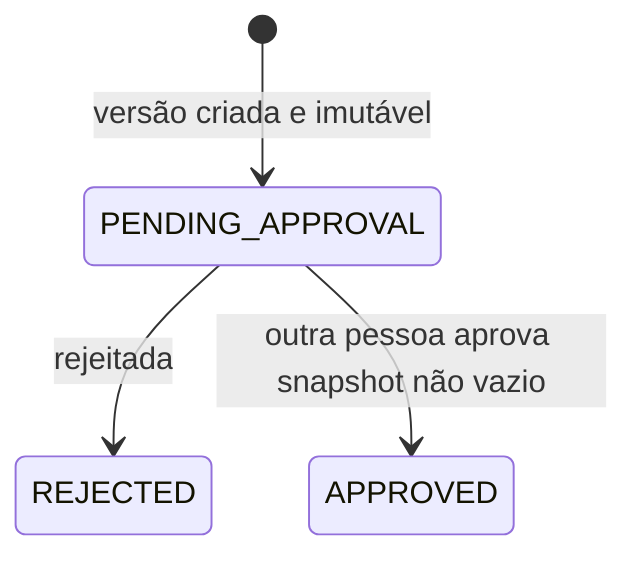
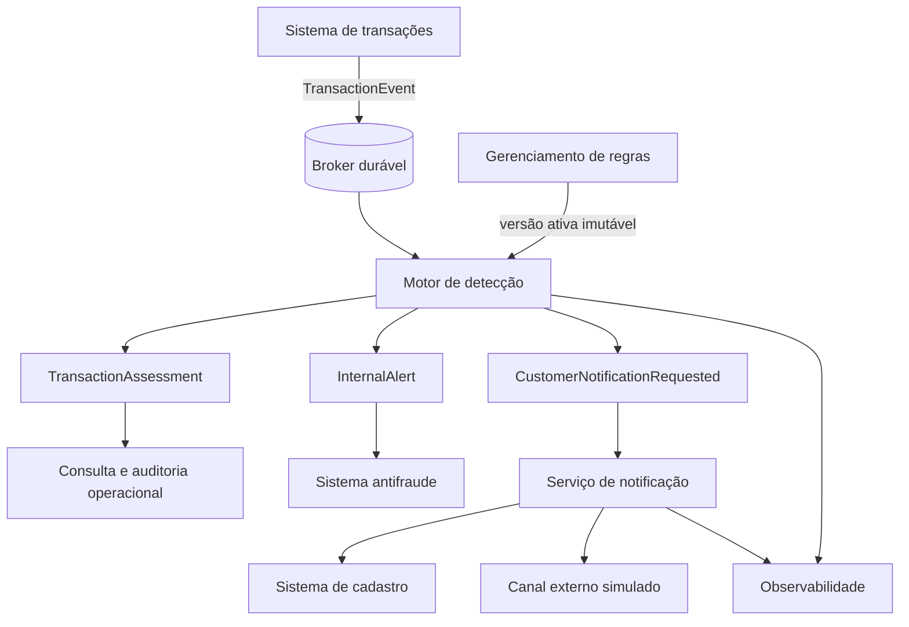
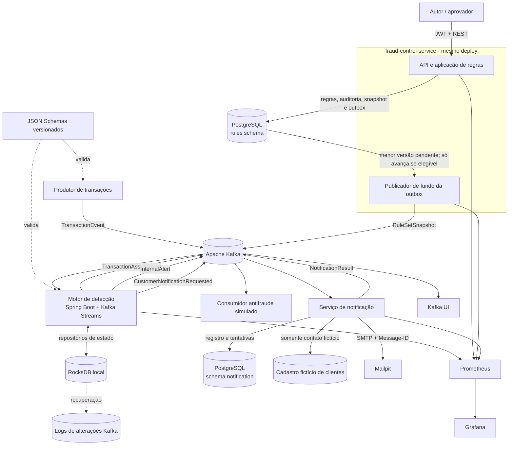
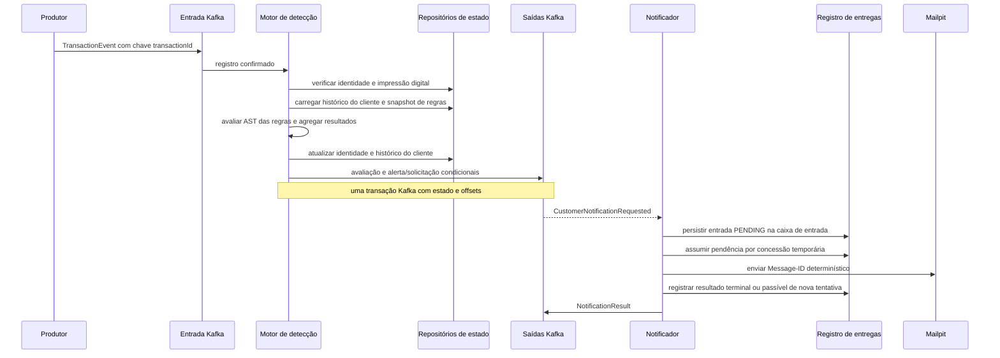
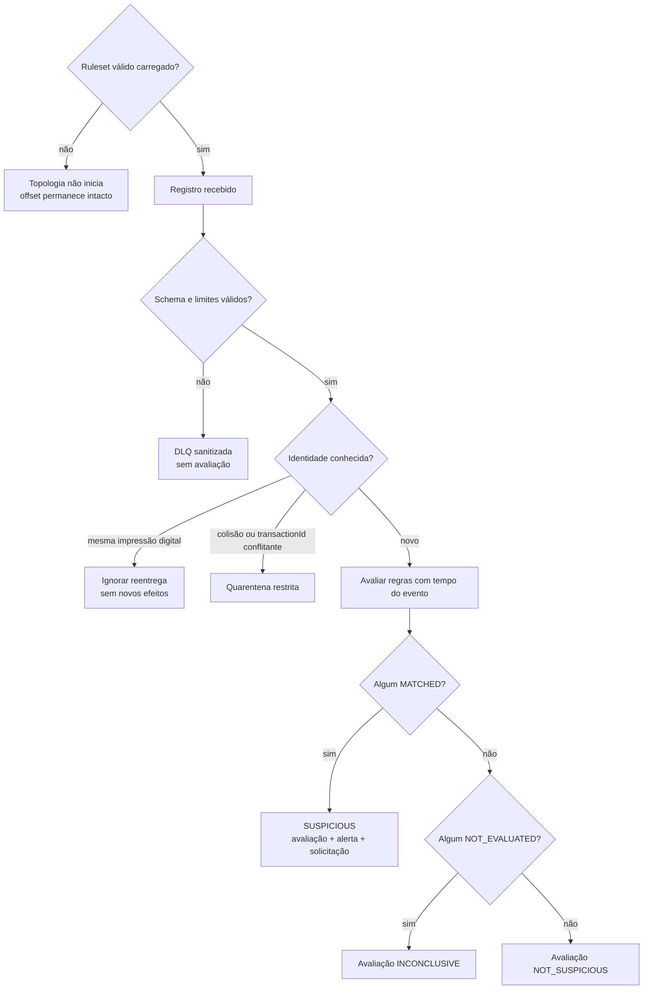
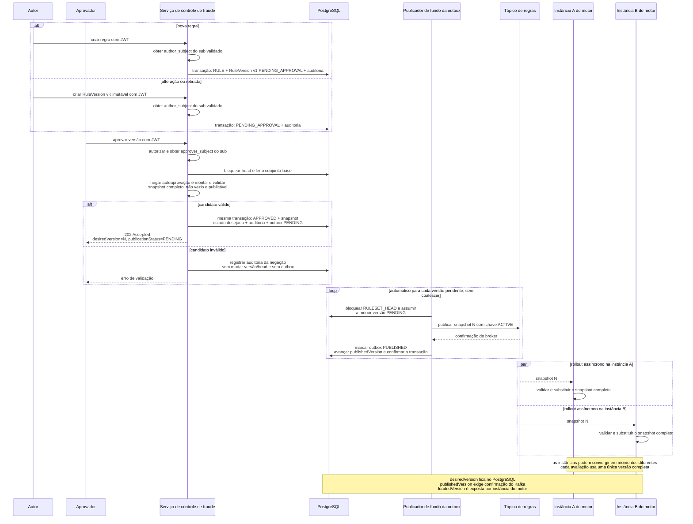
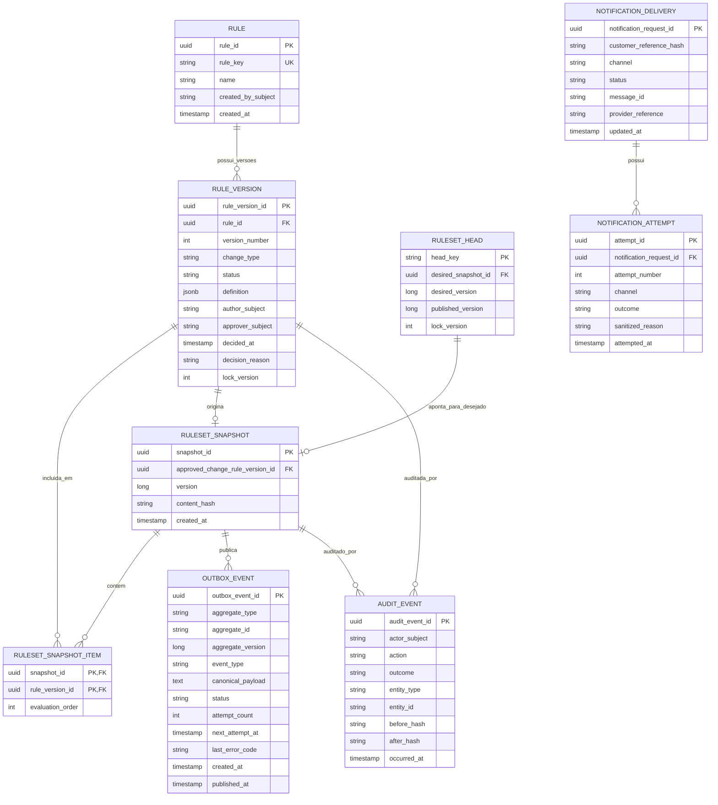
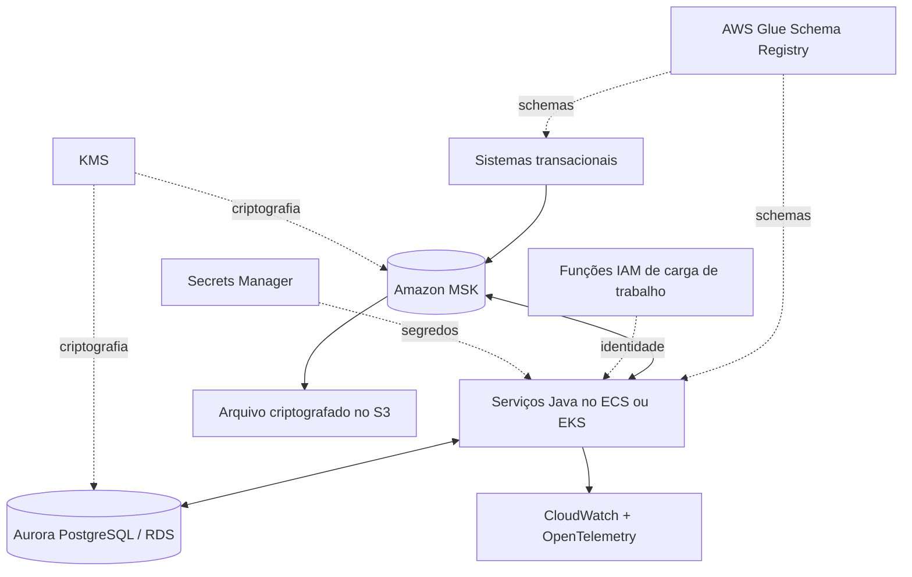

# Motor de Detecção de Transações Suspeitas - Plano

## Resumo do objetivo

- **Objetivo:** Permitir que sistemas antifraude identifiquem transações suspeitas em tempo real, recebam evidências explicáveis e notifiquem o cliente sem colocar o motor no caminho de autorização da transação.
- **Meios:** Construir uma fatia vertical em Java 21 com Spring Boot e Kafka Streams, apoiada por PostgreSQL, contratos JSON versionados e ferramentas Python de teste (KTD1, KTD2, KTD3, KTD4).
- **Autoridade do produto:** Requisitos do case técnico e decisões de escopo confirmadas durante o refinamento.
- **Perfil de execução:** Plano aprofundado de implementação em código; os experimentos de carga e falha executam fora da etapa comum de CI.
- **Condições de conclusão:** Todos os requisitos aplicáveis ao MVP, cenários de aceite, etapas de verificação e documentação devem estar atendidos; nenhum resultado de benchmark pode ser apresentado como certificação produtiva.
- **Responsabilidade pelo acabamento:** A execução inclui remoção de tentativas abandonadas, atualização dos diagramas e registro dos resultados reais de testes e benchmarks.

### Compromisso de autoria e aprendizagem

- Pelo menos duas classes relevantes da solução serão implementadas integralmente pelo autor do case. Nessas classes, a IA poderá explicar requisitos, esclarecer conceitos e revisar o resultado posteriormente, mas não gerará a implementação.
- As duas classes serão escolhidas antes da unidade correspondente, terão responsabilidade de domínio ou infraestrutura não trivial e serão identificadas na declaração final de uso de IA.

### Política global de TDD

- A implementação seguirá o ciclo vermelho-verde-refatoração em fatias verticais: um comportamento observável e um teste por vez, seguidos pelo código mínimo para fazê-lo passar.
- Os testes priorizarão interfaces públicas e comportamento, evitando acoplamento a métodos privados, estrutura interna ou mocks de colaboradores internos.
- Refatorações ocorrerão somente com a suíte verde, e cada unidade registrará os comandos e resultados que comprovam o ciclo.

---

## Contrato do produto

> **Nota de preservação:** O contrato do produto foi alterado em A2, R8, R9, R12, F4 e AE13-AE15 por decisões explícitas do autor do case: a criação já produz uma versão imutável pendente; sua aprovação valida integralmente a mudança, cria atomicamente um snapshot desejado não vazio e sua outbox; e as identidades administrativas vêm exclusivamente do `sub` do JWT validado. Foram removidas a submissão e a ativação manual separadas, sem enfraquecer a proibição de autoaprovação.

### Resumo

O plano implementa todo o escopo do brainstorm em um monorepo com três aplicações Java, Kafka Streams no plano de dados e ferramentas Python para testes de sistema e carga. O ambiente local torna avaliações, alertas, métricas e notificações inspecionáveis, enquanto as integrações AWS e os controles bancários completos permanecem documentados como arquitetura produtiva.

### Contexto do problema

Sistemas transacionais do banco precisam emitir eventos para detecção sem assumir dependência síncrona de um motor antifraude. O motor deve sustentar alta vazão e baixa latência, manter consistência após falhas, evitar efeitos duplicados, preservar dados pessoais e integrar sistemas internos heterogêneos.

O desafio exige profundidade no núcleo de processamento e clareza sobre operação em produção, mas não uma reprodução completa da infraestrutura corporativa. O escopo deve produzir evidência executável para as propriedades mais importantes e documentar os controles produtivos que não cabem no ambiente local.

### Atores

- A1. **Sistema produtor de transações:** publica eventos imutáveis no contrato canônico de entrada.
- A2. **Pessoa autora ou aprovadora de regras:** cria uma versão imutável de inclusão, alteração ou retirada, ou aprova uma versão criada por outra pessoa. A aprovação solicita automaticamente sua propagação; uma mesma identidade pode acumular permissões, mas nunca aprovar a própria alteração.
- A3. **Motor de detecção:** avalia cada evento aceito e publica resultados explicáveis.
- A4. **Sistema ou equipe antifraude:** consome alertas internos detalhados e fornece resultados posteriores de investigação.
- A5. **Serviço de notificação:** consome solicitações sanitizadas, resolve o canal do cliente e controla a entrega externa.
- A6. **Sistema de cadastro de clientes:** mantém dados de contato fora do domínio do motor e os fornece somente ao notificador autorizado.
- A7. **Cliente final:** recebe comunicação segura sobre uma transação suspeita.
- A8. **Equipe de SRE:** monitora disponibilidade, desempenho, qualidade das regras e recuperação após incidentes.
- A9. **Auditoria, Segurança e Compliance:** definem políticas de acesso, retenção e tratamento de dados e consultam evidências autorizadas.

### Decisões principais

- **Detecção assíncrona.** (decisão consolidada na sessão: direcionada pelo usuário — escolhida em vez do bloqueio síncrono da autorização porque o case pede detecção e alerta, e manter o motor fora do caminho de autorização isola a disponibilidade das transações.) Rege R1, R3, R27.
- **Resultado para toda transação e alerta somente para suspeitas.** (decisão consolidada na sessão: aprovada pelo usuário — escolhida em vez de publicar apenas resultados suspeitos porque um fluxo completo de avaliações melhora a auditabilidade e a integração com consumidores.) Rege R3, R4.
- **Um evento imutável por transação.** (decisão consolidada na sessão: direcionada pelo usuário — escolhida em vez de eventos de ciclo de vida da transação porque o MVP favorece um contrato delimitado e o tratamento explícito de conflitos.) Rege R1, R14, R15.
- **Regras determinísticas no MVP.** (decisão consolidada na sessão: direcionada pelo usuário — escolhida em vez de um modelo de aprendizado de máquina online porque regras determinísticas sem estado e com estado oferecem explicabilidade e validam o núcleo de streaming dentro do prazo.) Rege R7, R13.
- **Aprovação promove a mudança automaticamente.** (session-settled: user-directed — chosen over explicit submission and manual activation steps: the MVP preserves four-eyes approval without adding workflow ceremony.) A aprovação persiste o novo estado desejado e a outbox na mesma transação; a distribuição posterior é automática e observável. No máximo uma versão pode permanecer `PENDING_APPROVAL` por regra, impedindo que uma aprovação tardia restaure uma proposta obsoleta. Rege R8-R12.
- **O conjunto ativo nunca fica vazio.** (session-settled: user-approved — chosen over accepting an empty ruleset: an empty set could silently classify every transaction as `NOT_SUSPICIOUS`.) A aprovação de uma retirada que removeria a última regra ativa é negada antes de qualquer alteração de estado ou outbox. Rege R8, R12, R13.
- **Identidades administrativas vêm do JWT.** (session-settled: user-approved — chosen over accepting subjects supplied by the client: the validated `sub` is the authoritative identity for authorship, approval and audit.) Os DTOs de escrita não aceitam `author_subject`, `approver_subject` nem ator de auditoria informados no corpo. Rege R9, R29.
- **Estado gerenciado pelo processador e particionado por cliente.** (decisão consolidada na sessão: aprovada pelo usuário — escolhida em vez de Redis no caminho crítico porque o estado local particionado por chave evita uma dependência remota para cada transação.) Rege R19, R26.
- **Tempo do evento com resposta imediata.** (decisão consolidada na sessão: aprovada pelo usuário — escolhida em vez de usar somente tempo de processamento e esperar o fechamento completo da janela porque as janelas de negócio continuam significativas sem sacrificar a meta de latência.) Rege R20, R21, R22, R27.
- **Efeitos efetivamente uma vez.** (decisão consolidada na sessão: aprovada pelo usuário — escolhida em vez de afirmar processamento global exatamente uma vez porque a atomicidade da plataforma depende da meta de latência, enquanto identidade determinística e idempotência protegem as fronteiras externas.) Rege R14, R16, R17, R18.
- **Dois níveis de alerta.** (decisão consolidada na sessão: aprovada pelo usuário — escolhida em vez de expor um alerta rico a todos os consumidores porque a investigação interna recebe evidências enquanto a comunicação com o cliente permanece sanitizada.) Rege R4, R5.
- **Dados de contato fora do motor.** (decisão consolidada na sessão: aprovada pelo usuário — escolhida em vez de incluir dados de contato nos alertas porque a fronteira de notificação impõe limitação de finalidade e reduz a exposição.) Rege R5, R28.
- **Segurança produtiva especificada por fronteira.** (decisão consolidada na sessão: aprovada pelo usuário — escolhida em vez de reproduzir localmente todos os controles corporativos porque controles representativos continuam executáveis sem prejudicar a clareza do desenho produtivo.) Rege R29, R35.
- **Integração por contratos canônicos e adaptadores.** (decisão consolidada na sessão: aprovada pelo usuário — escolhida em vez de acoplamento direto aos sistemas internos porque produtores e consumidores podem evoluir sem alterar a semântica das regras.) Rege R1, R31, R32.
- **Fatia vertical em um monorepo.** (decisão consolidada na sessão: direcionada pelo usuário — escolhida em vez de um ecossistema poliglota de microsserviços e uma entrega somente arquitetural porque um fluxo executável maximiza profundidade, reprodutibilidade e domínio do código.) Rege R6, R35, R36, R37.

### Requisitos

**Detecção e saídas**

- R1. O motor deve consumir em tempo real um evento canônico, versionado e imutável por transação a partir de um broker de eventos durável.
- R2. O evento deve conter somente identificadores opacos e atributos necessários às regras, incluindo identidade do evento e da transação, cliente, valor, moeda, horário e contexto transacional aplicável.
- R3. Cada evento aceito deve produzir um `TransactionAssessment` com estado `NOT_SUSPICIOUS`, `SUSPICIOUS` ou `INCONCLUSIVE`; o resultado não representa autorização nem legitimidade definitiva da transação.
- R4. Uma avaliação suspeita deve produzir um único `InternalAlert` consolidado e uma única `CustomerNotificationRequested`, ambos relacionados pelo mesmo `alertId`.
- R5. O alerta interno deve conter as regras e evidências acionadas, enquanto a solicitação externa deve conter apenas referência opaca do cliente, categoria segura e referência de template.
- R6. O MVP deve demonstrar a entrega externa com dados fictícios e uma caixa de e-mail local, incluindo resultado de envio observável.

**Regras e governança**

- R7. O motor deve executar regras declarativas sem estado e com estado, usando limites, comparações e composições `AND`/`OR`, permitindo criar novos padrões dentro das primitivas suportadas sem nova implantação.
- R8. Inclusão, alteração ou retirada deve nascer como versão imutável pendente. Cada regra admite no máximo uma versão em `PENDING_APPROVAL`; uma nova proposta para a mesma regra só pode ser criada depois da decisão sobre a anterior. A aprovação por outra pessoa deve validar integralmente a mudança, registrar a decisão, criar um novo snapshot desejado com pelo menos uma regra ativa e inserir sua outbox na mesma transação; não haverá submissão nem ativação manual separadas no MVP.
- R9. A mesma pessoa não deve aprovar a própria alteração de regra. `author_subject`, `approver_subject` e o ator de cada auditoria administrativa devem ser derivados exclusivamente do `sub` do JWT validado, nunca de campos enviados pelo cliente.
- R10. O motor deve trocar o conjunto ativo de regras atomicamente para novas avaliações.
- R11. Uma indisponibilidade do gerenciamento deve manter o último conjunto válido em execução; idade acima do limite operacional configurado gera alerta sem tornar automaticamente a instância indisponível.
- R12. Um conjunto válido deve conter pelo menos uma regra ativa; uma instância sem esse conjunto não deve ficar pronta.
- R13. Cada regra deve produzir resultado individual explicável; qualquer `MATCHED` torna a avaliação suspeita, a severidade final é a maior encontrada e o alerta consolida todas as correspondências.



`APPROVED` registra uma decisão de governança concluída; não afirma que todas as instâncias do motor já carregaram o novo conjunto. A participação ativa de uma versão é derivada dos itens do snapshot desejado mais recente, enquanto publicação e carregamento são acompanhados separadamente. Uma versão rejeitada não é editada ou reenviada: a correção cria uma nova versão imutável.

**Consistência, tempo e estado**

- R14. Dentro do horizonte online configurado de identidade, o motor deve deduplicar reentregas por `eventId` sem repetir saídas; além dele, IDs determinísticos e consumidores idempotentes impedem a repetição do efeito de negócio, e replay deliberado usa namespace isolado.
- R15. O mesmo `transactionId` com outro `eventId` deve ser tratado como conflito de dados.
- R16. Avaliações, alertas e notificações devem usar identificadores determinísticos e consumidores idempotentes.
- R17. O MVP deve manter habilitada a atomicidade do processador para coordenar offsets, estado e saídas Kafka; se o benchmark local não atingir R27, o desvio será registrado como limitação medida e não justificará remover silenciosamente a garantia.
- R18. Integrações externas devem reconciliar resultados ambíguos antes de repetir um efeito.
- R19. O fluxo principal deve ser particionado por `customerId` e manter estado de janela com TTL no processador, sem consulta remota obrigatória por transação.
- R20. Regras temporais devem usar `occurredAt`, aceitar uma pequena desordem configurável e processar automaticamente eventos atrasados.
- R21. Um evento antigo demais para o histórico disponível deve tornar `NOT_EVALUATED` as regras com estado afetadas.
- R22. Eventos atrasados não devem reabrir avaliações anteriores automaticamente no MVP.

**Resiliência e capacidade**

- R23. Uma falha temporária de dependência deve preservar as avaliações possíveis, usar cache válido quando disponível e resultar em `INCONCLUSIVE` quando não for seguro concluir `NOT_SUSPICIOUS`.
- R24. Falhas transitórias devem usar novas tentativas limitadas, espera progressiva (`backoff`), disjuntor (`circuit breaker`) e DLQ.
- R25. Conflitos estruturais devem seguir quarentena restrita com investigação e reexecução controlada.
- R26. A arquitetura deve escalar horizontalmente para média de 8.000 TPS e picos de 25.000 TPS, expondo distribuição por partição, atraso dos consumidores, crescimento de estado e chaves sobrecarregadas.
- R27. O SLO produtivo deve ser de 99,9% das avaliações e alertas internos publicados de forma durável em até 500 ms após o recebimento; a entrega externa fica fora dessa janela.

**Segurança, privacidade e retenção**

- R28. O motor deve aplicar minimização e pseudonimização, excluir dados de contato do seu domínio e impedir que payloads ou logs exponham CPF, conta, cartão, e-mail ou telefone.
- R29. A arquitetura produtiva deve definir TLS em cada trânsito, criptografia em repouso, identidade de carga de trabalho, autorização de menor privilégio por serviço e tópico, gestão e rotação de segredos, auditoria e proteção equivalente para DLQ, quarentena, logs e rastros.
- R30. Avaliações e alertas devem ter retenção operacional e arquivamento protegido por períodos configuráveis, seguidos de eliminação ou anonimização conforme política institucional; o pipeline completo de arquivamento não pertence ao MVP.

**Integrações e operação**

- R31. Entrada e saídas devem usar contratos canônicos versionados e adaptadores substituíveis para evitar acoplamento da lógica de regras aos sistemas integrados.
- R32. Evolução de schema, testes de contrato e identidade de correlação devem proteger a compatibilidade e a rastreabilidade das integrações.
- R33. SRE deve observar métricas, logs estruturados e rastros correlacionados para disponibilidade, vazão, latência, atraso de consumo, erros, regras acionadas, `INCONCLUSIVE`, duplicidades, falhas de dependência, idade/versão do snapshot e recuperação do acúmulo.
- R34. O sistema deve distinguir anomalias imediatas de volume de falsos positivos confirmados e prever feedback `FRAUD`, `LEGITIMATE` ou `UNKNOWN` vindo de investigação, cliente ou sistemas posteriores.
- R35. A estratégia de qualidade deve cobrir testes unitários, contratos, integração, componente, ponta a ponta, fumaça, segurança, resiliência, desempenho e backtest.
- R36. Testes de carga e falha devem executar separadamente da etapa comum de CI e registrar ambiente, configuração e resultados.
- R37. O repositório deve fornecer execução reproduzível, decisões e trade-offs, diagramas, limitações e uso transparente de IA, mantendo explicações necessárias para que o responsável pelo case domine o comportamento entregue.
- R38. Backtest e reprocessamento devem permanecer capacidades arquiteturais explícitas e acionadas sobre intervalos delimitados, sem enviar notificações externas automaticamente; sua automação completa fica fora do MVP.

### Fluxo do sistema



### Fluxos principais

- F1. **Avaliação normal**
  - **Gatilho:** A1 publica uma transação válida.
  - **Atores:** A1, A3.
  - **Etapas:** O motor valida e deduplica o evento, consulta o estado do cliente, aplica o conjunto ativo e publica a avaliação.
  - **Resultado:** Existe um resultado explicável dentro da fronteira de latência.
  - **Abrange:** R1, R3, R10, R11, R12, R13, R27.
- F2. **Transação suspeita e notificação**
  - **Gatilho:** Pelo menos uma regra retorna `MATCHED`.
  - **Atores:** A3, A4, A5, A6, A7.
  - **Etapas:** O motor publica a avaliação, o alerta interno consolidado e a solicitação sanitizada; o notificador resolve o contato fora do motor e controla a entrega.
  - **Resultado:** A equipe recebe evidências detalhadas e o cliente recebe comunicação sem exposição da lógica antifraude.
  - **Abrange:** R4, R5, R6, R16, R18, R28.
- F3. **Reentrega e conflito**
  - **Gatilho:** Um evento já visto ou uma nova identidade de evento para a mesma transação chega ao motor.
  - **Atores:** A1, A3, A8.
  - **Etapas:** A reentrega retorna os mesmos efeitos; a identidade conflitante é isolada e observada para investigação.
  - **Resultado:** Nenhum alerta ou envio externo é duplicado.
  - **Abrange:** R14, R15, R16, R24, R25, R33.
- F4. **Mudança de regra**
  - **Gatilho:** A2 propõe uma nova regra ou versão.
  - **Atores:** A2, A3, A9.
  - **Etapas:** A criação persiste uma versão imutável pendente e associa ao `sub` autenticado sua autoria e auditoria. Uma segunda pessoa solicita a aprovação; antes de alterar qualquer estado, o serviço valida a AST, os limites, o contrato, a serialização canônica e que o snapshot candidato contém ao menos uma regra. A mesma transação registra o aprovador autenticado e a auditoria, monta o novo snapshot completo desejado e cria a outbox. O publicador propaga automaticamente todos os snapshots em ordem, e cada instância do motor valida e troca atomicamente o conjunto usado pelas novas avaliações.
  - **Resultado:** A mudança ocorre sem nova implantação, preserva histórico e pode ser retirada com rapidez.
  - **Abrange:** R7, R8, R9, R10, R11.
- F5. **Falha de dependência**
  - **Gatilho:** Gerenciamento de regras, notificador ou outra dependência fica indisponível.
  - **Atores:** A3, A5, A8.
  - **Etapas:** O motor usa estado válido local, mantém avaliações possíveis e publica `INCONCLUSIVE` quando necessário; entregas externas seguem novas tentativas e reconciliação independentes.
  - **Resultado:** A ingestão continua sem fabricar resultado seguro ou duplicar efeitos.
  - **Abrange:** R11, R12, R16, R18, R23, R24.
- F6. **Evento atrasado**
  - **Gatilho:** Um evento chega fora de ordem.
  - **Atores:** A1, A3, A8.
  - **Etapas:** O motor o processa automaticamente pelo horário de ocorrência, atualiza o estado futuro e registra a condição; histórico insuficiente impede somente as regras com estado afetadas.
  - **Resultado:** O evento não é descartado silenciosamente e avaliações passadas não são reabertas no MVP.
  - **Abrange:** R20, R21, R22, R23, R33, R38.
- F7. **Incidente de qualidade**
  - **Gatilho:** Métricas mostram crescimento atípico de alertas ou feedback posterior confirma baixa qualidade.
  - **Atores:** A2, A4, A8.
  - **Etapas:** A equipe identifica as regras responsáveis, investiga o contexto e retira ou substitui a versão ativa.
  - **Resultado:** O impacto é contido e permanece auditável sem classificar toda anomalia como falso positivo.
  - **Abrange:** R8, R10, R33, R34.

### Exemplos de aceite

- AE1. **Transação normal.** **Abrange R3.** Dado um evento válido que não aciona regras, quando ele é avaliado, então uma avaliação `NOT_SUSPICIOUS` é publicada e nenhum alerta é criado.
- AE2. **Múltiplas correspondências.** **Abrange R4, R13.** Dado que regras `HIGH` e `CRITICAL` acionam na mesma transação, quando a avaliação termina, então existe um alerta consolidado com ambas e severidade final `CRITICAL`.
- AE3. **Reentrega idêntica.** **Abrange R14, R16.** Dado o mesmo `eventId` recebido mais de uma vez dentro do horizonte online de identidade, quando as entregas são processadas, então ocorre somente o conjunto de saídas da primeira avaliação; alerta e notificação existem apenas quando essa avaliação é suspeita.
- AE4. **Identidade conflitante.** **Abrange R15, R25.** Dado o mesmo `transactionId` com outro `eventId`, quando o segundo evento chega, então ele é tratado como conflito e não produz uma segunda decisão silenciosa.
- AE5. **Autoaprovação.** **Abrange R9.** Dado que uma pessoa criou uma versão, quando tenta aprová-la, então a operação é negada e auditada.
- AE6. **Gerenciamento indisponível.** **Abrange R11, R12, R23.** Dado um conjunto válido já carregado, quando o serviço de regras fica indisponível, então o motor continua com a última versão; uma instância vazia permanece não pronta.
- AE7. **Notificador indisponível.** **Abrange R6, R16, R18, R23.** Dado um alerta suspeito, quando o canal externo falha temporariamente, então o alerta interno permanece publicado e a entrega é retomada sem duplicação.
- AE8. **Evento atrasado recuperável.** **Abrange R20.** Dado um evento fora de ordem ainda coberto pelo estado, quando chega, então é avaliado automaticamente, marcado como atrasado e passa a contribuir para avaliações futuras.
- AE9. **Histórico insuficiente.** **Abrange R3, R21, R23.** Dado um evento antigo demais para uma regra com estado e nenhuma correspondência conclusiva, quando é avaliado, então o resultado é `INCONCLUSIVE`, não `NOT_SUSPICIOUS`.
- AE10. **Minimização de dados.** **Abrange R2, R5, R28.** Dado o fluxo completo, quando payloads e logs são inspecionados, então somente o notificador autorizado acessa o contato fictício e o motor não contém esse dado.
- AE11. **Carga reproduzível.** **Abrange R26, R27, R33, R35, R36.** Dado um perfil documentado de carga, quando o teste executa, então registra vazão, percentis de latência, atraso de consumo, recursos e efeitos duplicados com identificação do ambiente.
- AE12. **Integração substituível.** **Abrange R31, R32.** Dado um consumidor interno compatível com o contrato versionado, quando ele é conectado por outro adaptador, então a lógica das regras não precisa mudar.
- AE13. **Aprovação e rollout assíncrono.** **Abrange R8-R12.** Dada uma versão pendente criada por outra pessoa, quando o aprovador a aprova, então a API retorna `202 Accepted` com o snapshot desejado e a publicação pendente. Cada instância continua usando seu último snapshot válido até receber, validar e trocar para a nova versão; uma republicação idêntica não causa segunda troca lógica.
- AE14. **Conjunto de regras não vazio.** **Abrange R8, R12, R13.** Dado que uma retirada eliminaria a última regra ativa, quando sua aprovação é solicitada, então a operação registra a auditoria da negação, mas não altera versão, head ou snapshot nem cria outbox; o último conjunto válido permanece em uso.
- AE15. **Proveniência da identidade administrativa.** **Abrange R9, R29.** Dado um token JWT válido, quando uma regra é criada, aprovada ou rejeitada, então autoria, aprovação e ator da auditoria correspondem ao `sub` autenticado; campos de identidade enviados no corpo são rejeitados e não podem falsificar a trilha.

### Critérios de sucesso

- O ambiente local executa o fluxo da transação até a avaliação, o alerta interno e o e-mail fictício com instruções reproduzíveis.
- O teste funcional não perde eventos únicos aceitos nem produz efeitos de negócio duplicados nos cenários de reentrega cobertos.
- O benchmark publica p50, p95, p99, p99.9, máximo, vazão, atraso de consumo e uso de recursos para carga sustentada e de pico.
- A arquitetura demonstra como escalar para 8.000 TPS médios e 25.000 TPS de pico e identifica limites do hardware local.
- Falhas simuladas mostram recuperação do estado e redução posterior do backlog sem corromper as saídas.
- Segurança, privacidade, integração, operação e retenção têm controles produtivos rastreáveis e simplificações locais declaradas.
- A documentação permite relacionar requisitos, decisões, fluxos, testes, limitações e evoluções sem depender de conhecimento implícito.

### Limites de escopo

**Incluído no MVP**

- Motor determinístico com estado, broker, gerenciamento simplificado de regras, contratos de saída, persistência operacional e observabilidade essencial.
- Entrega externa local simulada, carga e análise por ferramentas Python, testes automatizados e experimentos separados de resiliência e desempenho.
- Documentação da arquitetura produtiva, ameaças e controles, trade-offs, capacidade, operação e uso de IA.

**Adiado para depois**

- Aprendizado de máquina online, repositório compartilhado de características, serviço Python de decisão, modo sombra completo e pontuação ponderada ou híbrida.
- Motor síncrono no fluxo de autorização, respostas `approve/challenge/block` e políticas fail-open ou fail-closed.
- Reprocessamento e backtest automatizados, correção retroativa de avaliações e feedback real de sistemas de investigação ou contestação.
- Distribuição adaptativa de chaves sobrecarregadas (`salting`), agregação em dois estágios e múltiplos fluxos reparticionados por entidade.
- Infraestrutura multi-região, arquivamento automatizado, integração com provedor externo real e segurança corporativa completa no ambiente local.
- UI para regras, investigação, operação ou visualização de alertas.

### Dependências e premissas

- O produtor gera `eventId` e `transactionId` estáveis e publica o evento semanticamente correto por outbox transacional ou mecanismo equivalente.
- O broker é a entrada canônica e oferece retenção suficiente para reexecução e recuperação.
- O `customerId` é opaco e adequado ao particionamento; o contrato não transporta dados cadastrais desnecessários.
- O sistema de cadastro e os canais internos reais do banco serão representados por contratos e adaptadores simulados no MVP.
- O limite de 500 ms começa no recebimento pelo motor e termina na publicação durável da avaliação e do alerta interno.
- Prazos de retenção e tolerância a atraso são configuráveis e, em produção, dependem de políticas institucionais e requisitos regulatórios.
- Resultados obtidos em uma única máquina são evidência do comportamento do MVP, não certificação de capacidade produtiva.

### Fontes e pesquisa

- [Lei Geral de Proteção de Dados Pessoais](https://www.planalto.gov.br/ccivil_03/_ato2015-2018/2018/lei/l13709compilado.htm)
- [Glossário da ANPD](https://www.gov.br/anpd/pt-br/documentos-e-publicacoes/glossario-anpd)
- [Garantias de processamento do Apache Kafka Streams](https://kafka.apache.org/42/streams/core-concepts/)
- [Configuração do Apache Kafka Streams](https://kafka.apache.org/42/streams/developer-guide/config-streams/)
- [Testes do Apache Kafka Streams](https://kafka.apache.org/42/streams/developer-guide/testing/)
- [Estado global do Apache Kafka Streams](https://kafka.apache.org/42/javadoc/org/apache/kafka/streams/Topology.html)
- [GlobalKTable do Apache Kafka Streams](https://kafka.apache.org/42/javadoc/org/apache/kafka/streams/kstream/GlobalKTable.html)
- [Ciclo de vida do Kafka Streams](https://kafka.apache.org/42/javadoc/org/apache/kafka/streams/KafkaStreams.html)
- [Visão geral de segurança do Apache Kafka](https://kafka.apache.org/42/security/security-overview/)
- [Controle de acesso IAM do Amazon MSK](https://docs.aws.amazon.com/msk/latest/developerguide/iam-access-control.html)
- [AWS Glue Schema Registry](https://docs.aws.amazon.com/glue/latest/dg/schema-registry.html)
- [JSON Schema](https://json-schema.org/)
- [Requisitos de sistema do Spring Boot 3.5](https://docs.spring.io/spring-boot/3.5/system-requirements.html)
- [Suporte do Spring Boot ao Kafka](https://docs.spring.io/spring-boot/reference/messaging/kafka.html)
- [Motor de regras Drools](https://kie.apache.org/docs/10.0.x/drools/drools/rule-engine/index.html)
- [Padrão Outbox Transacional na AWS](https://docs.aws.amazon.com/prescriptive-guidance/latest/cloud-design-patterns/transactional-outbox.html)
- [Módulo Kafka do Testcontainers](https://java.testcontainers.org/modules/kafka/)

---

## Contrato de planejamento

### Decisões técnicas principais

- KTD1. **Ambiente de execução e build.** Java 21, Maven Wrapper e Spring Boot 3.5.x formarão a base das aplicações; o POM pai fixará a última versão de correção validada antes do primeiro código. Python 3.11 será usado somente em ferramentas de sistema e carga. Essa linha evita o risco de adoção imediata do Spring Boot 4 e permanece compatível com a máquina de desenvolvimento. Rege R35, R36, R37.
- KTD2. **Três aplicações no mesmo monorepo.** (decisão consolidada na sessão: aprovada pelo usuário — escolhida em vez de uma aplicação única ou repositórios separados porque separar plano de dados, plano de controle e notificador isola falhas, enquanto um repositório único mantém o case reproduzível.) `detection-engine`, `fraud-control-service` e `notification-service` serão unidades implantáveis independentes. Bibliotecas compartilhadas se limitarão aos contratos e ao suporte de testes. Rege R6, R11, R31, R35, R37.
- KTD3. **Kafka Streams como processador com estado.** (decisão consolidada na sessão: aprovada pelo usuário — escolhida em vez de Apache Flink e de um consumidor Spring Kafka convencional porque Kafka Streams fornece estado recuperável particionado por chave e atomicidade Kafka com uma superfície operacional menor e sem atraso de saída condicionado a checkpoints.) O motor usará a Processor API onde for necessário consultar stores por tempo e a DSL somente onde ela mantiver a semântica explícita. Rege R1, R17, R19, R20, R26, R27.
- KTD4. **JSON Schema Draft-07 e records manuais.** (decisão consolidada na sessão: aprovada pelo usuário — escolhida em vez de Avro com registro local e classes Java geradas porque contratos legíveis e records manuais mantêm o MVP transparente e compatível com o AWS Glue Schema Registry.) Jackson fará a serialização e desserialização JSON, e um validador compatível com Jackson 2 validará schemas compilados uma vez na inicialização. Testes de contrato impedirão divergência entre schemas, exemplos e records. Rege R1, R2, R5, R28, R31, R32.
- KTD5. **Contratos monetários e temporais sem ambiguidade.** Valores usarão inteiros na menor unidade monetária, moedas usarão ISO-4217 e horários usarão UTC `Instant`. IDs serão opacos e limitados em tamanho. Não haverá conversão cambial no MVP, e uma agregação não misturará moedas. Rege R2, R7, R20, R28, R32.
- KTD6. **Atomicidade Kafka habilitada desde o início.** `exactly_once_v2` envolverá o offset de entrada, os repositórios de estado e todas as saídas Kafka da avaliação. Consumidores lerão somente dados confirmados. O broker único local configurará o fator de replicação e o ISR mínimo do log de estado transacional como 1; produção manterá replicação resiliente. Mesmo que o benchmark local exceda 500 ms, a garantia permanecerá habilitada e o resultado será relatado como limitação medida; qualquer revisão futura dessa decisão exigiria novo contrato de consistência, não um ajuste oculto de desempenho. Rege R4, R14, R16, R17, R27.
- KTD7. **Integridade global antes do particionamento por cliente.** O tópico de entrada usará `transactionId` como chave. O primeiro estágio detectará conflitos da transação; em seguida, um reparticionamento explícito por `eventId` alimentará um repositório globalmente particionado de impressões digitais; por fim, eventos novos serão reparticionados por `customerId`. O mesmo evento com a mesma impressão digital será duplicata; qualquer colisão de identidade ou conteúdo será conflito. As duas redistribuições adicionais compram a garantia executável de R14/R15 e terão seu custo de latência medido. Rege R14, R15, R16, R19, R25, R27.
- KTD8. **IDs separados para o fluxo online e o backtest.** No fluxo online, `assessmentId` será determinístico a partir de `eventId`; `alertId` derivará de `assessmentId`; e `notificationRequestId` derivará somente de `alertId`. (session-settled: user-approved — chosen over deriving the request identity from `alertId` plus channel: the detection engine does not resolve the delivery channel.) O notificador escolhe o canal posteriormente e o registra na entrega e em cada tentativa. Um backtest usará `runId`, `eventId` e `rulesetVersion` em espaço de nomes próprio para não colidir com a avaliação online. Rege R4, R14, R16, R18, R38.
- KTD9. **DSL segura em vez de Drools no MVP.** (decisão consolidada na sessão: aprovada pelo usuário — escolhida em vez de carregar DRL ou expressões arbitrárias porque uma AST tipada com lista de permissões é mais fácil de limitar, explicar e integrar ao estado do Kafka.) A DSL suportará comparação de atributo, limite monetário, contagem e soma por janela, além de `AND` e `OR`. Não aceitará scripts, SpEL, reflexão ou ações executáveis. Limites cobrirão payload, número de regras, profundidade, condições e tamanho de janela. Rege R7, R13, R29.
- KTD10. **Snapshot completo, não vazio, inicialização bloqueante e rollout observável.** (session-settled: user-approved — chosen over allowing an empty active set: the engine must never interpret absence of policy as a safe transaction.) A aprovação construirá um `RuleSetSnapshot` completo e imutável com pelo menos uma regra ativa, versão monotônica, hash e versões exatas das regras. O JSON Schema usará `minItems: 1`, o serviço de controle recusará a retirada da última regra antes do commit e o motor tratará snapshot vazio como inválido. Identidades administrativas permanecerão no PostgreSQL e na auditoria, sem serem propagadas ao motor. O tópico compactado com chave `ACTIVE` alimentará um repositório global registrado por `Topology.addGlobalStore`; cada instância manterá uma cópia completa, e somente o `RuleSetUpdateProcessor` da thread global poderá gravá-la após desserialização defensiva, validação e compilação. Antes de chamar `KafkaStreams.start()`, um `RuleSetBootstrapLoader` independente, sem commits e com atribuição manual, lerá a partição até seu end offset e exigirá pelo menos um snapshot `ACTIVE` válido e não vazio; sem ele, a topologia de transações não inicia e seus offsets permanecem intocados. O `start()` então restaura o repositório global antes de retornar, repetindo a validação e alcançando qualquer atualização publicada durante a transição. Em cada atualização, a instância valida contrato, hash, versão e limites da DSL antes de substituir o valor completo. Cada avaliação captura uma única referência imutável no início e registra sua `rulesetVersion`. Assim, a troca é atômica por instância e avaliação, mas não é um corte simultâneo global: durante a convergência, instâncias diferentes podem avaliar transações adjacentes com versões consecutivas. O plano distinguirá `desiredVersion` no PostgreSQL, `publishedVersion` confirmada pelo Kafka e `loadedVersion` por instância. Evolução incompatível exige implantar consumidores antes do produtor de regras; o serviço de controle compartilha o validador e recusa schema não suportado. Uma atualização inválida mantém o último snapshot válido; uma instância vazia permanece não pronta até receber uma versão corretiva maior. Rege R8, R10, R11, R12, R13, R28, R32, R33.
- KTD11. **Validação prévia, aprovação transacional e outbox ordenada.** (session-settled: user-directed — chosen over separate submit and activate commands: approval is the single human action that promotes an immutable change.) PostgreSQL foi escolhido em vez de MongoDB ou DynamoDB porque transações relacionais, restrições e JSONB atendem ao fluxo, à auditoria e à outbox sem adicionar outro modelo de persistência. Depois de autenticar, autorizar e negar autoaprovação, o serviço bloqueia `RULESET_HEAD`, monta o snapshot candidato e valida integralmente AST, limites, schema, conjunto não vazio, serialização canônica, hash e tamanho compatível com a configuração do Kafka. Qualquer falha determinística é auditada e aborta a operação antes de mudar o status da `RuleVersion` ou criar snapshot/outbox. Somente então o serviço marca a versão como `APPROVED`, atualiza o estado desejado, grava a auditoria de sucesso e insere o `OutboxEvent` `PENDING` na mesma transação. A API retorna `202 Accepted` sem aguardar Kafka. Um relay automático executado em segundo plano dentro do `fraud-control-service` procura pendências enquanto a aplicação está ativa e considera sempre a menor versão `PENDING`, mesmo quando ela está em backoff. (session-settled: user-approved — chosen over coalescing unpublished snapshots: every approved snapshot is published in monotonic order so the audit trail and the observed rollout remain complete.) Somente se a primeira versão estiver elegível por `next_attempt_at` ele a publica; caso contrário, nenhuma versão posterior avança. Ele pode manter uma transação curta aberta durante o ack Kafka com timeout estrito porque mudanças de regra são raras. Falhas transitórias usam backoff exponencial limitado por um teto, continuam sendo tentadas sem pular a versão e geram alerta crítico quando excedem o limiar operacional. Após o ack, o relay marca outbox e `publishedVersion` na mesma transação. Uma falha entre publicação e commit causa republicação segura da mesma identidade, versão e hash. Rege R8, R9, R10, R11, R29, R31.
- KTD12. **Estado do caminho crítico em RocksDB com log de alterações Kafka.** Repositórios separados manterão integridade e deduplicação, histórico temporal por cliente e último conjunto de regras válido. O horizonte online inicial será 24 horas para identidade, suficiente para reentregas e recuperação operacional do MVP; a maior janela será 10 minutos e a retenção do histórico, 15 minutos. A retenção de sete dias da entrada serve a investigação restrita, não autoriza replay no fluxo online depois que a identidade expira. Backtest ou reprocessamento posterior usa `runId` próprio e mantém notificações externas bloqueadas. Esses valores são demonstrativos e configuráveis. Rege R14, R15, R19, R20, R21, R26, R38.
- KTD13. **Tempo do evento sem espera artificial.** `occurredAt` será o timestamp do registro. A tolerância inicial de atraso será de 2 minutos, a tolerância de futuro será de 1 minuto e eventos não serão retidos aguardando reordenação. Os 2 minutos governam a marcação operacional de atraso e a folga das janelas, não o descarte: um evento mais atrasado que isso, mas ainda coberto pelos 15 minutos de histórico, continua sendo avaliado e marcado. Somente a ausência do histórico exigido produz `NOT_EVALUATED`. Eventos atrasados consultarão fatos com horário menor ou igual ao seu e depois contribuirão para avaliações futuras. Essa interpretação protege o SLO e preserva R20-R22. Rege R20, R21, R22, R27.
- KTD14. **Tabela formal de agregação dos resultados.** A agregação ocorre somente sobre um snapshot válido com ao menos uma regra ativa. Qualquer `MATCHED` produz `SUSPICIOUS`; sem correspondência e com pelo menos um `NOT_EVALUATED` produz `INCONCLUSIVE`; todas as regras aplicáveis em `NO_MATCH` produzem `NOT_SUSPICIOUS`. Evento estruturalmente inválido não é aceito e não produz avaliação. Rege R3, R12, R13, R21, R23.
- KTD15. **Caixa de entrada, supressão e registro de entregas idempotentes no notificador.** O consumidor persistirá uma solicitação `PENDING` com unicidade por `notificationRequestId` antes de confirmar o offset; um despachante separado assumirá pendências por concessão temporária. Antes do canal externo, uma janela configurável por referência opaca de cliente, categoria e canal limitará notificações repetitivas; solicitações excedentes serão registradas como `SUPPRESSED` e publicarão resultado, sem ocultar nem suprimir o alerta interno. O adaptador SMTP usará `Message-ID` determinístico e consultará o Mailpit antes de repetir uma tentativa `SENDING` ambígua. Em produção, o canal deverá oferecer chave de idempotência ou consulta de status; SMTP puro não fornece processamento exatamente uma vez. Rege R6, R16, R18, R23, R24, R28.
- KTD16. **Kafka como log de integração, não como banco de consulta.** (decisão consolidada na sessão: aprovada pelo usuário — escolhida em vez de uma gravação síncrona no PostgreSQL e de um modelo de leitura no MVP porque o Kafka mantém atômica a transação da avaliação e permite que consumidores se recuperem por reexecução.) Kafka UI permitirá inspeção local; Prometheus/Grafana observarão agregados; um projetor para DynamoDB, OpenSearch ou outro modelo de leitura dependerá de consultas reais e fica fora do MVP. Rege R3, R4, R27, R30, R31, R33.
- KTD17. **Falhas classificadas por fronteira.** Payload inválido seguirá para DLQ sanitizada; conflito de identidade seguirá para quarentena restrita; falha transitória do notificador seguirá novas tentativas limitadas e DLQ; erro interno inesperado do motor interromperá a partição e alertará a operação. A quarentena será um registro operacional de referência, não uma fila automática de nova tentativa nem uma segunda cópia do payload: guardará coordenadas do registro original, hashes e códigos de motivo. A investigação decidirá entre descartar o evento inválido ou solicitar ao produtor um evento corrigido; qualquer reexecução será explícita, autorizada e auditada. A retenção do tópico de entrada cobrirá a janela local de investigação da quarentena; em produção, arquivo protegido atenderá períodos maiores. Kafka indisponível pausa o processamento e não fabrica uma avaliação `INCONCLUSIVE`. Rege R23, R24, R25, R29, R33.
- KTD18. **Segurança local representativa e produção completa.** (decisão consolidada na sessão: aprovada pelo usuário — escolhida em vez de reproduzir TLS/IAM corporativo localmente porque autorização executável na API e minimização de dados demonstram as fronteiras sem deslocar o núcleo de streaming.) O ambiente local validará JWT, `iss`, `aud`, expiração e `sub`, aceitará somente um algoritmo assimétrico declarado e chave pública/JWKS configurada, aplicará RBAC, separará redes e credenciais de banco, não versionará segredos e usará dados fictícios. Autoria, aprovação e ator de auditoria serão preenchidos no servidor exclusivamente a partir do `sub` já validado; os DTOs de escrita rejeitarão campos de identidade administrativa informados pelo cliente. Testes de integração gerarão chaves assimétricas efêmeras em diretório temporário. O bootstrap local criará um par RSA e tokens de desenvolvimento para `rule-author` e `rule-approver` sob `.local/security/`, diretório ignorado pelo Git; somente a chave pública será montada no serviço e a chave privada ficará restrita ao emissor local. Produção usará emissor corporativo/JWKS, MSK IAM/TLS, KMS, identidades de carga de trabalho, Secrets Manager e ACLs por tópico. Rege R9, R28, R29, R35.
- KTD19. **Observabilidade sem cardinalidade por cliente.** Micrometer/Prometheus medirá vazão, latência, atraso de consumo, restauração, regras, inconclusivos, conflitos e entregas. Logs JSON e rastros usarão correlação, mas payloads, contatos e identificadores de cliente não serão rótulos de métricas. Kafka UI e Mailpit serão superfícies de demonstração. Rege R6, R27, R28, R33, R34.
- KTD20. **Testes por camada com infraestrutura real nas bordas.** JUnit 5 e AssertJ cobrirão domínio; `TopologyTestDriver` cobrirá topologia e repositórios de estado; Testcontainers cobrirá Kafka/PostgreSQL/Mailpit; testes Python cobrirão caixa-preta, verificação de fumaça e carga. Desempenho e caos não bloquearão a etapa comum, mas terão protocolos e resultados versionados. Rege R26, R27, R35, R36.
- KTD21. **Mapeamento AWS sem infraestrutura como código executável no MVP.** Produção mapeará Kafka para Amazon MSK, aplicações para ECS ou EKS, PostgreSQL para Aurora/RDS, schemas para AWS Glue Schema Registry, segredos para Secrets Manager, criptografia para KMS, telemetria para CloudWatch/OpenTelemetry e arquivo para S3. Terraform/CDK e multi-região ficam fora do MVP. Rege R26, R29, R30, R31, R37.

### Desenho técnico de alto nível

#### Arquitetura de componentes



No ambiente produtivo, Kafka torna-se Amazon MSK; as três unidades implantáveis executam em ECS/EKS; os schemas são registrados no AWS Glue Schema Registry; e os bancos lógicos recebem credenciais e isolamento independentes. O `detection-engine` não acessa PostgreSQL no caminho crítico.

#### Sequência de avaliação da transação



#### Decisões da avaliação



#### Aprovação e rollout de regras



#### Semântica do rollout dentro do motor

O rollout é uma mudança de configuração, não uma nova implantação da aplicação. O tópico `fraud.ruleset.active.v1` tem uma partição, compactação e a chave constante `ACTIVE`; seu valor é sempre o snapshot completo. Cada instância do Kafka Streams mantém uma cópia local registrada por `Topology.addGlobalStore`. O processador ligado à fonte global é o único escritor: recebe bytes, valida e compila o snapshot e só então atualiza o store. Os processadores de transação o acessam apenas para leitura. A plataforma restaura esse repositório no início e o mantém atualizado por uma thread separada.

Como o próprio store ainda não existe antes de `KafkaStreams.start()`, o bootstrap não tenta consultá-lo prematuramente. Um consumidor Kafka independente faz somente a verificação inicial do tópico até o end offset, sem confirmar offsets de negócio. Encontrado ao menos um snapshot válido, a aplicação inicia Kafka Streams; o `start()` aguarda a restauração do store global, que reaplica a mesma validação. Se o tópico estiver vazio ou não contiver snapshot válido, a aplicação continua viva para diagnóstico, mas não pronta e sem consumir transações.

Ao receber a versão `N`, cada instância executa localmente esta sequência:

1. Desserializa e valida schema, hash, versão monotônica e limites da DSL sem alterar o snapshot corrente.
2. Constrói uma representação completa, tipada e imutável do novo conjunto.
3. Substitui de uma vez a referência local somente depois que toda a validação termina.
4. Atualiza `loadedVersion` e a telemetria de convergência.

O processador de transações captura a referência corrente uma única vez no início da avaliação. Uma avaliação que começou com `N-1` termina com `N-1`; a seguinte pode usar `N`. O resultado sempre registra a versão usada. Como as cópias globais não são sincronizadas pelo tempo do stream, duas instâncias podem usar `N-1` e `N` durante uma curta janela de convergência. O MVP aceita esse rollout progressivo e observável; um corte global coordenado exigiria barreira por `effectiveAt`, pausa das partições ou coordenação externa e fica fora do escopo.

Versão menor é ignorada. Mesma versão com mesmo hash é republicação idempotente. Mesma versão com outro hash ou versão maior inválida é rejeitada com sinal operacional, preservando o último snapshot válido. Uma instância sem nenhum snapshot válido permanece não pronta e não inicia o consumo de transações.

### Modelo de contratos

| Contrato | Campos semânticos obrigatórios | Chave e identidade | Observações |
|---|---|---|---|
| `TransactionEvent` | versão do schema, IDs de evento/transação/cliente, valor na menor unidade monetária, moeda, `occurredAt`, tipo de transação, canal, país do estabelecimento, hash do dispositivo, ID de rastreio | chave Kafka `transactionId`; o produtor garante a unicidade de `eventId` | Sem CPF, conta, cartão, e-mail ou telefone. |
| `TransactionAssessment` | ID da avaliação, IDs de origem, estado, severidade final, resultados das regras, versão do conjunto de regras, horários de recebimento/avaliação, marcadores de atraso, ID de rastreio | ID online derivado de `eventId` | Cada evento online aceito produz um. |
| `InternalAlert` | ID do alerta, ID da avaliação, IDs de origem, severidade, IDs de todas as regras correspondentes e códigos de evidência, versão do conjunto de regras, timestamps | chave `alertId`; ID derivado da avaliação | Contrato interno restrito. |
| `CustomerNotificationRequested` | IDs da solicitação/alerta, referências opacas de cliente/transação, categoria segura, ID do modelo, localidade | chave `notificationRequestId`, derivada somente de `alertId` | Não contém canal, evidência de regra nem contato; o notificador resolve o canal depois do consumo. |
| `NotificationResult` | ID da solicitação, canal, estado da entrega, número de tentativas, referência do provedor, motivo sanitizado, timestamps | chave `notificationRequestId` | Estados terminais e de nova tentativa são observáveis. |
| `RuleSetSnapshot` | ID/versão/hash do snapshot, ID da mudança aprovada que o originou, uma ou mais versões exatas de regras ativas e horário de criação | chave `ACTIVE` no tópico de regras | Não propaga identidades administrativas e nunca representa um conjunto vazio. A versão válida mais alta substitui o snapshot local; confirmação de publicação e carregamento são estados observáveis distintos. |
| `InvestigationFeedback` | ID do feedback, IDs da avaliação/alerta, rótulo `FRAUD/LEGITIMATE/UNKNOWN`, origem, `occurredAt` | chave `assessmentId` | Apenas o schema entra no MVP; o fluxo real de feedback é adiado. |
| `InvalidEventReference` | tópico/partição/offset de origem, hash do payload, versão do schema se legível, código do motivo, timestamp | hash das coordenadas de origem | Nunca copia o payload bruto para superfícies secundárias. |
| `QuarantinedEventReference` | tópico/partição/offset de origem, IDs legíveis, hash do payload recebido, referência/hash da identidade conflitante, código do motivo e timestamp | hash das coordenadas de origem e do conflito | Não copia o payload bruto nem dispara nova tentativa automática. |

Cada `RuleResult` transportará ID/versão da regra, `MATCHED`, `NO_MATCH` ou `NOT_EVALUATED`, severidade, códigos de evidência e valores avaliados sanitizados. A evidência deve explicar uma decisão sem expor a transação inteira nem detalhes de implementação úteis a um atacante.

### Inventário de tópicos

| Tópico | Chave | Partições locais | Política | Produtor | Consumidores |
|---|---|---:|---|---|---|
| `fraud.transaction.received.v1` | `transactionId` | 12 | exclusão, 7 d, com limite de bytes local | produtor/ferramenta de carga | motor de detecção |
| `fraud.ruleset.active.v1` | constante `ACTIVE` | 1 | compactação | serviço de controle de fraude | repositório global do motor de detecção |
| `fraud.assessment.created.v1` | `transactionId` | 12 | exclusão, 30 d | motor de detecção | Kafka UI/consumidores internos |
| `fraud.alert.internal.v1` | `alertId` | 12 | exclusão, 30 d | motor de detecção | consumidor antifraude/Kafka UI |
| `fraud.notification.requested.v1` | `notificationRequestId` | 12 | exclusão, 7 d | motor de detecção | serviço de notificação |
| `fraud.notification.result.v1` | `notificationRequestId` | 12 | compactação e exclusão, 30 d | serviço de notificação | operação/Kafka UI |
| `fraud.transaction.invalid.v1` | hash da referência de origem | 6 | exclusão, 7 d, restrito | motor de detecção | somente operação |
| `fraud.transaction.quarantine.v1` | hash da referência da transação | 6 | exclusão, 7 d, restrito | motor de detecção | somente operação |
| `fraud.notification.dlq.v1` | `notificationRequestId` | 6 | exclusão, 7 d, restrito | serviço de notificação | somente operação |

Os tópicos internos de reparticionamento e logs de alterações do Kafka Streams usarão nomes estáveis explícitos. O fator de replicação local é 1 porque o Compose possui um broker; produção usa pelo menos 3 onde a topologia do MSK permitir. Os valores de retenção dos tópicos são padrões de demonstração, não uma política legal de retenção.

#### Semântica operacional da quarentena

A quarentena não é um depósito alternativo de transações nem uma fila de retry. Ela contém somente uma referência segura ao registro original e ao conflito detectado. No MVP, a operação consegue localizar o original pelas coordenadas Kafka enquanto a retenção de sete dias estiver disponível, inspecionar a causa com acesso restrito e registrar uma disposição: evento inválido descartado ou correção solicitada ao produtor. Não existe botão ou consumidor que devolva automaticamente o mesmo registro ao fluxo, pois ele repetiria o conflito e poderia duplicar efeitos.

Uma reexecução produtiva só ocorre após correção da causa, com identidade autorizada, intervalo delimitado, auditoria e notificações externas bloqueadas até validação. O mecanismo administrativo completo de liberação/replay fica fora do MVP; o case entrega o contrato de referência, a retenção alinhada, sinais operacionais e o runbook. Se o limite de bytes local remover o original antes do prazo, o runbook registra “origem indisponível” como resultado da investigação, sem criar um ciclo de vida persistente da quarentena; em produção, arquivo criptografado e restrito sustenta a política institucional.

### Modelo de persistência



`RULE` representa a identidade estável da política de negócio (`rule_key`, nome e propriedade), enquanto `RULE_VERSION` representa cada proposta imutável de inclusão, alteração ou retirada e sua decisão de aprovação. Essa separação permite responder “qual regra é esta?” e “qual texto exato foi aprovado?” sem sobrescrever histórico. A restrição única `(rule_id, version_number)` impede versões duplicadas. Uma correção ou rollback sempre cria uma nova `RULE_VERSION`; nenhuma versão pendente, aprovada ou rejeitada é editada.

`RULE_VERSION.status` registra somente a governança: `PENDING_APPROVAL`, `APPROVED` ou `REJECTED`. Uma restrição única parcial em `rule_id` para o estado `PENDING_APPROVAL` garante no banco que cada regra tenha no máximo uma proposta pendente; tentar criar outra retorna conflito, e uma nova versão só pode nascer depois da aprovação ou rejeição da anterior. A participação efetiva de uma versão é derivada de `RULESET_HEAD.desired_snapshot_id` e de `RULESET_SNAPSHOT_ITEM`, evitando confundir aprovação com carregamento distribuído. Inclusão/alteração usa `change_type=UPSERT`; retirada usa nova versão imutável `change_type=RETIRE` e passa pela mesma aprovação por outra pessoa. Ao aprovar `UPSERT`, o snapshot substitui a versão anterior da mesma regra. Ao aprovar `RETIRE`, o snapshot exclui a regra, exceto quando isso deixaria o conjunto ativo vazio: nesse caso, toda a aprovação é rejeitada antes de qualquer escrita. Snapshots históricos continuam referenciando as versões que continham. `RULESET_SNAPSHOT.approved_change_rule_version_id` liga o novo conjunto à mudança que o originou, inclusive quando uma retirada não aparece entre os itens ativos.

A aprovação pertence ao agregado global `RULESET_HEAD`: sua linha constante `ACTIVE` é bloqueada e versionada na transação, evitando que aprovações simultâneas leiam o mesmo conjunto-base e percam alterações. O novo snapshot candidato é montado a partir do head bloqueado e validado por inteiro antes da transição; somente um candidato não vazio e publicável recebe a próxima versão monotônica e se torna `desired_snapshot_id`.

`RULESET_SNAPSHOT_ITEM` materializa, com integridade referencial, quais versões compõem cada snapshot e em qual ordem são avaliadas. Ela é a composição histórica canônica no PostgreSQL; não há uma segunda cópia JSONB do ruleset no snapshot. A validação anterior ao commit cobre a AST, seus limites, o schema do envelope, a presença de ao menos um item, a serialização canônica, o hash e o tamanho máximo publicável pelo Kafka. Na mesma transação, a aplicação grava em `OUTBOX_EVENT.canonical_payload` exatamente o envelope JSON canônico já validado. O `content_hash` usa SHA-256 sobre a representação UTF-8 canonicalizada do corpo do snapshot, sem o próprio campo de hash; mapas são ordenados lexicograficamente e números/timestamps seguem a representação única definida pelo contrato. O relay publica exatamente esse texto, e um teste de persistência-releitura-republicação comprova que o hash não muda. Snapshot, itens, mudanças de estado, head, auditoria e outbox são confirmados na mesma transação.

O relay bloqueia `RULESET_HEAD` e consulta o `OUTBOX_EVENT` `PENDING` de menor `aggregate_version` sem filtrar inicialmente por `next_attempt_at`. Se essa primeira linha ainda estiver em backoff, nenhuma versão posterior pode avançar; se estiver elegível, o relay mantém a transação aberta enquanto envia ao Kafka com timeout curto. Falha atualiza tentativa, código sanitizado e próxima execução, enquanto sucesso marca a outbox como `PUBLISHED` e avança `RULESET_HEAD.published_version` antes do commit. Isso garante ordem mesmo com várias instâncias do serviço. Nenhum snapshot aprovado é coalescido ou pulado: após uma indisponibilidade, `N`, `N+1` e `N+2` são publicados nessa ordem, ainda que versões intermediárias possam ficar ativas por pouco tempo durante o escoamento. Esse custo preserva a trilha completa; cada avaliação registra a versão efetivamente usada. Publicação duplicada após um ack ambíguo usa o mesmo `snapshot_id`, versão, hash e chave compactada `ACTIVE`; o motor trata mesma versão/mesmo hash como no-op e rejeita mesma versão/hash diferente.

Um único container PostgreSQL atenderá o ambiente local, com schemas e usuários separados para `rules`, `notification` e `customer_fixture`. O motor não terá credencial de banco. Flyway possuirá migrations independentes por serviço. A credencial da aplicação poderá inserir auditoria, mas não atualizar ou apagar seus registros; produção exportará a trilha para armazenamento imutável/SIEM.

### Superfície de API e autorização

O `fraud-control-service` oferecerá operações REST versionadas para criar, consultar, aprovar ou rejeitar versões `UPSERT` ou `RETIRE` e consultar o status desejado/publicado do ruleset. A criação produz diretamente uma versão imutável em `PENDING_APPROVAL`. A aprovação cria o snapshot e a outbox na mesma transação e retorna `202 Accepted` com `snapshotId`, `desiredVersion` e `publicationStatus=PENDING`; PostgreSQL e Kafka não compartilham uma transação, portanto a resposta não afirma que o motor já carregou a versão.

Para uma regra nova, a operação de criação grava `RULE` e sua primeira `RULE_VERSION` em `PENDING_APPROVAL` na mesma transação. Para alterar ou retirar uma regra existente, `RULE` permanece igual e a operação cria somente a próxima `RULE_VERSION`, ligada pelo mesmo `rule_id`. Portanto, o autor não precisa criar esses dois registros separadamente nem conhecer o modelo físico do banco.

Os comandos de escrita não recebem identidade administrativa no corpo. Na criação, o serviço preenche `author_subject` e o ator da auditoria com o `sub` do JWT validado; na aprovação ou rejeição, preenche `approver_subject` e o ator da auditoria com o `sub` da requisição corrente. Campos desconhecidos de autoria, aprovação ou auditoria são rejeitados na desserialização. Uma restrição de banco `approver_subject IS NULL OR approver_subject <> author_subject` funciona como defesa adicional à verificação da aplicação.

Se já existir uma versão `PENDING_APPROVAL` para a regra, a API rejeita uma nova proposta com `409 Conflict` e identifica de forma segura a pendência existente. Essa regra simples substitui versionamento concorrente e rebase de propostas no MVP.

| Permissão | Capacidade |
|---|---|
| `RULE_READ` | Consultar regras, versões e status de publicação. |
| `RULE_WRITE` | Criar versão imutável e pendente de inclusão, alteração ou retirada. |
| `RULE_APPROVE` | Aprovar ou rejeitar versão criada por outro `sub`; aprovar também cria o novo snapshot desejado e sua outbox. |
| `AUDIT_READ` | Consultar trilha administrativa autorizada. |

Uma identidade pode acumular permissões. A segregação entre autor e aprovador é contextual: `approver.sub` deve diferir de `author.sub`. Transições concorrentes usarão bloqueio otimista e operações condicionais; tentativas negadas também gerarão auditoria.

No MVP local haverá duas identidades autenticadas: `rule-author`, com `RULE_READ` e `RULE_WRITE`, e `rule-approver`, com `RULE_READ` e `RULE_APPROVE`. Não existirá `RULE_ACTIVATE`: a aprovação é a única ação humana que promove uma mudança imutável para o estado desejado. Em produção, uma identidade pode acumular as duas permissões conforme a política do banco, mas a verificação contextual sempre impede `approver.sub == author.sub`.

O status REST deriva `desiredVersion` de `RULESET_HEAD.desired_version` e `publishedVersion` da maior versão confirmada após ack do Kafka. `loadedVersion` não é inventada pelo serviço de controle: cada instância do motor a expõe por health/Actuator e por uma métrica de baixa cardinalidade. Assim, a operação distingue outbox pendente, propagação Kafka concluída e instância ainda defasada, sem prometer confirmação global síncrona. O SLO de 500 ms das transações não se aplica ao rollout de regras; a latência de convergência será medida e exibida, sem meta numérica fictícia antes do benchmark.

### DSL segura de regras

O schema da DSL modelará uma AST fechada. Nós do tipo folha farão comparação de atributo ou agregação `COUNT`/`SUM` em uma janela; nós compostos serão `ALL` e `ANY`. Campos, operadores, tipos, moedas e durações serão definidos por listas de permissões. A maior janela não poderá exceder o histórico configurado.

O conjunto inicial demonstrará:

- Valor individual acima de um limite.
- Quantidade de transações do cliente dentro de uma janela.
- Soma por cliente e moeda dentro de uma janela.
- Regra composta, como valor alto e canal ou país de risco.

O estado será atualizado somente depois de validação e verificação de identidade. A semântica de contagem/soma incluirá o evento corrente. Duplicatas, conflitos e eventos inválidos não alterarão o histórico.

### Fronteiras de segurança e privacidade

| Fronteira | Controle local executável | Controle de produção |
|---|---|---|
| API REST de regras | token JWT assimétrico, validação de emissor/audiência/expiração/`sub`, RBAC, identidades persistidas somente a partir do contexto autenticado e separação entre autor e aprovador; chaves/tokens locais ficam em diretório ignorado | provedor corporativo de identidade por issuer/JWKS, MFA para pessoas, tokens de curta duração e acesso emergencial auditado |
| Kafka | rede Compose isolada, dados fictícios e identidades distintas de cliente | MSK TLS, autenticação/autorização IAM, menor privilégio por tópico/grupo/ID transacional |
| PostgreSQL | schemas/usuários separados, acesso parametrizado, Flyway e sem exposição ao host | Aurora/RDS TLS, KMS, isolamento de rede, backups e rotação de credenciais |
| Estado/logs de alterações | sem acesso externo direto e valores sanitizados | discos criptografados, MSK KMS, restauração e retenção restritas |
| Notificação | solicitação sanitizada, registro de entregas e cadastro fictício | serviço autorizado de dados de clientes e API de idempotência/status do provedor |
| Logs/métricas/rastros | sem payload/contato bruto; endpoints de gerenciamento isolados | SIEM central, controles de acesso, política de retenção e exportação criptografada |
| DLQ/quarentena | somente metadados/referência e tópicos separados | ACLs dedicadas, criptografia, retenção limitada e reexecução auditada |
| Backtest | nomes separados e sem caminho de notificação online | principais de segurança, tópicos e grupos de consumidores separados, além de política de negação nas notificações de produção |

`customerId` permanece dado pessoal pseudonimizado porque ainda pode ser correlacionado. Avaliações e alertas também são dados sensíveis por inferirem suspeita de fraude. Minimização reduz exposição, mas não elimina obrigações de LGPD.

### Modelo de observabilidade

- **Métricas:** vazão de entrada/saída, latência de avaliações confirmadas, percentual dentro de 500 ms, atraso de consumo, estado de tarefas/rebalanceamento, restauração dos repositórios de estado, contagens de deduplicação/conflito, eventos atrasados/antigos demais, estado da avaliação, severidade dos alertas, regras correspondentes, propagação do conjunto de regras, acúmulo da outbox, tentativas de notificação e falhas terminais.
- **Logs:** JSON estruturado com timestamp, serviço, ID de rastreio, referência do evento/avaliação/alerta, resultado e código do motivo. Sem payload bruto, contato ou rótulos de métricas de alta cardinalidade.
- **Rastros:** contexto de rastreio W3C propagado nos cabeçalhos Kafka desde a ingestão até a notificação. Os segmentos identificam validação, acesso ao estado, avaliação das regras e entrega externa sem registrar atributos sensíveis.
- **Saúde:** a verificação de vida confirma o processo; a verificação de prontidão exige conectividade com Kafka, estado `RUNNING` do Streams e um conjunto de regras válido para o motor, além das dependências de banco/broker aplicáveis aos outros serviços.
- **Painéis e alertas:** Grafana exibe SLO, atraso de consumo, vazão, inconclusivos, conflitos, DLQs, versões do conjunto de regras e saúde das notificações. Alertas disparam por consumo acelerado do orçamento do SLO, crescimento do atraso, ausência de conjunto de regras válido, falha na restauração de estado, acúmulo da outbox e taxa de falha das notificações.
- **Qualidade de negócio:** picos imediatos são anomalias operacionais; a taxa confirmada de falsos positivos usa somente feedback posterior `FRAUD`, `LEGITIMATE` ou `UNKNOWN`.

### Mapeamento da produção na AWS



ECS reduz a superfície operacional quando as aplicações não precisam de APIs de Kubernetes; EKS é válido se o banco já padronizar Kafka Streams em Kubernetes e fornecer volumes/identidade/observabilidade. A decisão final depende da plataforma corporativa e não altera os contratos.

### Estrutura de saída

```text
.
├── pom.xml
├── mvnw
├── mvnw.cmd
├── .mvn/wrapper/
├── .env.example
├── .github/workflows/
├── compose.yaml
├── contracts/
│   ├── schemas/
│   └── examples/
├── libs/
│   ├── contracts-java/
│   └── test-support/
├── services/
│   ├── fraud-control-service/
│   ├── detection-engine/
│   └── notification-service/
├── tools/
│   ├── system-tests/
│   └── load-generator/
├── infra/
│   ├── kafka/
│   ├── prometheus/
│   └── grafana/
├── scripts/
└── docs/
    ├── architecture/
    ├── decisions/
    ├── operations/
    ├── performance/
    ├── security/
    ├── testing/
    └── plans/
```

### Sequenciamento

1. Fixar contratos, build e infraestrutura reproduzível antes dos serviços.
2. Implementar a DSL e o control plane antes de conectar rulesets dinâmicos ao motor.
3. Construir a topologia do motor orientada por testes, começando por uma avaliação não suspeita e acrescentando estado, idempotência e saídas atômicas.
4. Conectar o notificador depois que o contrato sanitizado estiver estável.
5. Adicionar telemetria junto aos fluxos e concluir painéis, caos e carga após o caminho completo funcionar.
6. Atualizar documentação e resultados com evidências reais, sem declarar números ainda não medidos.

### Impacto em todo o sistema

- **Produtores:** devem publicar a chave `transactionId`, IDs estáveis, timestamps válidos e apenas dados permitidos pelo schema.
- **Antifraude e notificações:** recebem contratos distintos, com evidência limitada à finalidade de cada consumidor.
- **Operação:** passa a administrar tópicos, repositórios de estado, conjunto de regras carregado, outbox, registro de entregas e SLO em vez de apenas processos HTTP.
- **Segurança e Compliance:** precisam governar identidades de carga de trabalho, retenção, reexecução, superfícies secundárias e auditoria das regras.
- **Desenvolvimento:** trabalha com três unidades implantáveis, contratos compartilhados e testes que exigem Docker apenas nas camadas de integração.

### Abordagens alternativas consideradas

| Alternativa | Quando seria mais forte | Por que não é a escolha do MVP |
|---|---|---|
| Apache Flink | Marcas d'água, saídas laterais de eventos atrasados, estado grande e redimensionamento gerenciado dominam o problema | A saída Kafka exatamente uma vez depende de checkpoints e a superfície local/operacional é maior para o prazo. |
| Consumidor Spring Kafka convencional | O detector possui deliberadamente pouco estado, persistido externamente | Estado de janelas, recuperação, reexecução e coordenação entre offset/saída virariam código próprio da aplicação. |
| Drools/DMN | Centenas de regras complexas, decisões escritas pelo negócio ou inferência são centrais | Ciclo de vida DRL/KIE, isolamento e propriedade duplicada do estado adicionam risco além da pequena DSL segura. |
| Redis no caminho crítico | Características compartilhadas de baixa latência precisam ser lidas por diversos motores independentes | Adiciona uma chamada de rede e uma fronteira de disponibilidade por evento; Kafka Streams já possui o estado particionado por chave e sua recuperação por log de alterações. |
| Corte global coordenado do ruleset | Todas as instâncias precisam trocar no mesmo instante por exigência regulatória ou semântica | Exige barreira por horário efetivo, pausa coordenada ou um protocolo de confirmação; o MVP aceita convergência curta porque cada avaliação registra a versão completa usada. |
| Coalescer snapshots ainda não publicados | Somente o estado final interessa e reduzir o tempo de recuperação é mais importante que observar cada versão aprovada | O MVP publica todos em ordem para preservar a correspondência completa entre aprovação, outbox, rollout e avaliações; aceita que uma versão intermediária possa ficar ativa brevemente após um acúmulo. |
| Avro com Schema Registry local | Payload binário compacto e governança local central são resultados avaliados | Adiciona um serviço e contratos gerados/binários; JSON Schema é mais fácil de inspecionar e pode ser mapeado para Glue depois. |
| MongoDB para regras | Os documentos de regras variam muito e as invariantes entre documentos são fracas | JSONB do PostgreSQL preserva flexibilidade documental, enquanto transações e restrições atendem melhor ao fluxo, à auditoria e à outbox. |
| DynamoDB para o plano de controle | Acesso por chave fixa, escala sem servidor e distribuição global dominam | Relacionamentos e auditoria ad hoc exigem desnormalização e índices deliberados; ele não beneficia o caminho crítico de streaming. |
| Gravação no PostgreSQL para cada avaliação | Consulta SQL imediata é obrigatória e a vazão é menor | Cria gravação dupla, coloca a disponibilidade do banco no caminho de 500 ms e acopla a escalabilidade. |

### Riscos e mitigações

| Risco | Consequência | Mitigação e evidência |
|---|---|---|
| Latência de confirmação do EOS excede o orçamento | A saída durável não atende R27 | Começar com EOS, registrar percentis ponta a ponta com leitura de dados confirmados, ajustar intervalo de confirmação/agrupamento e relatar honestamente o resultado medido. |
| Chave de cliente sobrecarregada | Uma partição torna-se o teto de vazão | Gerar perfis enviesados, expor atraso por partição e documentar salting/agregação em dois estágios como trabalho futuro. |
| Reparticionamentos de identidade consomem latência/vazão | A correção de R14/R15 compete com R27 | Nomear tópicos internos, medir cada estágio e manter a garantia global, salvo se evidências exigirem uma revisão explícita do desenho. |
| Estado cresce além do orçamento de disco | Restauração e processamento local degradam | Limitar janelas/TTL, estimar bytes por evento, expor tamanho do repositório e documentar capacidade por partição. |
| Janela de versões mistas durante o rollout | Transações adjacentes em instâncias diferentes usam `N-1` e `N` | Snapshot imutável capturado por avaliação, versão monotônica no resultado, último válido conhecido e `loadedVersion` por instância; não prometer troca global simultânea. |
| Acúmulo de snapshots após indisponibilidade | Versões intermediárias podem ficar ativas brevemente durante a recuperação | Publicar todas em ordem, observar idade/quantidade da outbox e registrar `rulesetVersion` em cada avaliação; documentar explicitamente que não há coalescimento no MVP. |
| Falha persistente na publicação bloqueia versões posteriores | O estado desejado avança no banco, mas o motor permanece no último conjunto publicado | Validar todo erro determinístico antes da aprovação; para falhas de infraestrutura, usar backoff com teto, alerta crítico, reconciliação e nunca pular a menor versão pendente. |
| Ponteiro de regras mais recente é incompatível | Uma instância nova não encontra snapshot válido após compactação | Compartilhar validação de contrato, implantar consumidores antes do produtor, bloquear schema incompatível e publicar versão corretiva maior; a instância vazia falha fechada como não pronta. |
| Regra causa uso excessivo de CPU/estado | SLO ou disponibilidade degradam | Lista de permissões tipada, limites de complexidade/janela, validação antes da publicação e métricas de tempo por regra. |
| Validação JSON é cara | CPU reduz os TPS alcançáveis | Compilar schemas uma vez, medir a validação separadamente e evitar conversões intensivas em reflexão. |
| Resultado SMTP é ambíguo | E-mail duplicado ou perdido | Registro de entregas, `Message-ID` determinístico, reconciliação com Mailpit e requisito explícito para o provedor produtivo. |
| Broker local não possui alta disponibilidade | A demonstração não comprova failover no nível de nó | Declarar a limitação, testar reinício/reexecução do processo e descrever estratégia de replicação/espera no MSK. |
| Dados sensíveis vazam por superfícies secundárias | Violação de LGPD/segurança | Testes com marcadores sintéticos nas saídas/logs/rastros/DLQs e diagnósticos restritos sem payload. |
| Referência de quarentena perde a origem | Investigação ou reexecução deixam de ser possíveis | Alinhar a retenção temporal da entrada e da quarentena, limitar bytes no ambiente local, registrar “origem indisponível” no procedimento e usar arquivo protegido conforme a política produtiva. |
| Escopo desloca a correção do núcleo | Extras polidos escondem semânticas ausentes | Tratar UI de consulta, infraestrutura como código, aprendizado de máquina e provedores reais como adiados até o contrato de verificação passar. |

### Notas de implementação adiadas

- A quantidade final de threads e de partições de produção depende da vazão medida por partição; os padrões locais estabelecem uma linha de base reproduzível, não uma afirmação de capacidade.
- Os índices SQL exatos seguem os padrões de consulta implementados, mas as restrições de unicidade e bloqueio otimista são obrigatórias.
- A imagem do Kafka UI, o leiaute do painel e os limites de recursos dos containers podem mudar durante a integração sem alterar os contratos.
- Um modelo de leitura produtivo deve ser escolhido a partir de padrões explícitos de consulta, busca e acesso analítico; DynamoDB, OpenSearch e S3/Athena resolvem consultas diferentes.

---

## Unidades de implementação

### U1. Fundação do repositório, contratos e infraestrutura local

- **Objetivo:** Estabelecer um monorepo Java/Python reproduzível, contratos canônicos e o ambiente Kafka/PostgreSQL/Mailpit usado por todas as unidades posteriores.
- **Requisitos:** R1, R2, R5, R6, R12, R16, R28, R30, R31, R32, R35, R37; KTD1, KTD2, KTD4, KTD5, KTD8, KTD10.
- **Dependências:** Nenhuma.
- **Arquivos:**
  - `pom.xml`
  - `.mvn/wrapper/maven-wrapper.properties`
  - `mvnw`
  - `mvnw.cmd`
  - `.gitignore`
  - `.env.example`
  - `compose.yaml`
  - `contracts/schemas/transaction-event-v1.schema.json`
  - `contracts/schemas/transaction-assessment-v1.schema.json`
  - `contracts/schemas/internal-alert-v1.schema.json`
  - `contracts/schemas/customer-notification-requested-v1.schema.json`
  - `contracts/schemas/notification-result-v1.schema.json`
  - `contracts/schemas/ruleset-snapshot-v1.schema.json`
  - `contracts/schemas/investigation-feedback-v1.schema.json`
  - `contracts/schemas/invalid-event-reference-v1.schema.json`
  - `contracts/schemas/quarantined-event-reference-v1.schema.json`
  - `contracts/examples/valid/`
  - `contracts/examples/invalid/`
  - `libs/contracts-java/pom.xml`
  - `libs/contracts-java/src/main/java/com/fraudengine/contracts/`
  - `libs/contracts-java/src/main/java/com/fraudengine/contracts/schema/SchemaValidator.java`
  - `libs/contracts-java/src/test/java/com/fraudengine/contracts/ContractSchemaTest.java`
  - `libs/contracts-java/src/test/java/com/fraudengine/contracts/ContractCompatibilityTest.java`
  - `libs/test-support/pom.xml`
  - `infra/kafka/create-topics.sh`
- **Abordagem:**
  1. Criar um reator Maven que imponha Java 21, compartilhe o gerenciamento de dependências e mantenha módulos implantáveis separados.
  2. Tornar os arquivos de schema Draft-07 a fonte externa de verdade e manter os records Java explícitos para facilitar a leitura.
  3. Validar todos os exemplos versionados e records serializados contra os schemas compilados.
  4. Iniciar um único broker Kafka KRaft, PostgreSQL e Mailpit pelo Compose; criar o inventário de tópicos com configurações locais fixas.
  5. Configurar como 1 o fator de replicação e o ISR mínimo do estado transacional do broker único, mantendo os tópicos internos do Kafka Streams compatíveis com a topologia local.
  6. Manter privadas as portas do broker e do banco onde o acesso pelo host não for necessário, e nunca versionar credenciais geradas ou estado de execução.
- **Padrões a seguir:** Fronteiras hexagonais em projeto novo; o módulo de contratos contém tipos de transporte, mas nenhuma lógica de domínio dos serviços.
- **Nota de execução:** Começar com testes de schema/exemplos falhando e, depois, introduzir records e validação. Não iniciar a lógica dos serviços antes que os contratos passem.
- **Cenários de teste:**
  - Todo exemplo válido obedece ao schema declarado e é desserializado no record correspondente.
  - Campos obrigatórios ausentes, moeda inválida, valor negativo, IDs grandes demais e versões de schema não suportadas são rejeitados.
  - Serializar cada record Java com Jackson produz um documento aceito pelo respectivo schema.
  - Um `RuleSetSnapshot` sem regras falha no JSON Schema; o menor snapshot válido contém exatamente uma regra ativa.
  - `CustomerNotificationRequested` não aceita `channel` e sua identidade pode ser determinada apenas pelos IDs já presentes no contrato do motor.
  - Um exemplo com campo opcional retrocompatível continua legível pelo contrato do consumidor anterior; uma alteração incompatível de tipo falha no teste de compatibilidade.
  - `docker compose config` resolve com valores de ambiente de exemplo e sem segredo real incorporado ao código-fonte.
  - A inicialização dos tópicos é repetível e preserva a configuração declarada de partição/retenção/compactação.
  - Um produtor transacional inicializa e confirma uma transação com sucesso no perfil de desenvolvimento com um único broker.
- **Verificação:** O reator compila a partir de um checkout limpo, os testes de contrato passam sem Docker e o Compose informa que Kafka, PostgreSQL e Mailpit estão saudáveis.

### U2. Plano de controle governado das regras

- **Objetivo:** Implementar gerenciamento autenticado do ciclo de vida das regras, snapshots imutáveis do conjunto de regras, auditoria somente de acréscimo e publicação confiável no Kafka.
- **Requisitos:** R7, R8, R9, R10, R11, R12, R29, R31, R32, R35; F4; AE5, AE6, AE13-AE15; KTD9, KTD10, KTD11, KTD18.
- **Dependências:** U1.
- **Arquivos:**
  - `services/fraud-control-service/pom.xml`
  - `services/fraud-control-service/Dockerfile`
  - `services/fraud-control-service/src/main/java/com/fraudengine/control/FraudControlApplication.java`
  - `services/fraud-control-service/src/main/java/com/fraudengine/control/domain/`
  - `services/fraud-control-service/src/main/java/com/fraudengine/control/application/`
  - `services/fraud-control-service/src/main/java/com/fraudengine/control/adapter/in/rest/`
  - `services/fraud-control-service/src/main/java/com/fraudengine/control/adapter/in/security/`
  - `services/fraud-control-service/src/main/java/com/fraudengine/control/adapter/out/persistence/`
  - `services/fraud-control-service/src/main/java/com/fraudengine/control/adapter/out/kafka/`
  - `services/fraud-control-service/src/main/resources/application.yml`
  - `services/fraud-control-service/src/main/resources/db/migration/`
  - `services/fraud-control-service/src/test/java/com/fraudengine/control/domain/RuleLifecycleTest.java`
  - `services/fraud-control-service/src/test/java/com/fraudengine/control/application/RuleApprovalTest.java`
  - `services/fraud-control-service/src/test/java/com/fraudengine/control/adapter/in/rest/RuleApiSecurityTest.java`
  - `services/fraud-control-service/src/test/java/com/fraudengine/control/adapter/out/persistence/RulePersistenceIntegrationTest.java`
  - `services/fraud-control-service/src/test/java/com/fraudengine/control/adapter/out/kafka/OutboxRelayIntegrationTest.java`
- **Abordagem:**
  1. Modelar `RULE` como identidade estável e cada inclusão, alteração ou retirada como `RULE_VERSION` imutável criada diretamente em `PENDING_APPROVAL`; impor no banco no máximo uma pendência por `rule_id` e rejeitar transições ilegais e desatualizadas com bloqueio otimista.
  2. Derivar `author_subject`, `approver_subject` e o ator de auditoria exclusivamente do `sub` do JWT validado; excluir esses campos dos DTOs de escrita, rejeitar tentativas de fornecê-los e impor `approver.sub != author.sub` na aplicação e no banco antes de revelar ou processar o candidato em profundidade.
  3. Validar a AST segura das regras e seus limites de complexidade na criação; na aprovação autorizada, sob o bloqueio de `RULESET_HEAD`, montar novamente o snapshot candidato completo e validar AST, limites, schema, conjunto não vazio, serialização canônica, hash e tamanho publicável antes de alterar qualquer estado de negócio.
  4. Persistir `APPROVED`, head, itens, snapshot, auditoria e outbox `PENDING` em uma única transação PostgreSQL somente depois da validação integral; responder `202` com publicação pendente.
  5. Executar o relay automaticamente em segundo plano dentro do `fraud-control-service`; bloquear `RULESET_HEAD`, selecionar sempre a menor versão pendente sem ignorá-la durante o backoff e publicar todos os snapshots aprovados, um por vez e em ordem monotônica, marcando a outbox e `publishedVersion` somente após o ack do Kafka.
  6. Tornar a publicação idempotente com a mesma chave `ACTIVE`, `snapshotId`, versão e hash; mesma versão/mesmo hash é no-op, enquanto hash conflitante é erro operacional.
  7. Validar assinatura assimétrica, algoritmo, emissor, audiência, expiração, `sub` e permissões do JWT independentemente da sobreposição de papéis; nos testes, gerar material criptográfico efêmero sem arquivos versionados.
- **Padrões a seguir:** Separação entre domínio/aplicação/adaptadores; PostgreSQL é a fonte de verdade do plano de controle, enquanto Kafka é responsável pela distribuição dos snapshots.
- **Nota de execução:** Implementar testes de ciclo de vida e autorização antes dos controladores REST e adaptadores de persistência.
- **Cenários de teste:**
  - `rule-author` cria uma regra nova; `RULE` e `RuleVersion` v1 imutável em `PENDING_APPROVAL` são persistidas atomicamente. Para uma regra existente, somente uma nova versão ligada ao mesmo `rule_id` é criada.
  - Criar uma segunda versão enquanto a mesma regra possui uma `PENDING_APPROVAL` retorna `409 Conflict`; depois que a primeira é aprovada ou rejeitada, a próxima versão pode ser criada com número monotônico.
  - Abrange AE13. `rule-approver` aprova uma versão de outro sujeito, recebe `202` com `desiredVersion` e publicação pendente, e a mesma transação confirma versão, snapshot, itens, head, auditoria e outbox.
  - Abrange AE5. O autor possui permissões de escrita e aprovação, mas não pode aprovar sua própria versão; a negação é auditada.
  - Abrange AE15. Criação, aprovação, rejeição e auditoria persistem o `sub` do JWT corrente; tentar enviar `author_subject`, `approver_subject` ou ator de auditoria no corpo é rejeitado e não altera a identidade armazenada.
  - Uma matriz de autorização prova separadamente as permissões de criar alterações ou retiradas, aprovar ou rejeitar, ler regras e ler auditoria, mesmo quando uma identidade acumula papéis.
  - Uma retirada exige versão `RETIRE` imutável e aprovação por sujeito diferente; a aprovação produz um snapshot sem a regra e preserva o vínculo com a proposta que originou a retirada.
  - Abrange AE14. Tentar aprovar a retirada da última regra ativa registra uma auditoria de negação com o `sub` do solicitante, mas versão, head e snapshot permanecem inalterados e nenhuma outbox é criada.
  - Operador inválido, profundidade excessiva da AST, número excessivo de regras, janela além do máximo, schema inválido, serialização não canônica ou payload maior que o limite Kafka é rejeitado antes da aprovação promover estado ou outbox.
  - Duas aprovações concorrentes da mesma versão resultam em uma transição confirmada e um conflito de estado desatualizado.
  - Aprovações concorrentes de regras diferentes são serializadas por `RULESET_HEAD`; cada snapshot parte do head mais recente e nenhuma alteração aprovada é perdida.
  - Estado da regra, auditoria e outbox são todos confirmados ou todos revertidos quando a persistência falha.
  - Uma falha do publicador após publicar no Kafka, mas antes de marcar a linha, provoca uma republicação idempotente do mesmo snapshot.
  - Duas instâncias do relay e um atraso artificial em `N` não permitem que `N+1` seja publicada primeiro; mesmo com `N` em backoff e `N+1` imediatamente elegível, nenhuma versão posterior avança. Uma falha incrementa `attempt_count`, respeita `next_attempt_at` e libera o lock pelo rollback/encerramento da conexão.
  - Com `N`, `N+1` e `N+2` aprovadas durante indisponibilidade do Kafka, a recuperação publica as três versões em ordem, sem coalescer nenhuma; falha persistente em `N` mantém as posteriores bloqueadas e dispara o sinal operacional configurado.
  - JWT com assinatura, algoritmo, emissor, audiência ou expiração inválida — incluindo `alg: none` — é rejeitado; um token válido sem a permissão necessária é negado.
  - Um snapshot com versão inferior, alterado ou com hash inválido não pode ser emitido como a versão publicada mais recente.
  - Persistir, reler e publicar o payload canônico depois de reiniciar o serviço preserva exatamente o `content_hash` verificado pelo consumidor.
  - Abrange AE6. Uma indisponibilidade de publicação deixa a outbox pendente e expõe seu acúmulo, enquanto o conjunto de regras existente no motor permanece inalterado.
- **Verificação:** Uma aprovação autorizada e integralmente válida cria atomicamente um snapshot não vazio, auditado com sujeitos vindos do JWT e uma outbox pendente; o relay publica todos os snapshots em ordem e sem interferência humana, e solicitações negadas, repetidas ou concorrentes não corrompem o estado.

### U3. Domínio de avaliação determinística das regras

- **Objetivo:** Implementar a AST limitada das regras, contratos de avaliação sem estado/com estado, agregação dos resultados e identidades determinísticas de saída, independentemente das questões de execução do Kafka.
- **Requisitos:** R3, R4, R5, R7, R13, R16, R21, R23, R28, R35; F1, F2, F6; AE1, AE2, AE9, AE10; KTD5, KTD8, KTD9, KTD14.
- **Dependências:** U1.
- **Arquivos:**
  - `services/detection-engine/pom.xml`
  - `services/detection-engine/Dockerfile`
  - `services/detection-engine/src/main/java/com/fraudengine/detection/DetectionEngineApplication.java`
  - `services/detection-engine/src/main/java/com/fraudengine/detection/domain/rules/`
  - `services/detection-engine/src/main/java/com/fraudengine/detection/domain/assessment/`
  - `services/detection-engine/src/main/java/com/fraudengine/detection/application/RuleEvaluator.java`
  - `services/detection-engine/src/main/java/com/fraudengine/detection/application/AssessmentFactory.java`
  - `services/detection-engine/src/main/java/com/fraudengine/detection/application/DeterministicIdFactory.java`
  - `services/detection-engine/src/test/java/com/fraudengine/detection/domain/rules/RuleEvaluatorTest.java`
  - `services/detection-engine/src/test/java/com/fraudengine/detection/domain/rules/CompositeRuleTest.java`
  - `services/detection-engine/src/test/java/com/fraudengine/detection/domain/assessment/AssessmentAggregationTest.java`
  - `services/detection-engine/src/test/java/com/fraudengine/detection/application/DeterministicIdFactoryTest.java`
- **Abordagem:**
  1. Representar os nós da AST com tipos Java fechados e lógica de visitante/avaliador; o código de domínio recebe uma porta somente de leitura para fatos históricos.
  2. Retornar um resultado individual com estado e evidência sanitizada para cada regra do snapshot capturado.
  3. Aplicar KTD14 uma vez após todos os resultados das regras; construir alerta e solicitação de notificação somente para avaliações suspeitas.
  4. Gerar IDs estáveis sem offsets Kafka para que a reexecução do mesmo evento online não crie uma nova identidade de negócio.
  5. Manter serialização de transporte, repositórios de estado e APIs do broker fora dos pacotes de domínio.
- **Padrões a seguir:** Serviços de domínio puros e determinísticos, valores imutáveis e portas para agregados históricos.
- **Nota de execução:** Implementar cada regra primitiva e de agregação de forma orientada por testes; testes de propriedade nos limites são apropriados para valores/janelas se permanecerem legíveis.
- **Cenários de teste:**
  - Abrange AE1. Uma transação válida com todas as regras em `NO_MATCH` produz `NOT_SUSPICIOUS` e nenhuma saída condicional.
  - Um limite usa inteiros na menor unidade monetária sem arredondamento e rejeita agregação de moedas incompatíveis.
  - Janelas de contagem e soma incluem o evento atual e excluem histórico posterior ao seu `occurredAt`.
  - `ALL` exige que todos os filhos correspondam; `ANY` exige pelo menos um; a profundidade aninhada não pode contornar o limite configurado.
  - Abrange AE2. Múltiplas correspondências produzem um alerta com todos os resultados e a maior severidade.
  - Abrange AE9. Nenhuma correspondência e indisponibilidade do histórico necessário produzem `INCONCLUSIVE`; qualquer correspondência conclusiva ainda produz `SUSPICIOUS`.
  - Reavaliar o mesmo evento online produz o mesmo ID de avaliação e, quando suspeito, os mesmos IDs de alerta e notificação; mudar posteriormente o canal escolhido pelo notificador não altera `notificationRequestId`, que deriva somente de `alertId`.
  - Os espaços de nomes online e de backtest produzem identidades diferentes para o mesmo evento.
  - Abrange AE10. A evidência e a notificação do cliente não contêm contato, expressão da regra, dados de conta/cartão nem payload bruto da transação.
- **Verificação:** O conjunto completo de regras pode ser exercitado como testes unitários puros, cada resultado agregado obedece a KTD14 e os IDs de saída permanecem estáveis entre reavaliações.

### U4. Topologia de detecção com estado no Kafka Streams

- **Objetivo:** Conectar ingestão canônica, verificações de integridade, estado particionado por cliente, regras dinâmicas e saídas atômicas de avaliação em uma topologia recuperável.
- **Requisitos:** R1-R5, R10-R27, R31-R33, R35; F1, F2, F3, F5, F6; AE1-AE4, AE6, AE8, AE9, AE13; KTD3, KTD6-KTD8, KTD10, KTD12-KTD14, KTD17.
- **Dependências:** U1, U2, U3.
- **Arquivos:**
  - `services/detection-engine/src/main/java/com/fraudengine/detection/adapter/in/kafka/DetectionTopology.java`
  - `services/detection-engine/src/main/java/com/fraudengine/detection/adapter/in/kafka/TransactionTimestampExtractor.java`
  - `services/detection-engine/src/main/java/com/fraudengine/detection/adapter/in/kafka/EventValidationProcessor.java`
  - `services/detection-engine/src/main/java/com/fraudengine/detection/adapter/in/kafka/TransactionIdentityProcessor.java`
  - `services/detection-engine/src/main/java/com/fraudengine/detection/adapter/in/kafka/EventIdentityProcessor.java`
  - `services/detection-engine/src/main/java/com/fraudengine/detection/adapter/in/kafka/CustomerEvaluationProcessor.java`
  - `services/detection-engine/src/main/java/com/fraudengine/detection/adapter/in/kafka/RuleSetStore.java`
  - `services/detection-engine/src/main/java/com/fraudengine/detection/adapter/in/kafka/RuleSetBootstrapLoader.java`
  - `services/detection-engine/src/main/java/com/fraudengine/detection/adapter/in/kafka/RuleSetUpdateProcessor.java`
  - `services/detection-engine/src/main/java/com/fraudengine/detection/adapter/out/kafka/OutputRouter.java`
  - `services/detection-engine/src/main/java/com/fraudengine/detection/config/KafkaStreamsConfiguration.java`
  - `services/detection-engine/src/main/java/com/fraudengine/detection/config/DetectionProperties.java`
  - `services/detection-engine/src/main/java/com/fraudengine/detection/health/StreamsReadinessHealthIndicator.java`
  - `services/detection-engine/src/main/resources/application.yml`
  - `services/detection-engine/src/test/java/com/fraudengine/detection/adapter/in/kafka/DetectionTopologyTest.java`
  - `services/detection-engine/src/test/java/com/fraudengine/detection/adapter/in/kafka/EventTimeTopologyTest.java`
  - `services/detection-engine/src/test/java/com/fraudengine/detection/adapter/in/kafka/RuleSetPropagationTest.java`
  - `services/detection-engine/src/test/java/com/fraudengine/detection/adapter/in/kafka/DetectionKafkaIntegrationTest.java`
  - `services/detection-engine/src/test/java/com/fraudengine/detection/adapter/in/kafka/DetectionRecoveryIntegrationTest.java`
- **Abordagem:**
  1. Consumir bytes de forma defensiva para que uma falha de desserialização possa produzir uma referência inválida sanitizada sem prender a partição.
  2. Validar a chave de entrada e o contrato antes de tocar nos repositórios de estado; verificar identidade da transação, reparticionar por `eventId` para deduplicação global e, depois, reparticionar registros aceitos por `customerId`.
  3. Materializar repositórios persistentes nomeados para identidade da transação, impressões digitais dos eventos e histórico do cliente, com logs de alterações habilitados; registrar o tópico compactado de ruleset por `Topology.addGlobalStore`, com consumo em bytes e processador de atualização responsável pela única escrita no store replicado em cada instância.
  4. Desabilitar o início automático da topologia; usar um consumidor Kafka independente, sem commits e com atribuição manual, para ler o tópico de regras até o end offset e exigir ao menos um snapshot `ACTIVE` válido e não vazio antes de chamar `KafkaStreams.start()`. A restauração subsequente do store global reaplica a validação e alcança atualizações concorrentes antes do processamento normal.
  5. No processador do repositório global de cada instância, desserializar defensivamente, validar versão monotônica/hash/DSL, compilar uma representação imutável e substituir o snapshot completo somente depois do sucesso. O processador de cada transação captura uma única versão imutável e a registra na avaliação.
  6. Avaliar cada evento aceito usando o histórico até `occurredAt`, atualizar o histórico na mesma transação Kafka e encaminhar saídas conforme KTD14.
  7. Configurar EOS v2, leituras de dados confirmados, nomes explícitos de recursos internos e prontidão ligada ao estado do Streams e a um conjunto de regras válido.
- **Padrões a seguir:** Kafka Streams Processor API para acesso ao repositório por intervalo de tempo; o avaliador de domínio permanece independente do broker.
- **Nota de execução:** Construir a topologia por meio dos casos do `TopologyTestDriver` antes de iniciar testes de integração com o broker. Preservar um teste de recuperação falhando antes de ajustar o desempenho.
- **Cenários de teste:**
  - Abrange AE1. Um evento normal com chave produz exatamente uma avaliação confirmada e nenhum alerta/solicitação.
  - Abrange AE2. Um evento suspeito publica atomicamente avaliação, alerta interno e solicitação de notificação com uma identidade de alerta compartilhada.
  - Abrange AE3. O mesmo evento/chave/impressão digital recebido repetidamente dentro do horizonte online não produz nova saída nem alteração de estado depois da primeira confirmação.
  - Uma reentrega sintética posterior ao horizonte online pode republicar os mesmos IDs determinísticos, mas o registro idempotente do notificador continua impedindo um segundo envio; replay deliberado antigo é recusado no fluxo online e usa namespace isolado.
  - O mesmo `eventId` com impressão digital diferente do payload é colocado em quarentena em vez de ser tratado como duplicata.
  - O mesmo `eventId` recebido sob chaves `transactionId` diferentes é detectado após o reparticionamento por identidade de evento e não pode criar uma segunda avaliação.
  - Abrange AE4. O mesmo `transactionId` com outro `eventId` é colocado em quarentena e não altera o histórico do cliente.
  - A referência de quarentena contém coordenadas, hashes e código do motivo, mas não o payload; o original recente pode ser localizado no tópico de entrada e não é republicado automaticamente.
  - Schema inválido, payload grande demais, chave Kafka incorreta e timestamp futuro excessivo seguem para uma saída de falha sanitizada sem bloquear o próximo registro válido.
  - Abrange AE6. Com o tópico de regras vazio ou sem snapshot válido, o bootstrap independente mantém a prontidão negativa e não chama `KafkaStreams.start()`; depois de encontrar um snapshot válido, a restauração global termina antes do processamento. A indisponibilidade posterior do plano de controle não interrompe a avaliação.
  - Um registro de entrada publicado antes do primeiro conjunto de regras permanece não confirmado e é avaliado exatamente uma vez depois que a inicialização inicia a topologia.
  - Um conjunto de regras vazio, com versão inferior, hash incorreto ou conteúdo inválido mantém o último conjunto válido carregado e incrementa uma métrica operacional de rejeição.
  - Uma atualização publicada entre o fim da verificação independente e a restauração global também é consumida; nenhuma transação é avaliada antes de o store alcançar o end offset observado pelo mecanismo de restauração.
  - Abrange AE13. Republicar a mesma versão com o mesmo hash não altera o snapshot carregado; a mesma versão com hash diferente é rejeitada e sinalizada.
  - Uma avaliação iniciada antes da troca termina integralmente com `N-1`, enquanto a primeira avaliação iniciada depois usa integralmente `N`; nenhuma saída mistura resultados de duas versões.
  - Abrange AE8. Um evento atrasado ainda retido é avaliado contra o histórico anterior, marcado como atrasado e influencia apenas avaliações posteriores.
  - Abrange AE9. Um evento além da retenção histórica retorna `NOT_EVALUATED` para regras com estado afetadas e segue KTD14.
  - Uma falha/reinício restaura os repositórios pelos logs de alterações e reprocessa a entrada não confirmada sem duplicar saídas de negócio.
  - Um teste de integração com duas instâncias mostra que ambas recebem o snapshot global, podem convergir em instantes diferentes, registram uma versão completa por avaliação e finalmente expõem a mesma `loadedVersion`.
- **Verificação:** A integração com Kafka real comprova saídas atômicas confirmadas, reinício/reexecução restaura o estado, dados inválidos não envenenam uma partição e a topologia permanece independente da disponibilidade do PostgreSQL.

### U5. Entrega idempotente de notificações

- **Objetivo:** Consumir solicitações de notificação sanitizadas, resolver dados fictícios de contato fora do motor e demonstrar entrega externa resiliente e observável.
- **Requisitos:** R4-R6, R16, R18, R23, R24, R28, R29, R31, R32, R35; F2, F5; AE7, AE10, AE12; KTD15, KTD17, KTD18.
- **Dependências:** U1, U4.
- **Arquivos:**
  - `services/notification-service/pom.xml`
  - `services/notification-service/Dockerfile`
  - `services/notification-service/src/main/java/com/fraudengine/notification/NotificationApplication.java`
  - `services/notification-service/src/main/java/com/fraudengine/notification/domain/`
  - `services/notification-service/src/main/java/com/fraudengine/notification/application/NotificationHandler.java`
  - `services/notification-service/src/main/java/com/fraudengine/notification/application/port/CustomerContactPort.java`
  - `services/notification-service/src/main/java/com/fraudengine/notification/application/port/NotificationChannelPort.java`
  - `services/notification-service/src/main/java/com/fraudengine/notification/adapter/in/kafka/NotificationRequestedConsumer.java`
  - `services/notification-service/src/main/java/com/fraudengine/notification/adapter/out/persistence/`
  - `services/notification-service/src/main/java/com/fraudengine/notification/adapter/out/profile/FixtureCustomerContactAdapter.java`
  - `services/notification-service/src/main/java/com/fraudengine/notification/adapter/out/mail/MailpitEmailAdapter.java`
  - `services/notification-service/src/main/resources/application.yml`
  - `services/notification-service/src/main/resources/db/migration/`
  - `services/notification-service/src/test/java/com/fraudengine/notification/application/NotificationHandlerTest.java`
  - `services/notification-service/src/test/java/com/fraudengine/notification/adapter/in/kafka/NotificationConsumerIntegrationTest.java`
  - `services/notification-service/src/test/java/com/fraudengine/notification/adapter/out/mail/MailpitReconciliationIntegrationTest.java`
- **Abordagem:**
  1. Persistir cada solicitação consumida como uma linha única `PENDING` na caixa de entrada/registro de entregas antes de confirmar seu offset Kafka.
  2. Despachar linhas pendentes de forma independente com uma concessão temporária renovável, para que um processo que falhou não perca a solicitação e uma linha `SENDING` expirada possa ser retomada.
  3. Manter o contato fictício do cliente em um schema/adaptador de banco separado, acessível apenas ao serviço de notificação.
  4. Resolver o canal somente dentro do notificador, registrá-lo na entrega e em cada tentativa e aplicar limite configurável por referência opaca de cliente, categoria e canal antes do envio; persistir `SUPPRESSED` e publicar o resultado sem apagar o alerta interno.
  5. Aplicar espera exponencial limitada e circuit breaker aos adaptadores de cadastro e canal sem afetar os alertas internos.
  6. Usar `Message-ID` determinístico; reconciliar com Mailpit antes de uma nova tentativa após timeout/falha ambígua.
  7. Publicar resultados de entrega sanitizados e encaminhar falhas esgotadas para a DLQ de notificação.
- **Padrões a seguir:** Portas isolam provedores de cliente/cadastro e canal; o registro de entregas é a autoridade da idempotência dos efeitos locais.
- **Nota de execução:** Implementar testes de concorrência do registro e de resultado ambíguo antes do caminho feliz de SMTP.
- **Cenários de teste:**
  - Uma solicitação suspeita válida resolve um contato fictício, envia um e-mail a partir de modelo e publica `SENT`.
  - Resolver ou alterar o canal de entrega não muda `notificationRequestId`; uma nova entrega da mesma solicitação continua encontrando a mesma linha idempotente.
  - Múltiplas entregas da mesma solicitação causam uma linha na caixa de entrada e uma mensagem externa.
  - Duas instâncias de notificação disputando uma solicitação não conseguem enviar ambas.
  - Várias solicitações do mesmo cliente/categoria/canal dentro da janela produzem todos os alertas internos, mas somente a quantidade externa permitida; as demais terminam como `SUPPRESSED`.
  - Uma falha após a confirmação do registro de entregas, mas antes da confirmação Kafka, consome novamente a solicitação sem criar uma segunda tarefa pendente.
  - Abrange AE7. Uma falha temporária do cadastro/canal repete dentro dos limites enquanto o alerta interno existente permanece disponível.
  - Uma falha após a aceitação pelo Mailpit, mas antes de `SENT`, é reconciliada pelo `Message-ID` determinístico e não é enviada duas vezes.
  - Uma falha permanente registra as tentativas, publica um resultado sanitizado e encaminha uma referência única para a DLQ.
  - Abrange AE10. O contato aparece apenas na memória do notificador/Mailpit e nunca nas saídas Kafka, motivos do registro de entregas ou logs.
  - Abrange AE12. Substituir o adaptador fictício por um simulador compatível com o contrato não exige alteração de regra ou topologia.
- **Verificação:** Mailpit mostra uma mensagem por solicitação entre novas tentativas/reinícios, os resultados de notificação refletem o estado terminal e o contato sensível permanece confinado ao adaptador autorizado.

### U6. Fortalecimento de observabilidade e segurança

- **Objetivo:** Tornar visíveis saúde dos serviços, SLO, acúmulo, propagação do conjunto de regras e controles de privacidade sem expor dados sensíveis ou de alta cardinalidade.
- **Requisitos:** R26-R30, R33-R35, R37; F5, F7; AE6, AE10; KTD18, KTD19.
- **Dependências:** U2, U4, U5.
- **Arquivos:**
  - `services/fraud-control-service/src/main/java/com/fraudengine/control/config/ObservabilityConfiguration.java`
  - `services/detection-engine/src/main/java/com/fraudengine/detection/config/ObservabilityConfiguration.java`
  - `services/notification-service/src/main/java/com/fraudengine/notification/config/ObservabilityConfiguration.java`
  - `services/*/src/main/resources/logback-spring.xml`
  - `infra/prometheus/prometheus.yml`
  - `infra/prometheus/alerts.yml`
  - `infra/grafana/provisioning/`
  - `infra/grafana/dashboards/fraud-engine-overview.json`
  - `compose.yaml`
  - `tools/system-tests/pyproject.toml`
  - `tools/system-tests/requirements.txt`
  - `tools/system-tests/src/fraud_system_tests/`
  - `tools/system-tests/tests/test_data_minimization.py`
  - `tools/system-tests/tests/test_authorization_boundaries.py`
  - `tools/system-tests/tests/test_rule_abuse_limits.py`
  - `tools/system-tests/tests/test_observability.py`
- **Abordagem:**
  1. Expor métricas dos serviços e do Kafka Streams pelo Actuator/Micrometer; definir rótulos limitados antes de criar o painel.
  2. Propagar o contexto de rastreio nos cabeçalhos Kafka e registrar somente referências seguras de correlação e códigos de motivo.
  3. Adicionar verificações de prontidão conforme as regras de responsabilidade em KTD19 e proteger endpoints de gerenciamento pela rede interna.
  4. Provisionar um painel e regras de alerta acionáveis para SLO, atraso de consumo, restauração, `desiredVersion`, `publishedVersion`, `loadedVersion` por instância, idade/acúmulo da outbox, rejeições de snapshot, quarentena e saúde das notificações.
  5. Examinar toda superfície secundária com marcadores sintéticos de CPF/e-mail/telefone e falhar testes diante de vazamento.
  6. Acrescentar Prometheus, Grafana e Kafka UI ao perfil observável do Compose, com healthchecks e provisionamento montado a partir de `infra/`.
  7. Criar nesta unidade a fundação pytest compartilhada dos testes de sistema, para que as verificações de segurança/observabilidade existam antes de U7 apenas acrescentar os cenários ponta a ponta.
- **Padrões a seguir:** Métricas de baixa cardinalidade; diagnósticos sem payload; um vocabulário de correlação único entre contratos, logs e rastros.
- **Cenários de teste:**
  - Uma transação conhecida pode ser acompanhada da ingestão à notificação usando sua referência de rastreio/correlação.
  - Kafka UI mostra eventos fictícios canônicos, enquanto Grafana mostra contagens agregadas e latência sem rótulos de transação/cliente.
  - A prontidão do motor muda somente depois que Streams está em execução e um conjunto de regras válido foi carregado; a verificação de vida permanece independente.
  - Rejeição de conjunto de regras, acúmulo da outbox, atraso do consumidor, restauração de estado e DLQ de notificação expõem, cada um, uma métrica e um sinal no painel.
  - O painel diferencia snapshot desejado, publicação confirmada e versão carregada por instância sem usar identidades de autor/aprovador como rótulos.
  - Abrange AE10. Marcadores sintéticos de CPF, e-mail, telefone e cartão não aparecem em saídas do motor, logs, rastros, métricas, auditoria ou tópicos de falha.
  - Um operador mal-intencionado de regras não consegue promover expressões executáveis nem um conjunto de regras além dos limites de CPU/estado.
  - Detalhes do Actuator e endpoints de auditoria não ficam disponíveis para um cliente público não autenticado.
- **Verificação:** O painel explica uma execução saudável e uma degradada, os alertas possuem gatilhos mensuráveis e os testes de privacidade/segurança não encontram marcadores proibidos.

### U7. Evidências ponta a ponta, de resiliência e de fumaça

- **Objetivo:** Comprovar a fatia vertical completa, a idempotência e a recuperação por cenários de caixa-preta que usam containers reais e fronteiras de processo.
- **Requisitos:** R1-R6, R8-R12, R14-R25, R29, R31-R37; F1-F6; AE1-AE10, AE12-AE15; KTD8, KTD10, KTD11, KTD17, KTD18, KTD20.
- **Dependências:** U2, U4, U5, U6.
- **Arquivos:**
  - `tools/system-tests/src/fraud_system_tests/dev_auth.py`
  - `tools/system-tests/tests/test_normal_transaction.py`
  - `tools/system-tests/tests/test_suspicious_transaction.py`
  - `tools/system-tests/tests/test_duplicate_and_conflict.py`
  - `tools/system-tests/tests/test_rule_rollout.py`
  - `tools/system-tests/tests/test_late_event.py`
  - `tools/system-tests/tests/test_service_recovery.py`
  - `tools/system-tests/tests/test_backtest_isolation_contract.py`
  - `scripts/smoke.sh`
  - `scripts/dev-bootstrap.sh`
- **Abordagem:**
  1. Fazer `scripts/dev-bootstrap.sh` gerar de forma idempotente um par RSA e tokens de curta duração para `rule-author` e `rule-approver` sob `.local/security/`, nunca versionados; montar somente a chave pública no serviço de controle e usar a privada apenas no emissor local. O README explicará os pré-requisitos e qualquer passo manual necessário será executado com orientação durante a unidade.
  2. Inicializar `rule-author` com escrita e `rule-approver` com aprovação; criar uma versão pendente com o primeiro, aprová-la com o segundo e aguardar, em ordem, a versão desejada, publicada e carregada.
  3. Produzir entradas de caixa-preta e consumir todas as saídas com isolamento de dados confirmados, em vez de inspecionar detalhes internos do Java.
  4. Reiniciar serviços e interromper dependências em pontos definidos e, depois, reconciliar resultados pela identidade determinística.
  5. Manter a verificação de fumaça rápida e determinística; manter experimentos destrutivos/de recuperação em um perfil explícito de testes de sistema.
  6. Validar o contrato de backtest e o caminho de negação sem construir o pipeline completo de reprocessamento.
  7. Marcar no pytest os cenários que exigem a stack como `system` e os destrutivos como `resilience`, preservando testes puros executáveis sem serviços externos.
- **Padrões a seguir:** Os testes verificam contratos observáveis externamente e consultam repetidamente com prazos limitados, nunca com esperas fixas.
- **Cenários de teste:**
  - Abrange AE1 e AE2. Transações normais e suspeitas com múltiplas correspondências produzem seus conjuntos completos de saída esperados.
  - Abrange AE3 e AE4. Entradas duplicadas e conflitantes preservam exatamente um efeito de negócio online e uma referência de conflito.
  - A referência de conflito permite recuperar o registro original dentro da retenção, mas o procedimento operacional não o recoloca automaticamente no fluxo; uma origem já removida é relatada pelo runbook sem criar estado persistente adicional.
  - Abrange AE5 e AE6. Separação entre autor/aprovador e comportamento do último conjunto válido conhecido sobrevivem à indisponibilidade do serviço de controle.
  - Abrange AE14 e AE15. A retirada da última regra ativa é negada sem outbox; autoria, aprovação e auditoria observadas na API/banco correspondem aos `sub` dos dois tokens, e campos de identidade forjados são rejeitados.
  - Abrange AE13. Aprovar retorna `202` e cria a outbox pendente; interromper e retomar o relay faz `publishedVersion` e `loadedVersion` convergirem sem segunda troca lógica no motor.
  - Aprovar três snapshots enquanto Kafka está indisponível e recuperar o broker faz todas as versões convergirem na ordem, sem coalescimento; avaliações observadas identificam precisamente qual versão usaram.
  - Abrange AE7. O reinício do notificador em torno de um envio ambíguo produz uma mensagem no Mailpit.
  - Abrange AE8 e AE9. Eventos atrasados recuperáveis e antigos demais produzem os resultados temporais documentados.
  - Abrange AE10. A inspeção do fluxo completo não encontra dados pessoais proibidos fora da fronteira do cadastro fictício/Mailpit.
  - Parar e reiniciar o motor depois de uma entrada aceita; as saídas se recuperam sem perda ou duplicação.
  - Parar Kafka temporariamente; os serviços expõem degradação e processam o acúmulo depois da recuperação sem fabricar resultados inconclusivos.
  - O caminho local de backtest usa namespace próprio, não possui produtor para `fraud.notification.requested.v1` e não cria mensagem no Mailpit; em produção, a negação adicional por identidade, tópico e grupo é exercida pelo MSK IAM.
  - Abrange AE12. Um consumidor interno alternativo e compatível lê alertas sem alterar a lógica do motor.
- **Verificação:** Um comando documentado gera credenciais locais ignoradas pelo Git e executa o fluxo saudável de fumaça; uma suíte separada de resiliência registra recuperação, escoamento ordenado do acúmulo e contagens de efeitos para cada falha injetada.

### U8. Geração de carga e evidências de capacidade

- **Objetivo:** Gerar perfis reproduzíveis de tráfego médio, de pico e enviesado e relatar honestamente latência, vazão, atraso de consumo, uso de recursos e efeitos duplicados.
- **Requisitos:** R26, R27, R33, R35, R36, R37; AE11; KTD12, KTD19, KTD20.
- **Dependências:** U4, U6, U7.
- **Arquivos:**
  - `tools/load-generator/pyproject.toml`
  - `tools/load-generator/requirements.txt`
  - `tools/load-generator/src/fraud_load_generator/producer.py`
  - `tools/load-generator/src/fraud_load_generator/result_consumer.py`
  - `tools/load-generator/src/fraud_load_generator/profiles.py`
  - `tools/load-generator/src/fraud_load_generator/report.py`
  - `tools/load-generator/tests/test_profiles.py`
  - `tools/load-generator/tests/test_latency_calculation.py`
  - `tools/load-generator/tests/test_result_reconciliation.py`
  - `docs/performance/benchmark-protocol.md`
  - `docs/performance/results-template.md`
- **Abordagem:**
  1. Usar um cliente Kafka de alta vazão com sementes determinísticas e perfis para tráfego sustentado, de pico, duplicado e com chave sobrecarregada.
  2. Consumir avaliações com isolamento de dados confirmados e reconciliar IDs únicos enviados com saídas, alertas e solicitações de notificação.
  3. Incluir `receivedAt` do motor em cada saída e medir o instante de observação dos dados confirmados menos esse timestamp como limite superior conservador para a visibilidade durável; relatar separadamente a latência do produtor ao consumidor.
  4. Executar aquecimento, meta sustentada de 8.000 TPS, meta de pico de 25.000 TPS e cenários com clientes enviesados somente até onde a máquina local permitir.
  5. Relatar ambiente, partições, threads de stream, conjunto de regras, composição dos eventos, duração, percentis, atraso de consumo, CPU/memória/tamanho do estado e limitações.
- **Padrões a seguir:** Sementes fixas e resultados legíveis por máquina; nenhuma afirmação irrestrita de capacidade produtiva a partir de um notebook.
- **Nota de execução:** Validar a reconciliação de resultados em taxa baixa antes de aumentar a vazão. O ajuste de desempenho segue as medições, não a intuição.
- **Cenários de teste:**
  - Uma semente fixa produz a mesma distribuição de eventos e clientes.
  - O cálculo de percentis e do percentual abaixo de 500 ms corresponde a amostras sintéticas conhecidas.
  - Um exemplo de leitura de dados confirmados comprova que o relógio do SLO começa no recebimento pelo motor, enquanto a latência de envio do produtor é relatada sob outro nome de métrica.
  - Entradas duplicadas são excluídas das contagens de perdas únicas, mas incluídas nas métricas de deduplicação.
  - Uma execução falha na verificação de integridade quando falta uma avaliação única ou uma saída de negócio é duplicada.
  - O perfil de chave sobrecarregada concentra o percentual configurado em um cliente e expõe o atraso da partição afetada.
  - Abrange AE11. Uma execução completa emite um relatório contendo todas as métricas exigidas e a impressão digital do ambiente/configuração.
- **Verificação:** A ferramenta produz um relatório JSON/Markdown reproduzível, contabiliza cada entrada única aceita e distingue a vazão local alcançada da meta de produção.

### U9. CI, arquitetura e documentação da entrega

- **Objetivo:** Transformar a implementação e as evidências em uma entrega reproduzível do case, com decisões, diagramas, segurança, operação, limitações e uso transparente de IA.
- **Requisitos:** R26-R38; F7; AE11, AE12; KTD16, KTD18-KTD21.
- **Dependências:** U1-U8.
- **Arquivos:**
  - `README.md`
  - `.github/workflows/ci.yml`
  - `.github/dependabot.yml`
  - `docs/architecture/overview.md`
  - `docs/architecture/contracts-and-topics.md`
  - `docs/architecture/aws-production.md`
  - `docs/decisions/decision-log.md`
  - `docs/security/threat-model-and-lgpd.md`
  - `docs/testing/strategy.md`
  - `docs/testing/tdd-evidence.md`
  - `docs/operations/runbook.md`
  - `docs/operations/slo-and-capacity.md`
  - `docs/limitations-and-evolution.md`
  - `docs/ai-usage.md`
- **Abordagem:**
  1. Tornar o README o caminho mais curto entre um checkout limpo e um resultado ponta a ponta visível, cobrindo pré-requisitos, inicialização, roteiro da demonstração, testes, observabilidade, segurança, limitações e uso de IA.
  2. Incluir no README um diagrama principal em Mermaid, legível sem ferramentas externas, mostrando produtor, Kafka, motor, controle de regras, PostgreSQL, notificador, Mailpit e observabilidade. Manter diagramas detalhados e o mapeamento AWS em `docs/architecture/`.
  3. Copiar deste plano o desenho arquitetural de referência e atualizá-lo para corresponder aos nomes implementados e ao comportamento medido.
  4. Registrar cada alternativa e trade-off adotado, incluindo detecção assíncrona, Kafka Streams, DSL segura, fronteiras do PostgreSQL, JSON Schema e ausência de modelo de leitura.
  5. Documentar o modelo de ameaças e cada fronteira de segurança entre ingestão e alerta, separando controles locais executáveis dos controles de produção. Mapear cada cenário de abuso para ator, ativo, fronteira de confiança, controle responsável e evidência de verificação. Incluir a retenção operacional dos tópicos, a limitação de apagamento seletivo em log append-only e a estratégia produtiva de expiração/anonimização ou destruição da associação pseudônima conforme política institucional.
  6. Publicar estratégia de testes, manual operacional, medição do SLO, método de capacidade, evidências de benchmark, limitações e evoluções.
  7. Declarar onde a IA auxiliou ideação, pesquisa, planejamento, código, testes e documentação, além de como as saídas foram revisadas e verificadas pelo autor; nomear as duas classes implementadas integralmente pelo autor do case.
  8. Executar verificações unitárias/de contrato/estáticas no CI normal; executar testes de integração com Docker em uma tarefa dedicada; manter carga e caos como artefatos manuais ou agendados.
  9. Consolidar em `docs/testing/tdd-evidence.md` uma amostra legível dos ciclos vermelho-verde-refatoração por unidade, com comportamento, teste inicial, comando e resultado, sem transformar o documento em transcrição extensa de terminal.
- **Padrões a seguir:** A documentação contém desenho e evidências pertinentes ao case, não preparação privada para entrevista nem afirmações sem comprovação.
- **Nota de execução:** A documentação evolui com cada unidade, mas esta unidade realiza a verificação final de consistência e links quebrados depois que existirem evidências medidas.
- **Cenários de teste:**
  - Uma pessoa sem contexto prévio segue o README e chega a uma avaliação normal, um alerta suspeito, uma mensagem no Mailpit e um painel no Grafana.
  - O diagrama principal do README renderiza no GitHub, diferencia o fluxo de dados do fluxo de controle e corresponde aos containers e tópicos implementados.
  - Todo comando documentado existe e usa arquivos do repositório em vez de caminhos locais absolutos.
  - O CI executa etapas de schema, testes unitários, análise estática e integração com versões fixadas de Java/Python.
  - Os diagramas de arquitetura nomeiam somente componentes e tópicos existentes ou claramente marcados como produção/futuro.
  - O registro de decisões explica PostgreSQL em comparação com MongoDB/DynamoDB e log Kafka em comparação com persistência síncrona.
  - O modelo de ameaças mapeia clientes Kafka comprometidos, operadores de regras mal-intencionados e exfiltração de cadastro/notificação para controles concretos e responsáveis pelos testes locais ou verificações de produção.
  - A documentação de LGPD distingue retenção técnica local, política institucional produtiva e a limitação de eliminação seletiva no Kafka, sem afirmar conformidade apenas por configurar TTL.
  - A declaração de IA identifica as duas classes autorais e a evidência de TDD mostra ao menos um ciclo verificável por unidade implementada.
  - A documentação vincula cada simplificação a uma limitação, controle de produção ou evolução futura.
- **Verificação:** Um ensaio a partir de checkout limpo tem sucesso, o CI está verde, a documentação corresponde às evidências de execução e nenhuma nota interna de preparação aparece no repositório oficial.

---

## Contrato de verificação

| Etapa | Comando ou evidência | Abrange | Resultado exigido |
|---|---|---|---|
| Formatação e análise estática | `./mvnw spotless:check verify -DskipITs` | U1-U6 | Compilação em Java 21, testes unitários/de contrato e verificações estáticas passam. |
| Integração Java | `./mvnw verify -Pintegration` | U2, U4, U5 | Testcontainers comprova PostgreSQL, EOS/recuperação do Kafka e reconciliação com Mailpit. |
| Qualidade Python | `python -m pytest -m "not system and not resilience" tools/system-tests tools/load-generator/tests` e `python -m ruff check tools` | U7, U8 | Auxiliares puros e cálculos de carga passam sem serviços externos; testes marcados que exigem a stack executam nas etapas próprias. |
| Validação do Compose | `docker compose config --quiet` | U1, U6 | A configuração resolve sem segredos versionados nem dependências inválidas. |
| Verificação de fumaça | `./scripts/smoke.sh` | U2-U7 | O bootstrap gera material JWT local ignorado pelo Git; autoria/aprovação usam sujeitos distintos e uma aprovação com rollout do conjunto de regras, avaliação normal, alerta suspeito e um e-mail terminam com sucesso. |
| Resiliência | perfil de resiliência dos testes de sistema | U4, U5, U7 | Reinício, escoamento do acúmulo, último conjunto válido conhecido e casos ambíguos de notificação preservam as contagens esperadas de efeitos. |
| Segurança/privacidade | suítes de autorização, proveniência do `sub` e marcadores sintéticos | U2, U4-U7 | Identidades inválidas ou forjadas no corpo são negadas, sujeitos persistidos correspondem ao JWT validado e marcadores de dados proibidos não escapam de sua fronteira. |
| Desempenho | gerador de carga e `docs/performance/benchmark-protocol.md` | U4, U6, U8 | O relatório separa a visibilidade desde o recebimento no motor até a leitura confirmada da latência entre produtor e consumidor, e inclui contagens de integridade, métricas de confirmação Kafka, atraso de consumo, recursos e ambiente. |
| Documentação | ensaio a partir de checkout limpo e revisão de links/comandos | U9 | README e arquitetura reproduzem o sistema verificado e declaram limitações e uso de IA. |

O CI normal executa análises estáticas e testes de schema e unitários a cada alteração. A integração com Docker executa em uma tarefa de CI separada. As suítes de resiliência e carga são etapas manuais explícitas porque são mais longas e sensíveis ao ambiente. A prontidão da entrega exige a verificação de fumaça, segurança/privacidade e o ensaio a partir de checkout limpo, além do CI verde.

A evidência dos 500 ms usa `readCommittedObservedAt - engineReceivedAt`. A observação ocorre depois da confirmação; portanto, um valor dentro do limite comprova que a publicação durável ocorreu no máximo até esse limite superior. A latência/taxa de confirmação do Kafka Streams e o atraso de consulta do consumidor são relatados separadamente para diagnosticar violações; o tempo entre envio pelo produtor e observação nunca substitui o relógio do SLO. O relatório deve declarar se o ambiente local alcançou 8.000/25.000 TPS; raciocínio arquitetural de capacidade não substitui uma medição malsucedida, e sucesso no notebook não certifica produção.

---

## Definição de pronto

### Conclusão global

- O fluxo local completo executa da transação canônica até a avaliação, o alerta interno e uma entrega reconciliada no Mailpit.
- Cada evento aceito possui uma avaliação identificada deterministicamente; reentregas dentro do horizonte online não republicam saídas, e consumidores idempotentes protegem efeitos além desse horizonte.
- Regras podem ser criadas e aprovadas por outra pessoa sem nova implantação; sujeitos administrativos vêm do JWT, toda aprovação é validada antes da transição, o snapshot desejado nunca fica vazio, snapshot e outbox são criados atomicamente e o rollout publica todas as versões em ordem até convergir de forma observável.
- Regras com estado, tempo do evento, duplicatas, conflitos, eventos atrasados, último conjunto válido conhecido e recuperação após reinício possuem evidências automatizadas.
- O modelo de ameaças, os controles locais, o mapeamento de segurança na AWS e a minimização da LGPD são coerentes com os contratos implementados.
- Painéis, logs, rastros, Kafka UI e Mailpit expõem as evidências operacionais pretendidas sem vazar dados proibidos.
- O CI e o caminho de fumaça a partir de checkout limpo passam; relatórios de resiliência e desempenho registram resultados e limitações reais.
- O repositório documenta todas as decisões arquiteturais e trade-offs necessários para compreender a solução entregue, sem preparação privada para a apresentação.
- A declaração de uso de IA nomeia as duas classes implementadas integralmente pelo autor, e a evidência de TDD registra ciclos verificáveis das unidades.
- Arquivos experimentais, abordagens abandonadas, dependências não utilizadas, diagramas desatualizados e dados gerados em execução são removidos antes da entrega.

### Conclusão por unidade

| Unidade | Sinal de conclusão |
|---|---|
| U1 | Build limpo, schemas válidos — incluindo snapshot não vazio e solicitação sem canal — e infraestrutura central saudável a partir de um checkout limpo. |
| U2 | Ciclo de vida governado, sujeitos derivados do JWT, validação integral prévia, auditoria/outbox e publicação ordenada de todos os conjuntos de regras passam nos testes de concorrência e falha. |
| U3 | A avaliação pura das regras abrange todas as primitivas, resultados de agregação e identidades determinísticas. |
| U4 | A topologia Kafka comprova saídas EOS, recuperação do estado, semântica temporal, idempotência e isolamento de eventos problemáticos. |
| U5 | Um efeito externo sobrevive a novas tentativas, concorrência e resultados ambíguos do Mailpit. |
| U6 | Painéis de SLO/saúde e verificações de privacidade/segurança explicam execuções saudáveis e degradadas. |
| U7 | Fluxos de caixa-preta de fumaça e resiliência abrangem os exemplos de aceite do case. |
| U8 | O relatório reproduzível de carga contabiliza entradas/saídas e declara honestamente a capacidade medida. |
| U9 | Documentação da entrega, CI, diagramas, registro de decisões e declaração de IA correspondem ao repositório verificado. |
